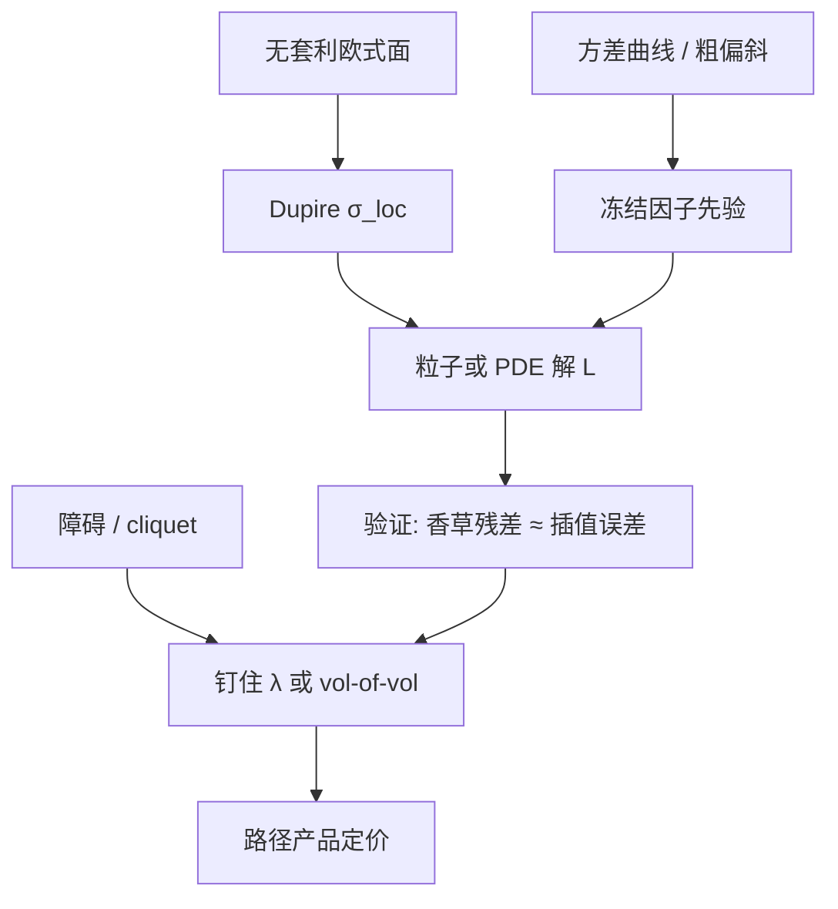

# 局部-随机混合校准

    
香草已经被杠杆函数用尽；混合强度必须用障碍、cliquet 或对冲误差来识别，否则局部与随机互相替代，表面上拟合完美，路径产品仍在纯局部与纯随机之间任意漂移。

    <footer>—— 粒子校准见 Guyon and Henry-Labordère；混合 SLV 的工程传统见 Lipton 以及 Ren, Madan and Qian</footer>

[局部随机波动](/quant/local-stoch-vol) 给出乘积规格 $\sigma_t=L(S_t,t)\sqrt{v_t}$ 与条件期望约束 $L^2\mathbb{E}[v\mid S]=\sigma_{\mathrm{Dup}}^2$。本篇只写**校准顺序与识别**：因子先钉在哪里、杠杆怎么估、混合权重用什么仪器、粒子与 PDE 如何与定价引擎对账。不重复 Dupire 公式，不把 [Heston](/quant/heston) 五参数再解释一遍，也不把 [Bergomi](/quant/bergomi) 曲线动态重推；那些是因子候选，不是本篇的对象。

## 问题

LSV 有两类自由度。随机因子 $v_t$（Heston、对数正态、Bergomi 投影、甚至 [rBergomi](/quant/rough-bergomi) 的对角线）决定聚类、杠杆相关与未来微笑能打开多少；杠杆 $L(S,t)$ 是一张函数，负责把条件方差修到与今日全部欧式一致。香草只约束条件期望，不约束条件分布的分散度。放大因子的 vol-of-vol，校准器会把 $L$ 往反方向调，香草残差仍在插值误差内，障碍价格却从 Dupire 端滑向纯 SV 端。问题收成：如何把校准写成不可逆的两层（或三层），使 $L$ 不能偷走因子的动态，以及用哪些非香草把混合强度钉住。

「混合」一词在工程里还指另一种写法：$\sigma_t=\sigma_{\mathrm{loc}}(S,t)\,v_t^{\gamma}$ 或 $(1-\lambda)\sigma_{\mathrm{loc}}+\lambda\times\mathrm{SV}$。$\lambda=0$ 退回 Dupire，$\lambda=1$ 退回纯随机（并丢掉精确香草拟合，除非再乘 $L$）。无论哪一种参数化，香草都不能识别 $\lambda$ 或 $\gamma$。把它们天天用香草重估，等于把识别重新弄坏。

### 为何不能联合乱优化

若把 Heston 的 $(\kappa,\theta,\sigma,\rho,v_0)$ 与整张 $L$ 网格丢进同一个最小二乘，目标函数对香草几乎平坦：许多组合给出同一组边际。优化器会把 vol-of-vol 推高、用 $L$ 补偿，或反过来。结果依赖初值与正则，不可复现。正确的联合只发生在**路径产品**加入目标之后，且因子应被先验或方差曲线约束在合理区，而不是五个数全部自由。Bergomi 型因子更应冻结 $\xi_0$，只放 $\eta,\rho$ 与混合强度进第二层。

杠杆 $L$ 不是 Dupire 的 $\sigma_{\mathrm{loc}}$，也不是隐含波动。随机因子已经贡献了一部分局部方差，$L$ 只补缺口。昨日的 $L$ 表接到今日重估的 $\theta$ 上，香草立刻破，障碍更破。

## 方法

**第一层：边际。** 从无套利欧式面算出 $\sigma_{\mathrm{Dup}}(K,t)$，光滑凸插值，禁止生差分，见 [Dupire 校准](/quant/dupire-calib)。这一层与因子无关。

**第二层：因子水平。** 用方差互换期限结构或 ATM 方差曲线钉住 $v$ 的水平与均值回复；相关 $\rho$ 用香草偏斜做粗校准，不必完美——残差留给 $L$。Heston 违反 Feller 时，先修因子或改对数正态，不要指望 $L$ 在零方差附近当垃圾桶。Bergomi / rBergomi 则冻结 $\xi_0$ 与 $H$，只把 vol-of-vol 放在窄区间。

**第三层：杠杆。** 粒子法（Guyon–Henry-Labordère）：每时间层用核回归估计 $\widehat{\mathbb{E}}[v_t\mid S_t=K]$，令 $L=\sigma_{\mathrm{Dup}}/\sqrt{\widehat{\mathbb{E}}[v\mid S]}$，粒子用该 $L$ 继续扩散。PDE / Fokker–Planck 在二维 $(S,v)$ 上更稳，三维以上走粒子。校准与定价必须共用 Euler（或同一 scheme）、同一边界政策：对 $v$ 的吸收或反射会扭曲条件期望，$L$ 在低执行价飙升，看起来像短端跳，其实是边界伪影。

**第四层：混合强度。** 用少数流动障碍、cliquet 或历史 Delta 对冲误差选定 $\lambda$ 或 $\gamma$，或等价地把因子 vol-of-vol 在窄带内微调。仪器必须是路径依赖的；用另一张香草切片去「确认」$\lambda$，是循环论证。校准 $L$ 之后必须把欧式再定价一遍，残差应在插值误差量级。

### 粒子噪声、带宽与翼部

核带宽太大，$L$ 被抹平，短端偏斜拟合变差；太小，$L$ 复制 Dupire 翼部爆炸，粒子在深虚值稀疏区振荡。生产上对 $L$ 做执行价切趾与期限平滑，并版本化整张表——只存五个 Heston 数、不存 $L$，无法复现昨日障碍价。粒子数不足时，条件期望的蒙特卡洛误差会进入 $L$，再进入下一层扩散，误差累积是乘性的。应在若干时间层上把粒子估计的 $\mathbb{E}[v\mid S]$ 与独立的 dense PDE 切片对账，至少在二维因子时做一次。

Ren–Madan–Qian 与 Lipton 的早期混合把 $\lambda$ 当成显式参数、杠杆取 Dupire 本身，实现简单，香草只在 $\lambda=0$ 时精确。现代粒子 LSV 先保证香草，再用 $\lambda$ 解释「还剩多少随机性」。两套语言不要混在同一张模型卡上而不写清约束。

## 机制

Gyöngy 只锁定边际。混合校准要锁定的是**条件方差的分解**：多少来自 $S$ 的确定性杠杆，多少来自仍随机的 $v$。障碍看到的是路径上波动何时变大：纯局部把 $\sigma$ 写成 $S$ 的函数，跌到障碍附近才加波动；纯随机可以在现货尚远时就把 $v$ 抬高。$\lambda$ 在二者之间滑动。这正是障碍市场常落在 LV 与 SV 报价之间的原因，也是只用香草无法决定报价落点的原因。

与粗糙核的衔接：短端极陡偏斜若强迫 $L(S,0^+)$ 去模仿跳或粗糙，数值不稳。短端应让跳或 [rBergomi](/quant/rough-bergomi) 承担，LSV 的 $L$ 只修中长端香草残差。混合校准不是「有了 $L$ 就可以不要动态模型」。

### 引擎一致性比粒子数更要紧

「香草对、障碍不对」的假 LSV 问题，根源经常是：校准 $L$ 用一种离散，定价用另一种；或校准用近似公式（Bergomi–Guyon 展开），定价用 MC。$L$ 是在特定生成元下定义的固定点，换生成元就要重算。同一参数在欧式上对账，是混合校准的验收标准，不是可选回归测试。

把 $\lambda$ 解释成「市场有多相信随机波动」是故事，不是识别。$\lambda$ 是障碍相对 Dupire 与纯 SV 的位置参数。换一家的障碍报价，$\lambda$ 就应重估；香草没动而 $\lambda$ 大变，说明识别靠的是那几张障碍，限额应写在障碍流动性上。

## 边界与工程取舍

有跳时 Dupire 比值不再是瞬时连续方差，$L$ 会把跳质量吸成尖峰。随机利率、离散股利要进生成元，不能把股票 $L$ 表直接乘到期货上。高维篮子的条件期望不再是标量 $S$ 的函数，要投影。逐日重校准 $L$ 而不版本化，会使历史 PnL 无法复现，对冲比昨天与今天不在同一模型里。

计算预算：二维 PDE 校准适合 Heston-LSV；Bergomi 多因子与 rBergomi 走粒子或投影。不要用 Heston 特征函数去给 LSV 香草定价——乘了 $L$ 之后仿射已破，必须 PDE 或 MC。控制变量若用「无 $L$ 的 Heston 闭式」，偏差是系统性的，只能减方差，不能当价格。

完美拟合香草仍然只对欧式边际。美式提前行权、离散观察障碍、带价差的对冲，都不被条件期望约束所担保。混合校准解决的是识别，不是把市场摩擦写进 $L$。

因子选 Heston 是因为二维便宜；选 Bergomi 是因为方差账要对；选粗糙核是因为短端。混合校准的流程相同，换的是第二层先验，不是另发明一套 $L$ 的方程。

## 小结

- 混合校准必须分层：Dupire 钉边际，因子先验钉动态，粒子或 PDE 解 $L$，路径产品钉 $\lambda$。
- 香草不能识别混合强度；联合乱优化会使 $L$ 与 vol-of-vol 互相替代。
- $L$ 表与因子参数一起版本化；校准与定价共用同一离散格式。
- 短端陡偏斜应交给跳或粗糙核，$L$ 不要在 $t\to 0$ 处模仿跳。
- 欧式验收是插值误差量级的残差；障碍落在 LV 与 SV 之间是设计目标，不是故障。
- 出处：Guyon and Henry-Labordère（粒子）；Lipton；Ren, Madan and Qian；边际匹配见 Dupire 与 Gyöngy；因子对象见 Heston、Bergomi。
