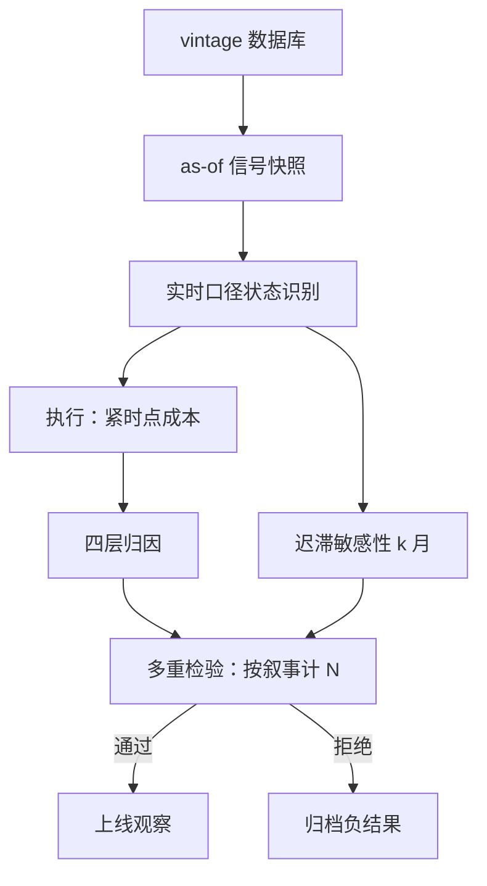

# 宏观策略的回测难点与收束

宏观回测最大的敌人不是拟合不足，而是叙事的事后可得性：每一条样本外失败的策略，在样本内都有一条看起来必然的故事线。

<footer>—— 据 Leamer, American Economic Review, 1983 与 White, Econometrica, 2000 整理</footer>

[上一课](/quant/mac-commodity-macro)把商品写成宏观轴与库存轴的两层状态，利率、外汇、商品三个表达账户至此写全。本课回到第一课埋下的承诺——「回测与实盘只能用实时口径」，把宏观回测特有的骗术列成协议，再对整门课收束。本课程到此收束。

## 问题

同一套宏观策略，回测与实盘的落差比高频策略大得多，原因四件套。第一，数据被改写：宏观序列逐轮修订，初值噪声大、修订后的序列平滑、拐点清晰——用修订后数据回测，阈值规则的误报比实盘能看到的少得多。第二，发布滞后：环比数据公布滞后一到两个月，信号按数据所属期而不是可得期对齐，每一步都在用未来。第三，独立样本极少：状态以年计，三十年样本只含几个完整周期，有效样本数是周期数不是月数。第四，叙事无限供给：故事线不占数据文件，海选叙事等于把 $N$ 藏起来。缺口是把这些变成回测前就必须满足的协议，而不是事后自觉。

### 协议清单

数据层四件事：用 vintage 或首发值口径重算状态，信号与执行按可得期做 as-of 连接（[时点数据](/quant/point-in-time)、[前视偏差](/quant/look-ahead-bias)）；标准化与参数只用滚动或递归窗口；对识别迟滞做敏感性——状态确认滞后 $k$ 月就晚 $k$ 月动手，夏普掉多少进报告；按叙事数计 $N$，过[多重检验](/quant/backtest-overfitting)与[紧缩夏普](/quant/deflated-sharpe)的门槛再谈上线。

美国 2008 年四季度 GDP 年率首报为 $-3.8\%$，其后修订到 $-8.4\%$ 附近：按终值识别「衰退格」比按首值早了不止一个季度。修订不是误差项，是与状态相关的信号成分。

## 方法

执行层协议同样显式：换格与翻仓的成本按第三课口径，在条件指数最紧的时点计冲击；EM 远期按 NDF 可执行价、商品按避开滚仓窗的成交假设计（前两课的边界进回测）。归因分四层：状态判断（概率对错）、映射（象限与赢家）、工具（carry 与基差）、执行（滑点），四层分开才能回答错在哪一环。最后是稳健性：换指标集、换窗口、换阈值带重跑，结论报分布而不是报冠军——冠军是 $N$ 次试验的最大值统计量，报它等于报噪声的运气。

## 机制

修订为什么系统性抬高回测而不是无偏加噪：修订方向与后续确认的状态相关——衰退确认后数据被大幅下修，用修订序列回测等于让阈值规则提前看到衰退的确认，第一课「平滑概率偷未来」的错误在数据层重演。独立样本少为什么致命：月度 $t$ 值按观测数算，但周期级参数——格序、反应函数、状态数——每个周期只提供一个独立样本，参数不确定度远大于 $t$ 值所示。这就是宏观策略的统计验收必须与机制论证并列的原因：机制错了，统计再好也上不了线；机制立住了，样本外仍要以年计去等。

## 边界

协议本身不免费：vintage 库有缺口，历史初值未必完整保存；敏感性每做一轮就是新试验，要计回 $N$。低频策略的样本外验证以年计，负结果归档与快照冻结是唯一让组织记住教训的机制。也不因噎废食：按清单执行的宏观回测依然可行，只是置信度必然低于同样本量的日内策略，仓位尺寸与监控频率要按这个折扣定。

## 小结

- 回测口径四件套：vintage 首发值、as-of 连接、滚动窗口、迟滞敏感性。
- 修订与状态相关，用修订后数据等于把衰退确认偷进信号——数据层的前视。
- 独立样本是周期数不是月数；叙事计入 $N$，过多重检验门槛再谈上线。
- 成本按紧时点计，归因分状态、映射、工具、执行四层。
- 全课程收束：识别给出概率，象限给出赢家，流动性给出开关，战术层定预算，利率、外汇、商品是三个表达账户，回测纪律是它们共同的门槛。
- 出处：Leamer, AER, 1983；White, Econometrica, 2000；时点口径见[时点数据](/quant/point-in-time)，多重检验见[回测过拟合](/quant/backtest-overfitting)与[紧缩夏普](/quant/deflated-sharpe)。
