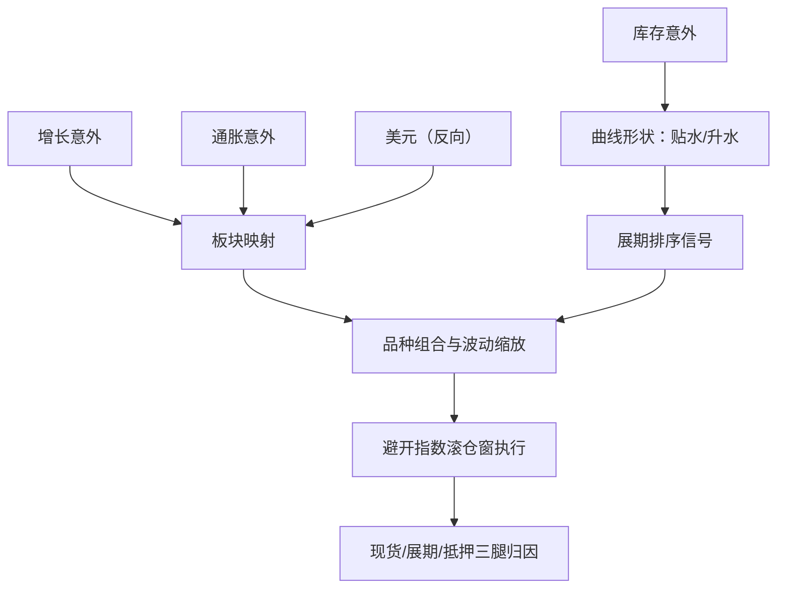
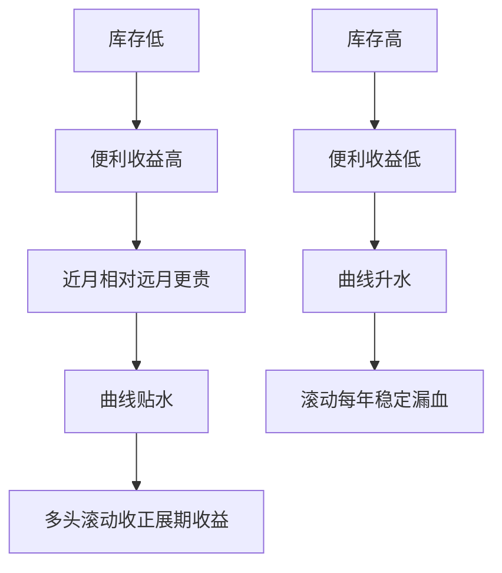

# 商品的宏观策略

商品的宏观故事都要先过库存这一关：同一条需求新闻，库存低时是行情，库存高时只是头条。

<footer>—— 据 Working, American Economic Review, 1949 与 Gorton, Hayashi &amp; Rouwenhorst, Review of Finance, 2013 整理</footer>

[上一课](/quant/mac-fx-macro)把宏观之差落进汇率账户，并预告美元与商品的相关是共同因子的投影。象限表把商品放在过热与滞胀格（第二课），但商品自带一层别的资产没有的状态变量：库存与曲线。商品的宏观策略因此是两层状态之和——全球的增长通胀轴，加每个品种自己的库存轴。

## 问题

失效样本先摆出来：2008 年 7 月到 12 月，WTI 从 147 美元跌到 34 美元附近——增长塌下来时通胀预期跟着塌，「抗通胀资产」比股票跌得快。商品的麻烦是它不是一个资产类，而是一篮子各自出清的现货市场：收益要拆成现货、展期与抵押三腿（[展期收益](/quant/roll-yield)），「抗通胀」只在通胀由需求或商品自身供给驱动的象限成立。缺口是把两层状态分开度量：宏观轴决定板块贝塔，库存轴决定每个品种的曲线形状与展期符号；混在一起，板块判断会被品种级的曲线运动淹没。

「展期收益」翻译成白话：期货会到期，多头必须不断把快到期的合约换成更远月的，这一换有赚有亏——贴水时像贱买贵卖，稳定小赚；升水时反过来，稳定小亏。长期持商品指数，收益里很大一块来自换约而非现货涨价。

### 库存是品种级 regime

[Contango 与 backwardation](/quant/contango-backwardation)描述曲线的相对位置，背后是库存：低库存支撑贴水，高库存把升水顶向全额持有成本——Working 的仓储逻辑。库存因此是商品自己的 regime 变量，第一课的框架在品种级重演：读库存的意外而非水平（[库存与曲线](/quant/inventory-curve)），把基差当库存的影子变量做排序信号（[展期 alpha](/quant/commodity-roll-alpha)）。

Gorton–Hayashi–Rouwenhorst（2013）在三十余个商品、近四十年月度库存数据上把基差的预测力归到可交割库存的低水平：基差是库存的影子，跳过库存直接读曲线，等于读影子不读人。

## 方法

落地分三步。第一步记账：现货、展期、抵押三腿分开，指数总收益里被机械滚仓窗吃掉多少展期要单独报（展期收益课的口径）。第二步两层信号：库存与基差在品种与到期之间排序，执行避开指数公开滚仓窗——那里的需求可预测、会被抢跑；宏观层把增长意外映射到工业金属与能源，通胀意外映射到广谱商品，美元当反向因子，板块内再做品种分散——单品种由天气、地缘与 OPEC 式供给冲击主导，分散是必须而不是装饰。第三步组合：按[波动目标](/quant/vol-targeting)定各板块预算，与象限表对表——过热格加商品；滞胀格里商品是少数分子不受增长拖累的资产，但前提是通胀腿确实由商品驱动，工资与服务主导的通胀不会自动兑现成商品贝塔。

## 机制

展期为什么是策略的核心而不是报表细节：静态持有商品指数，长期超额里展期贡献与现货贡献同阶，contango 里机械滚仓每年稳定漏血。展期 alpha 的机制是仓储理论：低库存时便利收益高，近月相对远月贵，多头收的是稀缺补偿，付钱的是需要即期供给的套保者——展期收益是对稀缺性的保险费。它与第二课「过热格商品占优」是同一枚硬币的两面：需求超预期首先击穿低库存品种的曲线，基差走强的截面排序本身就是宏观意外的微观成像，两层状态在机制上连通。

数字感受升水曲线的漏血：若近月 100 美元、十二个月后 108 美元（年化升水约 8%），多头每年滚动换约就要拖累约 8%；换成贴水 8% 的曲线，同样滚动反而每年多收约 8%。同一桶油，曲线形状不同，年收益差出约 16 个百分点。

## 边界

「通胀对冲」是条件的：需求驱动成立；供给驱动的滞胀里能源与农产品的冲击互不共线，广谱多头照样亏。仓储容量、交割地库存与挤仓能让曲线与宏观库存脱节（contango 课的口径）；政策储备改变的不是当期库存而是市场信念，读数要分账。主连连续行情不能用来回测展期现金流（展期 alpha 课的口径）。也不高估宏观轴的分辨率：金属与能源对增长意外的响应领先滞后各不相同，板块映射按月频校准，别按日频追。

常见误区：听到「通胀来了就买商品」。2008 年上半年通胀预期并不低，随后半年 WTI 仍从 147 美元跌到 34 美元附近——需求塌了，通胀预期跟着塌。商品抗的是「需求驱动的通胀」，不是名字里带通胀的一切行情。

## 小结

- 商品是两层状态之和：全球增长通胀轴定板块贝塔，库存轴定曲线与展期符号。
- 收益拆现货、展期、抵押三腿记账；指数机械滚仓的漏血单独报。
- 基差是库存的影子：排序读库存意外，执行避开公开滚仓窗。
- 「抗通胀」只在需求驱动通胀的象限成立；供给与政策冲击不共线。
- 出处：Working, AER, 1949；Gorton, Hayashi &amp; Rouwenhorst, Review of Finance, 2013；曲线与展期口径见[Contango 与 backwardation](/quant/contango-backwardation)、[展期收益](/quant/roll-yield)与[展期 alpha](/quant/commodity-roll-alpha)。
