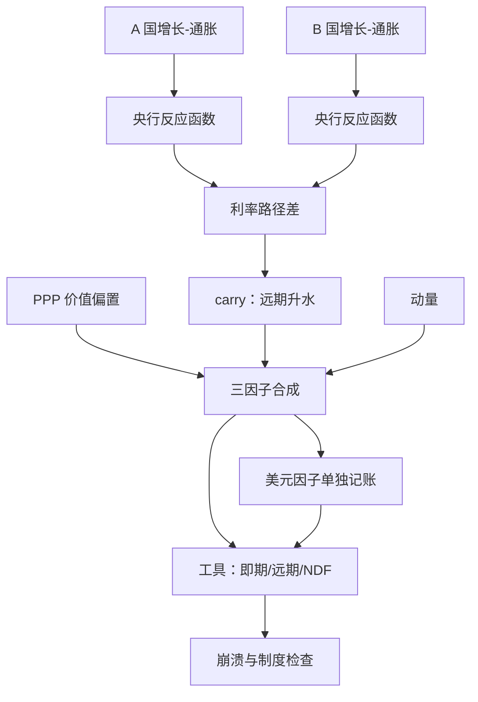

# 外汇的宏观策略

外汇没有现金流可分析：每一笔头寸都是一次相对宏观投票，你买的从来不是一张货币，而是两个经济体、两家央行之间的差。

<footer>—— 据 Lustig, Roussanov &amp; Verdelhan, Journal of Finance, 2011 与 Menkhoff, Sarno, Schmeling &amp; Schrimpf, JFE, 2012 整理</footer>

[上一课](/quant/mac-rates-strategies)把宏观观点拆到利率三轴上。但「两个经济体之差」还有更直接的账户：汇率。利率给出差的斜率，汇率给出差的价格；本课讲外汇如何消费前三课的状态概率、象限与利率输出，以及它自带的 carry、价值与美元周期。

## 问题

外汇信号的三个来源各有陷阱。carry 用利差或远期升水排序（[外汇 carry 与动量](/quant/fx-carry-mom)），但远期升水被利率差套住——CIP 保证买入远期不等于看多，赚的是 UIP 失败的溢价，即市场为崩溃风险卖的保险，左尾是保价不是意外。价值用实际汇率对中枢的偏离（[PPP 锚](/quant/ppp-anchor)），但中枢本身以年计漂移。美元不是第三个信号而是全局因子：美元走强通常对应全球 funding 收紧——第三课第三条链在外汇上的定价，EM 与 DM 在这条链上不对称。缺口是把利差观点与汇率观点分开记账，把美元周期当状态而不是当一篮子货币的均值；混起来，崩月会被误诊成判断错，而不是保险被行权。

### 从象限到利差到汇率

宏观链条逐环落：增长与通胀象限决定两家央行的反应函数差，反应函数差投影成政策利率路径差，路径差的现值就是远期曲线——carry 是这条链的静止像，象限换格时静止像跟着重画。表达上三因子合并：carry 给排序、价值给慢偏置、动量给方向确认，按波动缩放后合成。避险态美元走强的 smile 让美元空头天然承担状态尾部——第一课的资产内生代理里，美元本身就是状态变量之一。

Rogoff 汇总的证据：实际汇率的半衰期约三到五年。PPP 信号的有效调仓频率因此是年级——把它当周度信号，等于用漂移中的中枢放大噪声。

## 方法

落地分三层。信号层：carry 按远期升水排序并按波动缩放；价值用实际汇率对多年中枢的偏离，只做偏置不做触发；动量与 carry 相关有限，分开构造。组合层：美元因子单独记账——所有外币对美元的平均不是套息，是全局风险暴露；EM 腿按单一货币设容量与干预限额，与 DM 腿分账。执行层：管制货币走 NDF，远期点与即期的脱钩要按[外汇市场结构](/quant/fx-market-structure)的分层报价处理；对冲比率是显式决策——把外币债券对冲回本币，同时把它的 carry 一并对冲掉，这笔成本按基差入账，不进收益。

## 机制

carry 为什么有溢价：CIP 套汇把远期升水钉在利率差上，若 UIP 成立，利差应被即期贬值精确抵消，carry 交易零收益；实证的失败意味着高息货币的贬值慢于利差——溢价是对崩溃月的补偿，机制是灾害风险与杠杆化套息的被迫平仓，第三课的保证金螺旋正是平仓的执行通道。美元的机制是同一条链的另一头：美元融资的杠杆在 global funding 收紧时被迫还美元、买美元，美元升值与跨资产相关性塌向 1 同时出现。所以美元因子与衰退格、流动性紧缩态天然同向：做套息等于系统性做空状态尾部，崩月亏损可以吃掉整年的 carry 收入。

## 边界

UIP 失败不是免费午餐：单个货币对的排序收益极不稳，收益靠几十个货币对的分散吃，且崩溃月 carry 与趋势同亏（carry 课的口径），去重后仍要单独报极端月。2008 年后交叉货币基差改写了 carry 的含义：对冲成本不等于利差，按旧口径算的套息在基差里漏钱。PPP 的中枢随贸易条件与生产率移动，把全样本均值当永恒公允会系统性偏。干预与资本管制让远期与即期分层，NDF 贴水不是可执行价格。也不把美元负相关写成机制：美元与商品同受全球 funding 与风险偏好驱动，相关性是共同因子的投影，不是因果——这是下一课的入口。

## 小结

- 远期升水是利率差的静止像；carry 赚 UIP 失败的溢价，左尾是保价不是意外。
- 三因子分工：carry 排序、PPP 慢偏置、动量确认；美元因子单独记账。
- 美元走强与 funding 收紧同源，套息等于系统性做空状态尾部。
- 对冲比率是显式决策：对冲即把 carry 一并对冲掉，基差成本入账。
- 出处：Lustig, Roussanov &amp; Verdelhan, Journal of Finance, 2011；Menkhoff 等, JFE, 2012；Rogoff, Journal of Economic Literature, 1996；排序与执行见[外汇 carry 与动量](/quant/fx-carry-mom)、[PPP 锚](/quant/ppp-anchor)与[外汇市场结构](/quant/fx-market-structure)。
