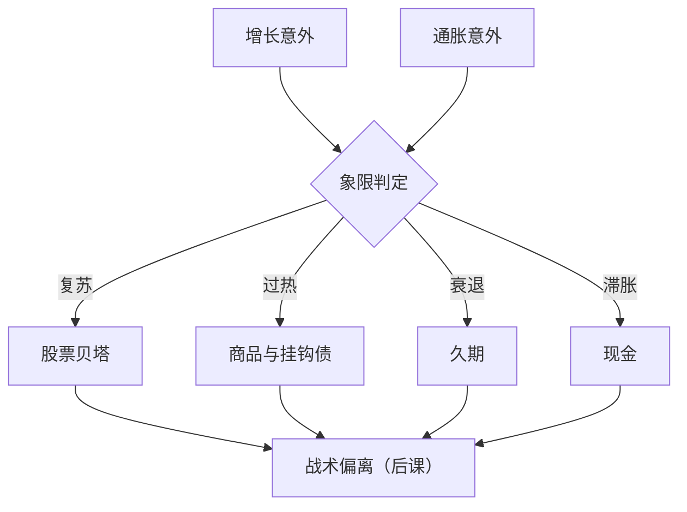
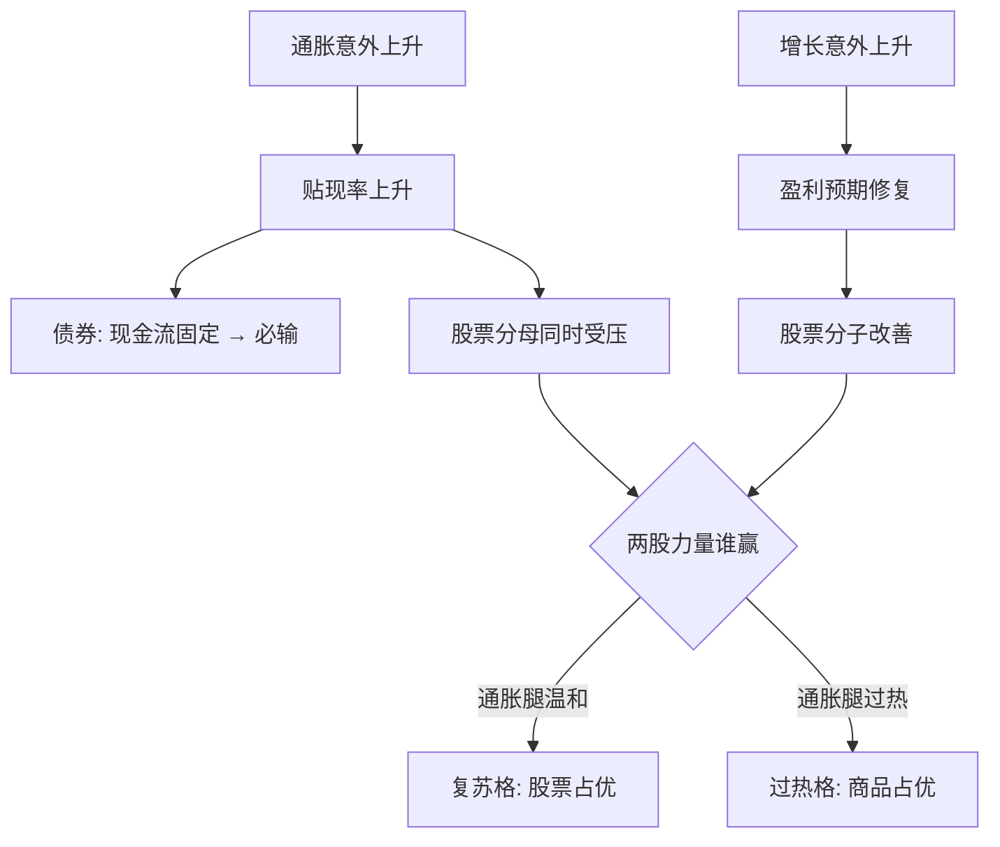

# 增长-通胀象限

把宏观压成两个轴会丢信息，但不压成轴就什么都做不了：增长定分子的方向，通胀定贴现率的脾气。

<footer>—— 据 Fama &amp; French, Journal of Financial Economics, 1989 与美林投资时钟报告（2004）整理</footer>

[上一课](/quant/mac-regime-identification)把宏观状态变成滤波概率与转移矩阵，并约定回测只能用实时口径。本课把最常用的二维 regime 展开：增长与通胀。同是「状态转坏」，通胀上行与通胀下行对应的资产排序相反，一维识别在这里失效。象限给每个状态格配上相对赢家与可交易代理，后课的战术配置直接消费这张映射表。

## 问题

一维 regime 不够。增长下行的两种走法——通胀同升（滞胀）与通胀同落（衰退）——在大类资产上的排序相反：债券在后者常是当年的最佳资产，在前者几乎垫底。把两种情形合并成一个「坏状态」，仓位映射必然错一半。

常见误区：以为「经济变坏就买债券」。增长下行若伴随通胀上行（滞胀），债券几乎垫底，最稳的是现金；只有通胀一起回落的「衰退格」才是债券的天下。先看通胀轴的符号，再谈买什么。缺口是把增长意外与通胀意外各取一轴，问每格里谁是相对赢家，以及用什么工具表达——不是买「资产名」，是买久期、贝塔、商品或通胀挂钩腿。

### 意外进定价，水平只是背景

[宏观因子](/quant/macro-factor-set)已立了口径：进入定价的是意外而非水平。操作化：增长轴用 PMI 或工业增加值环比动量对共识的偏离，通胀轴用 CPI 环比与盈亏平衡通胀率的边际变化。两轴各自标准化后划四格：复苏（增长正、通胀负）、过热（双正）、滞胀（增长负、通胀正）、衰退（双负）。

股债相关性的符号在 1990 年代末前后翻转：此前通胀冲击主导时股债同跌，此后增长冲击主导时债券成了股票的对冲。把 2000 年后的相关性外推回 1970 年代，会高估 60/40 组合在滞胀里的保护。

「意外进定价，水平只是背景」举例：CPI 同比 3% 这个数字本身不构成信号；本月公布的 3% 高于市场共识的 2.6%，这 0.4 个百分点的差才是行情的来源——共识早就被价格消化了，动的只有意外。

## 方法

映射表按贴现率与盈利的两分法填：复苏格里盈利修复而贴现率未动，股票贝塔最好；过热格里需求拉动通胀，商品与通胀挂钩债占优；滞胀格里估值与盈利双杀，现金的实际收益最稳；衰退格里通胀回落压贴现率，久期最好。表达全部落在可交易工具上：衰退格买国债期货或现券拉久期，复苏格加股指贝塔，过热与滞胀格用商品期货与挂钩债调整，而不是按叙事买板块。

## 机制

排序的机制是分子与分母的赛跑：债券现金流固定，通胀意外升即贴现率升，债券必输；股票的分子随增长修复，只有通胀意外同时抬贴现率时才输——复苏与过热对股票的分野全在通胀腿。相关性本身是象限的函数：通胀主导定价时股债相关性为正，增长主导定价时为负，60/40 的保护只在后一类象限成立。象限表因此同时是收益表与风险表：换格时不仅换赢家，还换分散结构，风险预算要跟着换格走，不能只挪收益敞口。

「分子与分母的赛跑」用房子打比方：股票像一栋能涨租金的房子（分子=租金，分母=折现率），债券像一笔租金写死的租约。利率一升两者都掉价，但债券的现金流没有回旋，股票还能靠生意变好找补回来——这就是两轴必须分开看的原因。

## 边界

四格把两个连续量硬切，边界抖动时仓位在相邻格间翻转，映射要按概率带渐进（上一课的口径）。时钟的样本以美国战后至 2000 年代为主，格序依赖央行的反应函数：通胀目标制确立前后的格序不同，搬到别的经济体要重新验证。象限当择时触发器会过拟合，当风险预算偏置更稳。也不把「现金」字面化：滞胀格里持币的意思是缩短久期、压低贝塔，不是囤钞票。

## 小结

- 增长与通胀各取意外一轴成四格；同是「变坏」，滞胀与衰退的资产排序相反。
- 每格配相对赢家与可交易代理：复苏贝塔、过热商品、滞胀缩久期压贝塔、衰退买久期。
- 股债相关性的符号随象限变，60/40 的保护只在通胀意外为负时成立。
- 格序依赖央行反应函数与样本期，跨经济体使用要重新验证。
- 出处：Fama &amp; French, JFE, 1989；美林投资时钟（2004）的叙事框架；意外口径见[宏观因子](/quant/macro-factor-set)。
