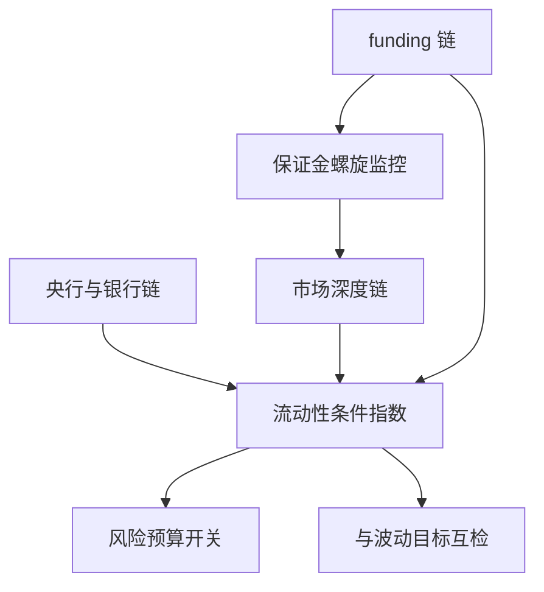
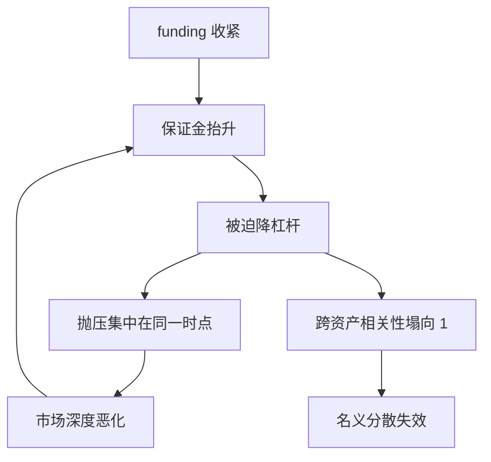

# 流动性条件

流动性不是一种东西：央行给的是准备金，市场给的是深度，经纪人给的是保证金——三条链断了哪一条，资产的表现都不一样。

<footer>—— 据 Brunnermeier &amp; Pedersen, Review of Financial Studies, 2009 与 Nagel, Review of Financial Studies, 2012 整理</footer>

[上一课](/quant/mac-growth-inflation-quadrant)用增长与通胀两轴给四个象限配上相对赢家。但 2008 年与 2020 年的转折先发生在资金面：增长-通胀刻得动中期趋势，刻不动保证金螺旋驱动的快下跌。本课把流动性从背景提为第三根轴，分清三条不同口径的「流动性」，并给出监控与风险开关的用法。

## 问题

象限表假设资产可以按赢家顺序平稳换仓；资金面收紧时这个假设先破：全市场保证金抬升迫使同向去杠杆，跨资产相关性塌向 1，名义分散失效。更麻烦的是「流动性」被当成一个词用，其实至少三条链：央行与银行体系的准备金（资金可得性）、市场流动性（价差与深度）、funding liquidity（杠杆投资者的保证金与融资）。混用三条链会错判两次：看到央行扩表就断定资产必涨——第一条链宽松不等于第三条链不紧；或把市场价差走阔当成央行收紧。缺口是分链度量、合成条件指数，并明确它进风险预算而不是收益预测。

「funding liquidity」翻译成白话：你还能不能借到继续持仓所需的钱、要追加多少保证金。它与「市场流动性」（想卖时有没有人接盘）是两回事——完全可以出现没有人卖、但人人都在被追缴保证金的局面。

### 三条链的度量

央行与银行链看准备金余额、资产负债表净变动、政策利率在走廊的位置，信用侧加票据与 OIS 利差。市场链看国债与期货的买卖价差、深度、Amihud 价格冲击系数，加期现基差。funding 链看保证金率、回购折扣与互换基差。各链标准化、滞后对齐后合成条件指数。

Brunnermeier–Pedersen 的 margin 螺旋：funding 收紧迫使降杠杆，降杠杆压市场深度，深度恶化再抬保证金，两条链相互增强。Nagel 用套利误差的走阔度量这条链：资金最紧时「免费午餐」反而最大，因为想吃它的人借不到钱。

## 方法

落地分两步。第一步建指数：三链各选两三个指标，标准化后按风险预算等权——不按样本内解释力加权，避免挑权重；价格侧日度更新，宏观侧月度校准。第二步定用途：条件指数只做风险开关——紧缩态压总风险预算、放宽再平衡节奏，不直接当方向信号。与[波动目标](/quant/vol-targeting)分工：vol targeting 盯已实现波动，流动性指数盯「去杠杆能不能成交」这个执行条件；波动还没起而 funding 先紧时，后者先触发减仓。

「风险开关不是方向信号」的直觉类比：烟雾报警器不会告诉你火从哪来、要不要搬家，它只让你先放下手里的活去查看。流动性指数报紧时，动作是压仓位、给执行留余量，不是预测「明天涨还是跌」。

## 机制

为什么流动性是第三根轴：跨资产策略的收益不只来自状态判断，还来自能否按判断的价格调仓。funding 紧时，套利与 carry 仓位的保证金上升，浮亏仓位被迫先平，抛压集中在最需要流动性的时点出现，市场链随之恶化。2008 年 TED-OIS 利差一度超过 300 个基点、2020 年 3 月最安全的美债现货价差也走阔，是同一机制的两个标本。策略含义：象限换格的最差执行时点恰恰是条件指数报紧的时点，风险预算必须在信号之前就给执行留余量——把换仓拆片、预留冲击成本，而不是假设中间价成交。

## 边界

三条链不是机械传导：央行扩表不等于银行放贷（乘数内生），准备金充裕时市场深度仍可以极差。合成指数的权重有任意性，换指标集结论可能翻转，要报告稳健性而不是只报一条线。「流动性驱动的下跌」多数事后才分得清，实时只承认「条件紧」这个事实并按风险开关反应。也不要把缩表机械映射为下跌：第一链收缩的定价影响，取决于它与增长、通胀意外的相对大小——流动性只是轴，不是全部的地图。

常见误区：看到央行扩表的新闻就买资产。扩表给的是银行体系的准备金（第一条链），若杠杆投资者的保证金仍在收紧（第三条链），资产照样跌——2020 年 3 月美联储已开始投放流动性，市场仍先暴跌了约两周。

## 小结

- 「流动性」至少三条链：央行准备金、市场深度、funding 保证金；混用必然错判。
- 条件指数按风险预算等权合成，用途是风险开关与执行余量，不是方向信号。
- 保证金螺旋让去杠杆集中在最需要流动性的时候；与 vol targeting 互检。
- 扩表不等于放贷、缩表不机械等于下跌；换指标集要报稳健性。
- 出处：Brunnermeier &amp; Pedersen, RFS, 2009；Nagel, RFS, 2012；波动目标口径见[波动目标](/quant/vol-targeting)。
