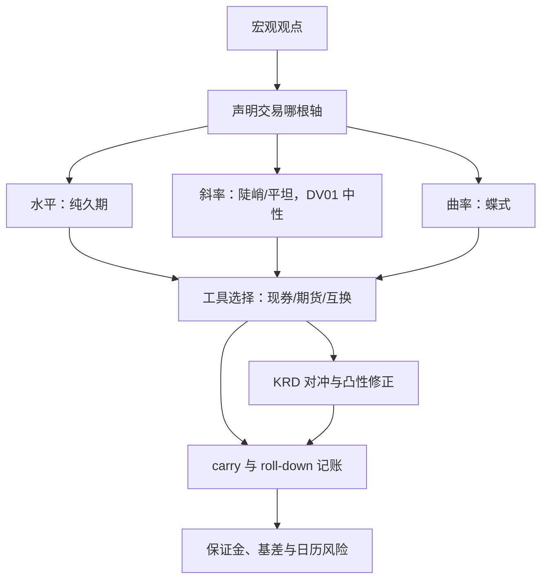

# 利率交易策略

债券收益的共同来源比债券的个数少得多：水平、斜率、曲率。观点若不声明自己在交易哪根轴，账户会替你随机选一根。

<footer>—— 据 Litterman &amp; Scheinkman, Journal of Fixed Income, 1991 与 Koijen, Moskowitz, Pedersen &amp; Vrugt, JFE, 2018 整理</footer>

[上一课](/quant/mac-tactical-allocation)把多路信号收进围绕政策组合的有界偏离，并要求每个信号先折成方向与强度。象限表里「衰退买久期、过热缩久期」在那里还是一行映射；本课把它落成可成交的利率头寸：观点沿哪根轴、用什么工具表达、carry 与对冲怎么算、盈亏记在哪一层。

## 问题

宏观观点与利率头寸之间隔着三个不对齐。第一，收益率曲线不是一维：水平、斜率、曲率解释了大部分共同变动（[曲线主成分](/quant/curve-pca)），「看空利率」的仓在斜率与曲率上多半背着未被声明的暴露，跌对了方向也可能亏钱。第二，观点是预期，头寸盈亏是 carry 与变动之和：正 carry 是缓冲不是信号，把它当做多理由，方向错时的亏损只会比直觉更大、更慢显现。第三，工具不是中性选择：现券、期货与互换的 carry、保证金与基差各不相同，同一观点换工具等于换策略。缺口是把每个宏观观点分解成对三根轴的显式声明，再让工具服从分解。

### 三族头寸与 carry 分解

三根轴各对应一族头寸：纯久期对水平，DV01 中性的陡峭化与平坦化对斜率，两翼对中间的蝶式对曲率——蝶式权重由关键期限 DV01 解出，不是固定的 $1:-2:1$（[曲线蝶式](/quant/curve-butterfly)）。持有期期望超额按期限结构 carry 分解（[期限结构 carry](/quant/ts-carry)）：价格不变假设下的 carry 加 roll-down 是相对确定的部分，方向判断只作用于 DV01 乘期望收益率变动那一项；把四项混成一句「看多债券」，归因就无从谈起。

1994 年 2 月起美联储一年内连续加息 250 个基点，10 年期美债收益率上行约 200bp；靠回购杠杆放大久期的橙郡（Orange County）组合当年 12 月破产。carry 厚度不覆盖 DV01×Δy，杠杆把这句话变成偿付问题。

## 方法

宏观映射沿象限走：衰退格与宽松初期做多久期、做陡；过热格与加息周期尾端缩久期、付固定、做平——斜率由央行路径主导，反应函数变了格序跟着变（第二课的边界在利率上的投影）。执行分三步。第一步选工具：期货要盯 CTD 切换与净基差；互换要认出[互换价差](/quant/swap-spread)里混入的信用与监管供需，并按[多曲线](/quant/multi-curve-ois)口径记账折现。第二步对冲：非平行观点用[关键利率久期](/quant/key-rate-duration)在关键工具上解向量，久期长的头寸补[凸性](/quant/duration-convexity)修正。第三步风控：期货保证金与互换变动保证金的现金流错配、新券发行与拍卖日历、央行会议与数据日的日历风险，分别设限。

## 机制

先拆轴再下单的机制理由：不拆的仓位是三根轴暴露的随机和，事后无法回答「观点错在哪一层」，上一课的偏离归因在这里接不住。carry 分解的机制意义是把确定的与要预测的分开：curve 头寸对掉水平后剩下的斜率暴露，收益主要来自央行路径与期限溢价的移动——正是第一、二课状态变量在利率内部的投影。对冲结构因此随象限变：衰退格里久期与股票负相关，久期仓是组合的对冲腿；滞胀格里两者正相关，同一笔久期只是另一份风险。第二课「换格换分散结构」的论断，在资产内部同样成立。

## 边界

久期只对瞬时平行移动成立，扭转让 DV01 中性的曲线仓照样亏损（凸性课的口径）。互换价差不是纯利率：拿它当利率观点的对冲腿，等于把信用与监管供需一起买进组合。央行是利率市场最大的玩家，「按统计规律做平做陡」在反应函数切换点系统性失效——通胀目标制确立前后的样本不能混用（第二课的警告在利率上的重述）。负利率与走廊制度下 roll-down 的几何变形，照搬正利率样本的 carry 厚度会错。

## 小结

- 先声明交易哪根轴：水平、斜率、曲率各有一族头寸与对冲方法。
- carry 加 roll-down 是价格不变下的确定项，方向判断只作用于 DV01×E[Δy]。
- 工具不是中性选择：CTD、互换价差、多曲线各自夹带基差与信用成分。
- 斜率由央行路径主导，反应函数切换处统计规律失效。
- 出处：Litterman &amp; Scheinkman, Journal of Fixed Income, 1991；Koijen 等, JFE, 2018；轴的统计结构见[曲线主成分](/quant/curve-pca)，对冲见[关键利率久期](/quant/key-rate-duration)。
