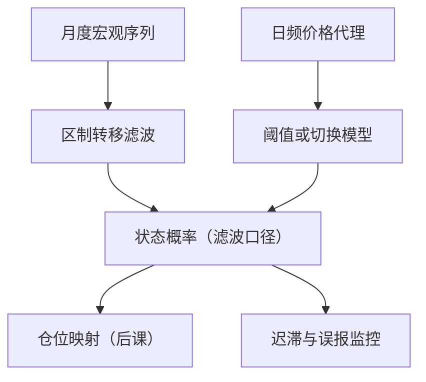

# 宏观 regime 的识别

宏观策略的第一决定不是买什么，而是承认现在处于哪种状态；状态命名错了，后面每一步都错得整齐。

<footer>—— 据 Hamilton, Econometrica, 1989 与 Burns &amp; Mitchell, Measuring Business Cycles, 1946 整理</footer>

[上一课](/quant/ap-map)把账户绩效收在测量纪律上：先钉测量再谈评价，核算保忠实、评估保公平——树序的下一课程转向宏观与跨资产，视角从账户换到资产。资产这一侧，[时间序列动量 CTA](/quant/cta-tsmom)对宏观状态是被动的：趋势自己会翻仓；主动宏观策略要先回答：现在处于哪种状态，这个判断有多可信。本课是「宏观与跨资产策略」的第一课。后面的象限、流动性、战术配置与各资产表达，都默认你会把状态写成概率而不是叙事。后课默认已经读完本课。

## 问题

跨资产的相关结构、风险溢价、对冲工具的有效性都随宏观状态变：[宏观因子](/quant/macro-factor-set)把跨资产共同收益命名为增长、通胀、流动性三类冲击；[风险溢价时变](/quant/time-varying-rp)说明条件溢价 $\lambda_t$ 随状态移动。缺口因此不是「讲宏观故事」，而是把状态变成可操作、可证伪、能逐点复现的对象：当前状态是什么？转移概率多大？识别滞后几期？留在叙事层的仓位映射全凭口径——「滞胀要来了」无法回测，也无法归因。

### 三条识别路径的分工

规则法用公布口径的指标与阈值：NBER 峰谷认定是事后裁定，实时版本必须换成月度代理——失业率低点、产出持续收缩、信用利差过阈值。统计法由 Hamilton 把增长序列写成两区制的马尔可夫切换：扩张均值高、衰退均值低，滤波递归输出 $\Pr(s_t=j\mid\mathcal{F}_t)$。资产内生法把价格本身当状态的充分统计量：信用利差、期限斜率、美元与波动率日频可得，但已含溢价变动。三条路分工：规则法与官方口径对表，统计法负责估计，价格代理负责实时。

滤波概率只用 $t$ 期及以前的信息；平滑概率 $\Pr(s_t=j\mid\mathcal{F}_T)$ 用了全样本。回测与实盘只能用滤波口径——把平滑概率画进仓位图，等于把下一次衰退的确认偷进拐点前的仓位，夏普凭空多一截。

## 方法

统计法落地按三步：状态数 $K$ 先取 2，不为拟合某段行情加态；转移矩阵 $p_{ij}=\Pr(s_t=j\mid s_{t-1}=i)$ 与各区制均值方差由 Hamilton 滤波的极大似然一起估出；输出当前概率、转移概率与区制参数。验收看三条：滤波概率对已认定衰退期的覆盖与迟滞（以月计）、转移概率在滚动窗口的稳定性、对切换的响应速度。资产内生法先把指标标准化，再用阈值或切换模型收敛成概率。两路不互斥：宏观数据月频且事后修正，价格代理日频且实时，实战用价格概率日度监控、宏观滤波月度校准，两套概率背离即是信号。

## 机制

状态要写成概率而不是分类：转移概率给出置信度与持续性，$p_{11}$ 高意味着状态大概率延续，风险预算按期望状态久期分配；点估计式的全进全出在概率贴着 0.5 抖动时高频翻仓，把识别噪声直接变成交易成本。误判成本不对称：把衰退当成扩张，会在下跌里持续承接暴露；反向误判只损失机会成本。阈值因此不应居中——宁可多付误报成本，也要压缩下行漏报。相关性随状态变是另一半：危机里跨资产相关性抬升使名义分散失效，状态概率因此同时是收益输入与风险开关；后者由流动性条件一课接手。

## 边界

regime 是后验命名：峰谷认定滞后数月才公布，实时识别必带误报与迟报，滤波能压缩不能消除。状态数与持续期参数的样本内最优是过拟合温床，$K$ 从 2 升到 3 常只为迁就一段特殊时期；换窗口重估后状态边界移动，映射规则要随参数版本化。宏观数据修正使「同一季度」在不同 vintage 下属于不同状态，回测不用首次公布值就会系统性好看（收束课专讲）。也不承诺拐点择时：确认状态比预测转折容易得多，仓位映射按概率带渐进调仓，不押单点。叙事命名只做沟通用，不进自动规则。

## 小结

- 识别的对象是状态的概率与转移，不是叙事；叙事不可证伪，无法回测归因。
- 规则法、区制转移、资产内生代理三条路分工：与官方口径对表、统计估计、实时监控。
- 回测与实盘只能用滤波或预测口径；平滑概率把未来状态偷进拐点前的仓位。
- 误判成本不对称，阈值应向「宁可误报」倾斜；识别同时是收益输入与风险开关。
- 出处：Hamilton, Econometrica, 1989；Burns &amp; Mitchell, Measuring Business Cycles, 1946；冲击命名与溢价时变见[宏观因子](/quant/macro-factor-set)与[风险溢价时变](/quant/time-varying-rp)。
