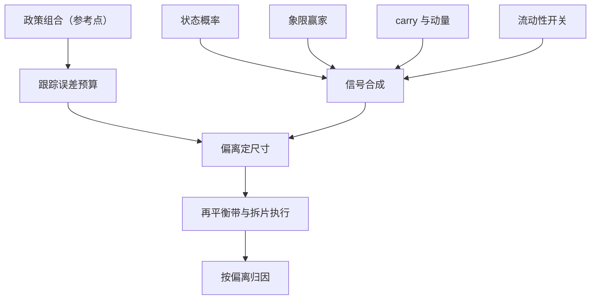

# 跨资产配置的战术层

政策组合决定回报的大头；战术层花钱买的不是更高收益，而是围绕参考组合的偏离权——偏离有界，错了才付得起。

<footer>—— 据 Brinson, Hood &amp; Beebower, Financial Analysts Journal, 1986 与 Sharpe, Financial Analysts Journal, 2010 整理</footer>

[上一课](/quant/mac-liquidity-conditions)把流动性提成第三根轴，并留下一条执行纪律：换仓的最差时点恰恰是条件指数报紧的时点。至此框架课的三件工具齐了——状态概率、象限映射表、风险开关；本课把它们收进同一个执行框架：围绕政策组合的战术偏离层。第二课映射表里标注的「战术偏离」在这里落地，后面的利率、外汇、商品三课，都在这一层里各占一个表达账户。

## 问题

战术配置的常见死法不是判断错，而是没有结构：状态概率、象限表、carry、动量各自成单，账户上只剩一组没人批准过的总偏离——跟踪误差无预算，信号互相抵消却各付一遍成本，同向时风险翻倍。缺口是把「多个信号」合成「一组仓位偏离」，并且回答四个问题：偏离相对谁定义？幅度多大？何时进退、成本谁付？盈亏记在谁头上？不给答案，前三课的概率与映射就只是报告素材。

### 围绕参考组合的偏离结构

政策组合先立住：它承载战略风险预算，是战术的参考点。战术写成偏离 $\Delta w_t$，预算用跟踪误差带住，偏离的协方差用收缩后的 $\Sigma$ 估出（[协方差收缩](/quant/cov-shrinkage)）；锚可选等风险贡献（[风险平价](/quant/risk-parity)）或市场均衡（[Black–Litterman](/quant/black-litterman)）。每个信号先折成方向与强度的标量：状态概率给置信度（第一课），象限格给相对赢家（第二课），carry 与动量给截面排序（[Carry](/quant/carry-everywhere)、[时序动量](/quant/cta-tsmom)），流动性开关只许压不许放（第三课）。

Brinson 等的样本里，政策权重解释了 91 支养老基金总收益方差的约 93.6%。把「择时贡献」算成收益占比而不是方差占比，是战术层价值最常被夸大的口径错误。

## 方法

落地四步。第一步定预算：总跟踪误差上限先于任何信号存在，满偏离对应的主动风险不得超过它。第二步合成信号：各信号标准化成 $[-1,1]$ 的强度，按风险预算等权加权，而不是按样本内夏普加权——后者把多重检验直接搬进仓位。第三步定尺寸：偏离 $=$ 满偏 $\times$ 强度，满偏由 TE 预算反解；状态概率贴着阈值抖动时按概率带渐进调仓，与第一课同口径。第四步执行：再平衡带宽住微调，换格与翻仓按上一课拆片、预扣冲击成本；并与既有的 CTA 或[波动目标](/quant/vol-targeting)模块对表，防止同一信号在两个账户里双计。

## 机制

为什么围绕参考组合而不是整体推倒重排：主动风险是稀缺品，TE 预算应集中在最可证伪的信号上；参考组合保证任何时刻账户的风险结构可解释，偏离的盈亏能单独归因——「政策赚的」与「战术赚的」混记，战术层就永远无法被验收，也无法被关停。信号合成的机制意义在相关性：carry、动量与象限映射在危机里常常同向（[危机 alpha](/quant/crisis-alpha) 的凸性正来自趋势翻空），有效偏离数远小于信号个数，按信号个数平分预算会隐性放大总风险。流动性开关只压不放的理由也在此：它判断的是执行条件不是收益方向，funding 紧时唯一正确的动作是收缩。

## 边界

战术层修不了政策错误：政策组合的贝塔本身摆错位置，战术是在错误地基上做微雕；Brinson 的方差分解既是战术层的价值上限，也是它的免责条款——偏离预算不保证战术为正，只保证它错时的损失有界。信号频率错配要显式处理：象限以季计、动量以月计、流动性以日计，放进同一个合成器之前先分层，否则最快的信号实际上决定了全部仓位。也不神化参考组合：政策再平衡与战术换仓共用同一本成本账，口径必须一致，否则归因第一层就失真。

## 小结

- 战术层是围绕政策组合的有界偏离：跟踪误差预算先行，信号只决定预算怎么花。
- 信号各折成方向与强度后按风险预算合成；概率带渐进，流动性开关只压不放。
- 危机里多信号同向，有效偏离数远小于信号个数；按信号数分预算会放大风险。
- 偏离单独记账与归因，战术层才能被验收、被关停。
- 出处：Brinson, Hood &amp; Beebower, FAJ, 1986；Sharpe, FAJ, 2010；锚与协方差构造见[协方差收缩](/quant/cov-shrinkage)、[风险平价](/quant/risk-parity)与[Black–Litterman](/quant/black-litterman)。
