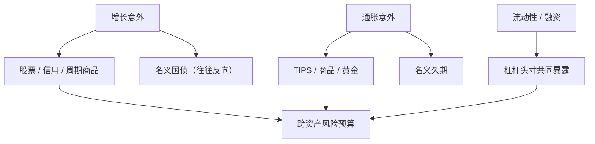

# 宏观因子：增长、通胀、流动性

    
股票、债券、信用与商品的共同收益，最终要对着增长意外、通胀意外和融资条件这三类冲击来命名；统计主成分能张成空间，但不能告诉你该用利率还是用铜去对冲。

    <footer>—— Chen, Roll & Ross 的宏观 APT；增长–通胀–流动性作为多资产风险的三分法</footer>

风格因子用回报解释回报：HML、CMA、动量都是资产内部的多空。[宏观状态变量](/quant/macro-state-variables) 强调能预报投资机会的总量。再往下一层，多资产配置常用三个可命名的冲击：**增长、通胀、流动性**。增长意外拉动股票、信用、周期商品；通胀意外撕裂名义债券与实物资产；流动性与融资冲击在 2008、2020 这类月份里同时打折所有需要资本的头寸。Chen、Roll 与 Ross（1986）已经把工业产出、非预期通胀、期限与信用利差写进 APT；本篇把后续实践收成这一组三因子语言，并写清楚意外如何构造、与统计因子如何衔接。

## 问题

投资者要对冲的不是「PC2」，而是明年的衰退、通胀再起、或中间层垮掉。若因子不能映射到可交易的对冲工具（股票指数、TIPS、商品、信用、短端资金），风险预算无法执行。纯股票面板里，增长与贴现率新闻纠缠，通胀往往弱；把债券、商品、信用放进同一套资产，三类冲击才分得开。问题是识别：同期宏观发布带修订与滞后，金融价格即时但内生。用全样本均值减实现值当「意外」，等于用未来信息定义冲击；用市场价格当冲击，又可能只是在回归价格自己。

三分法还要对付共线。滞胀里增长坏、通胀坏同时发生；危机里增长坏、流动性坏同时发生。三个名字不是三个正交的主成分。工程目标是：每个名字对应一套对冲资产与一套可实时观察的代理，而不是在股票残差里再挖三个宏观 α。

### 意外，而不是水平

APT 与宏观因子定价要的是未预期冲击，不是 CPI 的水平。水平已经被价格贴现；意外才驱动当期收益。工业产出、CPI、就业用预测模型（调查、时间序列）的残差，且预测只许用 $t$ 时已发布的 vintage。金融代理可以是：周期股减防御股、盈亏平衡通胀变动、TED 或 LIBOR–OIS、信用利差变动、Pastor–Stambaugh 或 Fontaine–Garcia 的融资流动性。价格代理的优点是日频、无修订；缺点是已经含风险溢价变动，不能把「利差走阔」自动读成「流动性因子实现值为负」而不问是预期损失还是风险价格。

$$
f_{t}^{\mathrm{g}}=\Delta y_t-E_{t-1}[\Delta y_t], \quad
f_{t}^{\pi}=\pi_t-E_{t-1}[\pi_t], \quad
f_{t}^{\ell}=\Delta \mathrm{liq}_t.
$$

三个 $f$ 进入时间序列 $R_{it}=\alpha_i+\beta_i^{\mathrm{g}}f_t^{\mathrm{g}}+\beta_i^{\pi}f_t^{\pi}+\beta_i^{\ell}f_t^{\ell}+\varepsilon_{it}$，再在截面上估 λ。宏观因子往往不可交易，λ 是风险价格，不是该因子组合的平均超额收益；要把价格变成可交易，需要复制那些 β 显著的资产。

Chen–Roll–Ross 的「非预期通胀」不是 CPI 同比本身。用通胀水平当因子，会把长期名义趋势当成每月冲击，股票载荷接近零或符号乱跳。先做意外，再谈定价。

## 方法

增长腿。实体侧用工业产出、实际消费、就业意外；市场侧用股票市场本身、周期减防御、铜、运输。股票市场作增长代理时，与 CAPM 的市场因子高度重叠，截面上难以再给「增长」一个独立 λ——它已经是市场溢价。更干净的做法是在跨资产面板里让股票、高收益信用、工业商品同向，国债反向，定义增长为这一共同方向，再用宏观发布做外证。

通胀腿。名义国债与 TIPS 的相对收益、盈亏平衡通胀的变动、商品与黄金。短端通胀意外与长端通胀风险溢价不是同一个对象：前者靠近发布日的 CPI 意外，后者靠近期限溢价与锚定。股票对通胀的载荷符号依赖样本：1970 年代负、1990 年代后接近零或正，不能把单一 β 写进风险模型当常数。

流动性腿。交易流动性（价差、换手、Pastor–Stambaugh）与融资流动性（TED、经纪商杠杆、Fontaine–Garcia）应分开再看相关。危机里二者一起动，平常可以分道。流动性因子在股票截面上与规模、低价股纠缠；在跨资产上更接近「所有杠杆头寸的共同打折」。把流动性写进三分法，是承认中介机构资本是独立于增长与通胀的状态。

### 从 APT 到跨资产风险预算

Chen–Roll–Ross 在股票组合上检验宏观意外是否被定价。现代风险预算把同一组名字用于股债商信的配置：增长超配股票与信用、低配国债；通胀超配 TIPS、商品、低配名义久期；流动性紧张时降杠杆、减信用与统计套利。这是工程映射，不是 1986 年论文的原回归。检验仍应走时间序列 β 加截面 λ，或走 [Giglio–Xiu](/quant/giglio-xiu) 把宏观代理投影到大面板潜空间，以免漏因子把 λ 扭曲。

## 机制

增长冲击改变预期现金流与劳动收入，股票与高收益信用的边际投资者要求补偿；国债在衰退里提供对冲，增长 β 为负，溢价可以是负的（保险）。通胀冲击改变实际利率与名义合约的真实价值：名义债权人受损，实物资产与部分定价权强的股票受益。流动性冲击改变中介的风险承受：即便现金流新闻为零，被迫去杠杆也会把价格推离基本面，随后预期收益升高——这是[风险溢价时变](/quant/time-varying-rp) 的中介渠道，流动性因子因此既是风险又是状态变量。

三分法的叙事价值是对冲工具可命名。统计 PC 在样本内拟合更好，但 2022 年通胀冲击来临时，你需要事先知道该空名义债、多商品，而不是临时解释 PC3。宏观分解用拟合换可执行性。代价是宏观意外噪、λ 的 $t$ 统计量弱，股票样本里通胀溢价尤其不稳定。

### 与风格因子的分层

不要把 SMB、HML 与增长通胀流动性放在同一层当互斥模型。风格是股票截面的特征因子；宏观是跨资产的状态冲击。可以问：价值因子收益是否在增长意外为负时更高（风险故事）还是更低（被迫抛售）。把宏观当第一层、风格当第二层，或把宏观只用于调节风格的风险预算，比在个股上估三个极噪的宏观 β 更稳。个股宏观载荷的估计误差会毁掉 [Fama–MacBeth](/quant/fama-macbeth) 的第二步。

流动性不是波动率。VIX 上升可以来自增长新闻、也可以来自中介资本。把 VIX 当流动性因子，会在疫情初期把增长与融资捆成一块。能拆开的时候用利差与资产负债表，不能拆开的时候承认共线，不要硬正交化后再讲三个独立故事。

## 边界与工程取舍

发布日历：本月工业产出往往下月才公布，状态必须移位。修订：用最终值回测条件策略会前视。频率：宏观月频，交易日频，日频代理用金融价格、月频用宏观意外对账。国际样本的通胀机制不同，不能把美国 1970–2022 的股票–通胀 β 搬到 A 股当定律。

不要用三个宏观意外去「解释」动量与低波动的全部 α：它们不是为这些排序组合设计的。也不要在股票五因子上再加三个高度相关的宏观序列还报告七个显著 λ——共线会让符号对调。容量上，宏观对冲通过指数期货、TIPS、商品流动性足够；用个股去复制宏观 β 会把特质噪声变成交易。

真实出处：Chen, Roll & Ross, *Economic Forces and the Stock Market*, Journal of Business, 1986。cay 与条件消费 CAPM 见 Lettau–Ludvigson，属状态变量而非本篇三分法的定义。融资流动性见 Fontaine & Garcia 等。禁止把三分法标成 Fama–French 2015 的附录。

## 小结

- 增长、通胀、流动性是给跨资产共同收益命名的三个冲击，对应不同的对冲工具。
- 进入定价的应是意外而非水平；金融价格代理日频可用，但已含溢价变动。
- 三者并不正交：滞胀与危机是共线体制，硬正交会讲错故事。
- 风格因子是股票截面层，宏观是状态层，宜分层而不是互斥替换。
- 出处：Chen, Roll & Ross, Journal of Business, 1986。
