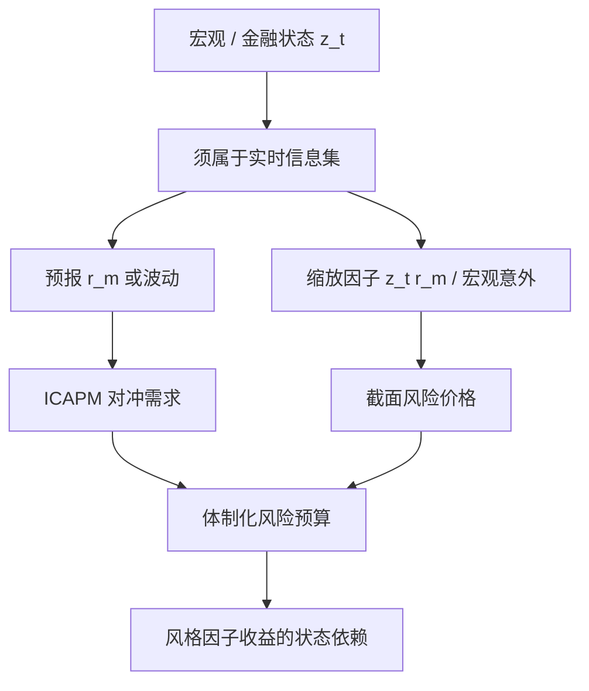

# 宏观状态变量

资产价格贴现的是未来消费与投资机会；能预报这些机会的宏观变量，就应当进入随机贴现因子，而不是只当宏观研究的背景板。

<footer>—— Lettau–Ludvigson 的 $cay$；Chen–Roll–Ross 的宏观因子 APT</footer>

条件定价把「状态」写成随机贴现因子的自变量。状态可以是金融变量（期限利差、信用利差），也可以是宏观总量（工业产出、通胀、消费–财富比）。Chen、Roll 与 Ross（1986）直接把宏观意外当作 APT 因子；Lettau 与 Ludvigson 构造 $cay$，连接消费、资产财富与劳动收入的长期均衡，用其偏离预报超额收益。宏观状态变量要回答的是：哪些可观测的总量能代表投资机会集的变化，从而既进入时间序列可预测性，也进入截面风险溢价。对量化组合，它们还是体制识别与风险预算的慢时钟。

## 问题

ICAPM（Merton）说，对投资机会集的对冲需求会产生额外因子。机会集不可直接观测，实践中用状态变量代理：变量必须能预报未来市场收益或未来波动，投资者才有动机对冲它。单纯与同期产出相关还不够——那只是现金流新闻。Fama–French 的 SMB、HML 常被解释成这种代理：价值与小盘在坏宏观状态下更敏感。宏观状态变量路径则试图把代理还原成可命名的总量，避免永远用回报去解释回报。

选择困难在于：宏观序列低频、滞后、修订；金融序列高频但内生。用同期通胀意外解释股票收益，和用 $t-1$ 已发布的 $cay_t$ 去预报 $t+1$ 收益，信息集完全不同。条件 CAPM 篇强调工具必须属于 $\mathcal{F}_t$；宏观变量把这个问题变成数据发布日历。

### 哪些变量反复出现

Chen–Roll–Ross 使用工业产出增长、非预期通胀、期限利差、信用利差等。后续文献广泛使用：违约利差、期限利差、股息价格比、短期利率、$cay$、消费增长率、劳动收入。Petkova（2006）表明，用一组预报市场的状态变量，可以在一定程度上吸收 HML 的信息。Lettau–Ludvigson 的 $cay$ 同时出现在时间序列超额收益预测与条件消费 CAPM 的截面检验里，是宏观状态变量里少有的「两条腿都走路」的例子。

股息价格比、期限利差已经是价格。用它们当状态变量，宏观含义弱、金融含义强。$cay$ 与工业产出更「宏观」，但估计噪声和发布滞后也更大。没有免费的真实状态。

## 方法

时间序列预测。$r_{m,t+1}=a+b z_t+e_{t+1}$。$b$ 显著是进入 ICAPM 的入场券之一。样本短、持久预测变量（$cay$、估值比率）导致 Stambaugh 偏误，推断要用模拟或偏误修正。样本外 $R^2$ 往往接近零，这不立刻杀死变量：Goyal 与 Welch 对许多预测变量的悲观结论，应与截面定价分开看——弱时间序列预测仍可能对应重要的风险价格。

截面。把 $z_t r_{m,t+1}$ 或宏观意外当作因子，做 Fama–MacBeth 或 GMM。Chen–Roll–Ross 测的是宏观意外是否被定价；Lettau–Ludvigson 测的是 $cay$ 缩放的消费风险是否吸收规模与价值。两者都要求因子在期初可构造：意外要用预测模型的残差，而不能用同期实现减去全样本均值（全样本均值含未来）。

状态依赖风险预算。实务不估计完整 SDF，而是用 $z_t$ 分体制：高信用利差、低 $cay$（坏状态）时降低杠杆、收紧价值或动量的暴露上限。这是条件 CAPM 思想的工程简化，必须防数据挖掘：体制规则要预指定，并承认 Harvey–Liu–Zhu 式的多重检验。

### $cay$ 作为模板

Lettau 与 Ludvigson 估计消费、资产财富、劳动收入的协整，残差为 $cay$。理论上，消费高于财富所支持的水平，预示未来资产收益较低（或未来消费回落）。它把宏观总量的长期预算约束写进一个标量状态。复制时应用递归或滚动协整，处理样本修订；用作者公布的全样本 $cay$ 做「预测」会高估可交易性。

宏观意外因子在月频上比日频干净，但组合风控是日频的。常见折中是：日频仍用金融状态（利差、波动），宏观状态只在月频再平衡时更新风险预算，避免对修订序列做日频交易。

## 机制

随机贴现因子 $m_{t+1}$ 随状态变，风险价格 $\lambda_t$ 随 $z_t$ 变，资产若对 $z$ 敏感就获得溢价。价值股像一个卖出看跌：在产出与就业恶化时跌得更多，故要求更高收益——若投资者恰好要为这些状态买保险。宏观状态变量是给这条保险单定价的指数。统计 PCA 也能抓到坏状态的共同下跌，但不告诉你跌的是「通胀新闻」还是「贴现率新闻」。宏观分解的价值在于叙事与对冲工具（债券、商品、通胀互换）可以对上。

与基本面风险模型的衔接：Barra 风格在股票截面上吸收公司特性；宏观状态解释的是风格因子收益何时变贵。可以把 $f^{\mathrm{HML}}_t$ 对 $z_{t-1}$ 回归，看价值因子是否在坏状态实现更高收益或更高波动。这比直接让宏观变量进入个股 $\Sigma$ 更稳——个股对宏观的载荷噪，风格对宏观的载荷厚。

### 修订、滞后与「实时」

宏观数据多次修订。用最终修订值做历史条件化，等于使用未来统计局的知识。实时研究应使用当时可得的 vintage。滞后：本月工业产出往往下月才公布，状态变量要移位。忽略这两点，条件模型的样本内成功大量来自不可交易的信息。这与因子研究里用未来行业分类做中性化是同一类错误。

## 边界与工程取舍

宏观状态不适合做高换手 alpha。它们的预测 $R^2$ 低、半衰期长，更像体制变量。把 $cay$ 当成日频择时信号，会过拟合噪声。多重检验同样残酷：宏观候选很多（通胀、产出、货币、就业的各种变换），搜出来的「状态」需要与 Harvey–Liu–Zhu 同一纪律。

宏观因子也解释不了所有异象。短期反转、部分微观结构信号几乎不与季度总量对齐。强行把一切塞进 Chen–Roll–Ross，只会得到不显著的风险价格和虚假的安全感。该用微观结构模型的地方不要用宏观 SDF。

状态变量若不能预报收益或波动，投资者没有对冲动机，它就不该进入 ICAPM。同期相关只说明宏观新闻动了现金流，不足以成为截面定价因子。

## 小结

- 宏观状态变量代理投资机会集，进入条件 SDF / ICAPM；它们须能预报未来收益或波动，且属于实时信息集。
- Chen–Roll–Ross（1986）用宏观意外做 APT 因子；Lettau–Ludvigson 用 $cay$ 同时做超额收益预测与条件消费 CAPM。
- $cay$ 与估值比率持久、有 Stambaugh 偏误；复制须递归估计，并处理数据修订与发布滞后。
- 实务上宏观状态更适合月频体制与风格风险预算，不适合日频挖掘；风格因子是连接个股风险模型与宏观状态的厚样本层。
- 候选很多，必须用多重检验纪律；不能用同期宏观相关冒充定价。
- 出处：Chen, Roll and Ross, *Economic Forces and the Stock Market*, Journal of Business, 1986；Lettau and Ludvigson, *Consumption, Aggregate Wealth, and Expected Stock Returns*, Journal of Finance, 2001，以及 *Resurrecting the (C)CAPM*, JPE, 2001；Petkova, *Do the Fama–French Factors Proxy for Innovations in Predictive Variables?*, Journal of Finance, 2006。
