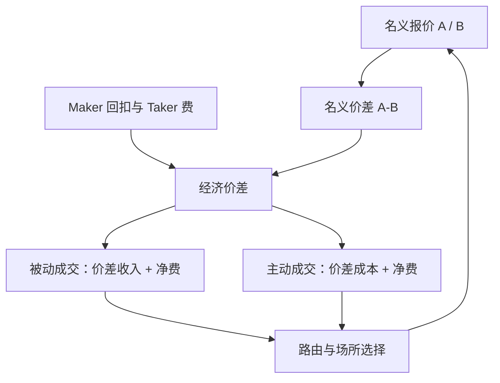

# Maker-taker 费用

    
报价价差是给经纪人看的数字；把 maker 回扣与 taker 费用加进去之后，经济价差才是提供或吃进流动性的真实账单。

    <footer>—— 据 Angel, Harris and Spatt, Equity Trading in the 21st Century, 2010/2015；Foucault, Kandel and Kadan 对限价簿收费的讨论</footer>

美国等市场的交易所以 maker-taker 定价：向提供流动性的限价单支付回扣（rebate），向吃进流动性的市价单或可立即成交限价单收取接入费（taker fee）。名义买卖价差因此可以压到一个最小报价单位，甚至看起来「免费」，因为做市商的一部分收入来自回扣而不是价差。Angel、Harris 与 Spatt 把这种收费写成现代股权市场结构的核心参数；Battalio、Corwin 与 Jennings 的经验工作表明，回扣会改变订单路由与执行质量。本篇写费用如何进入成交的事后会计、如何扭曲报价价差与 [有效价差](/quant/spread-cost)，以及倒置场所（taker-maker）为什么会把同一笔经济价差显示成不同的名义价差。它是费用经济学，不是如何规避交易所规则或操纵队列的说明书。A 股的佣金、规费与印花税结构不同，对照写在边界一节。

## 问题

一笔主动买入成交在卖价 $A$，名义价差成本相对中点是 $A-m$。若该成交发生在 maker-taker 场所，买方作为 taker 另付 $f_T$，卖方作为 maker 收取 $r_M$（通常 $f_T>r_M$，交易所净赚差）。买方的经济成本是 $A-m+f_T$，卖方的经济收入是 $A-m+r_M$ 里属于价差的那一截加上回扣。报价可以收窄到 $A-B$ 小于经济价差：做市商愿意在名义上少赚价差，因为回扣补上。观察者若只用 $A-B$ 去估 [实施缺口](/quant/implementation-shortfall)，会低估 taker 的成本、高估 maker 的价差收入。

路由问题随之出现。经纪商若保留回扣、不把净费转给客户，就有激励把订单送到回扣最高的场所，而不是送到执行概率或价格改善最好的场所。这是费用经济学对代理冲突的含义，不是微观结构噪声。倒置场所反过来向 taker 付回扣、向 maker 收费，名义价差往往更宽，经济价差仍由同一类供需决定。比较场所之间的报价宽度而不加回费用，会把收费方案的会计差异当成流动性差异。

### 经济价差与名义价差

定义费用调整后的买卖价：

$$
B_{\mathrm{econ}}=B+r_M,\qquad A_{\mathrm{econ}}=A+f_T
$$

（符号随谁付谁收而变；倒置场所把 $r_M$ 换成收费、$f_T$ 换成回扣。）经济价差 $A_{\mathrm{econ}}-B_{\mathrm{econ}}$ 才在跨场所、跨时段可比。最小报价单位约束的是 $A-B$，不是经济价差。当 $A-B$ 已经等于一个 tick，竞争转入回扣与队列：提供流动性的收益来自 $r_M$ 加剩余价差，排队资本的机会成本见 [队列位置](/quant/cancel-queue-position)。maker-taker 不能单独决定价差，它改变的是价差与回扣之间的**分拆**。

美国接入费曾有监管上限，回扣因此不能无限抬。上限一变，名义价差与路由会一起跳。把某一年度的回扣当结构常数，会在费率修订后把历史校准用错。

## 方法

**成交会计。** 每笔应记录：场所、主动/被动、名义价格、费用与回扣、数量。maker 的已实现价差要用经济价格重算，否则库存模型会把回扣误当成 alpha。taker 的短fall 应含 $f_T$。组合回测若假设中点成交且不扣接入费，对美股股票是漏计；若再减半个名义价差，可能与回扣双计或漏计，取决于假设的订单类型。成本模块必须与 [订单类型](/quant/order-types) 绑定：限价做成交才有 $r_M$，且有不成交风险。

**报价比较。** 跨场所 BBO 应用经济价差或「费用调整的 NBBO」。名义最优买价可能来自高回扣场所，对 taker 并不是经济最优。智能路由的目标函数应是预期经济价格加填成概率，而不是名义价格。经验研究若回归「报价价差对 maker-taker 费率」，必须控制 tick 约束与逆向选择，否则费率的系数混进了股票类别。

**做市报价。** 在 [Avellaneda–Stoikov](/quant/avellaneda-stoikov) 或 [GLFT](/quant/glft-market-making) 里，成交的瞬时收益应写成价差加期望净费。回扣提高提供流动性的强度补偿，最优名义价差可以更窄。把费率漏掉，校准出来的 $\kappa$、$A$ 会吸收费用，场所一换参数全坏。

### 倒置场所与零售内化

倒置场所用 taker 回扣吸引吃单，maker 付费换队列或价格优先。名义价差更宽，是为了让 maker 的经济账仍平。零售订单若被内化或被支付订单流（PFOF）买走，客户看到的价格改善要对照当时经济 NBBO，而不是对照某一个高回扣场所的名义报价。这些都是费用与代理的会计，不改变「谁提供了不可立即成交的限价」这一流动性定义。

回扣不是无风险收益。成为 maker 意味着被知情者捡走的期权，见 [毒性](/quant/toxic-flow)。费率只平移了提供流动性的确定性等价，没有取消逆向选择项。把回扣当 alpha 去加杠杆，是在卖出未对冲的毒性。

## 机制

费用改变的是双边匹配的转移支付，不创造交易剩余，但会改变谁愿意挂单、谁愿意吃单、订单在何处相遇。名义价差有最小单位时，转移支付成为主要竞争维度：场所用回扣买深度，用 taker 费为深度定价。深度增加未必降低 taker 的经济成本——他付了更高的 $f_T$。社会意义上的交易成本要用经济价差加失败执行的机会成本来度量，不能只用报价宽度的时间序列。

队列机制被放大。回扣越高，同一价位上排队越长，填成变慢，[成交概率](/quant/fill-probability)下降，取消与改价增加。库存偏度仍然必要：回扣不能替代把 $q$ 拉回零。高频账户对费率最敏感，因为往返次数把每一基点乘上很大的换手；低频组合的主导项仍是价差与冲击，费率是次项，但仍应记账以免与中点假设不一致。

### A 股对照

沪深股票竞价没有美式 maker-taker 回扣：投资者付佣金与规费，卖方另有印花税，交易所对流量的激励主要通过套餐佣金与会员结构，而不是对每一笔被动成交付 rebate。因此 A 股的报价宽度更接近经济价差（仍要加佣金与税）。把美股文献里「价差被回扣压到一个 tick」的图像搬到 A 股，会低估名义价差的信息含量。期货与部分国际产品另有手续费档位，应按合约细则把开平、日内平仓写进 $f$，不要套用股票 maker-taker 的符号。

## 边界与工程取舍

费率表随会员等级、流量档位、是否做市商资格而变，回测用公开「标价」可能与真实账单差一个档。暗池与零售内化的费用不在同一张表上。最小报价单位、集合竞价、收盘拍卖往往有不同收费，不可用连续竞价的 $f_T$ 去套拍卖成交。

不要把 maker-taker 写成「应当总做 maker」。填成、毒性、队列位置与 alpha 衰减决定订单主动被动；费率只是目标函数里的一项。也不要为了回扣去把本应一次吃完的母单拆成虚假的被动，这会把 [实施缺口](/quant/implementation-shortfall) 换成延误。合规上，路由与最佳执行义务以客户经济利益为准，不是以经纪商回扣为准——模型若优化的是后者，对象就已经错了。

费用是公开的价格表，不是隐蔽优势。研究应把费率当状态变量：修订日做事件研究，而不是把某一年的净费写进常数。结构一变，历史最优的被动比例会失效。

## 小结

- Maker-taker 把流动性提供的一部分报酬从价差挪到回扣，名义价差与经济价差因此分叉。
- 执行会计、短fall 与做市校准必须用费用调整后的价格，并与订单主动被动绑定。
- 跨场所比较报价宽度而不加回费用，会把收费方案当成流动性。
- 回扣补偿的是提供流动性，不取消逆向选择；把它当 alpha 是在卖毒性。
- A 股竞价没有对等的逐笔 rebate，不能直接套用美股的价差压缩图像。
- 出处：Angel, Harris and Spatt, *Quarterly Journal of Finance* 及相关市场结构报告；Battalio, Corwin and Jennings, *Journal of Finance*, 2016；Foucault 等对限价簿收费与路由的理论工作。
