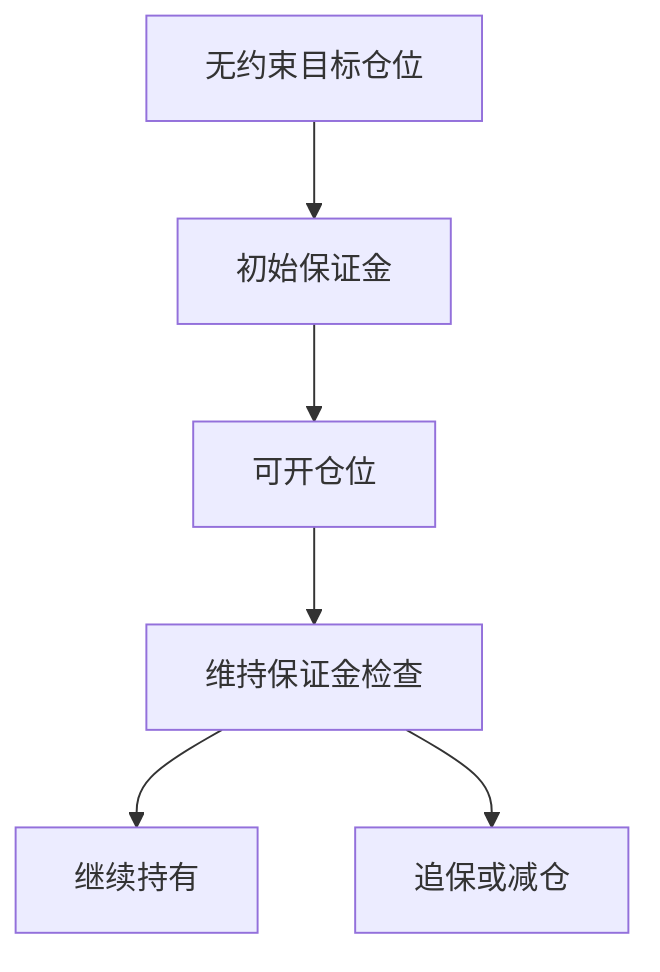

# 保证金与维持保证金

报表杠杆是会计身份；保证金是经纪商按持仓与规则锁住的现金。回测若只乘杠杆倍数、不设维持线，等于假设资金无限且不会被要求追加。

<footer>—— 据 Reg T / FINRA 维持保证金惯例；Brunnermeier and Pedersen, Review of Financial Studies, 2009 对融资流动性整理</footer>

上一课[合并与少数股东](/quant/nci-consolidation)收束了公司状态表。本课是「市场制度、资金与事件」第一课；后课默认你已区分**报表杠杆**与**可交易保证金**。缺口从「当时能读到什么基本面」换成「当时能加多少杠杆、保证金何时被催缴」。不重写 NCI，不把强平路径提前讲完。

## 问题

基本面多空组合在研究里常按市值加权再乘一个名义杠杆。真实账户要缴初始保证金，价格逆向移动后要满足维持保证金，否则被要求追加或减仓。Brunnermeier–Pedersen 把市场流动性与融资流动性绑在一起：价格下跌抬升保证金、迫使卖出、再压价格。缺口是把这条约束写进回测状态机，而不是把杠杆当常数。

财务课的资产负债率不能映射成保证金率。经纪商看的是持仓类别、集中度、是否可融资，不是合并报表的 D/E。

### 初始保证金不是维持保证金

开仓按初始比例锁现金；持仓期间按维持比例检查。价格有利时，超额保证金可被抽走去开新仓；价格不利时，先碰到维持线而不是初始线。回测若只用初始比例做杠杆上限，会低估追保频率。后课强平是维持线被击穿且未能追加之后的路径。

Reg T 对美股多头初始常见 50%、维持 25% 量级，但组合保证金、指数期货、融券空头各不相同。本课要的是双线结构，不是某一司法辖区的法条表。

## 方法

账户状态至少含：现金、持仓市值、已用保证金、可提取超额。每日（或每次标记）计算保证金占用，与维持要求比较。信号给出的目标仓位若使初始保证金不足，必须降杠杆或拒绝开仓，而不是按无约束权重成交。形成日宇宙仍用财务课的 PIT 与退市规则；本课只叠加资金约束。

回测要声明是隔夜保证金还是盘中最高占用。用收盘价检查维持线，会漏掉盘中击穿——这是后课缺口风险的入口，本课先承认检查频率是模型的一部分。

纸面目标权重可保留，可交易仓位必须经初始线裁剪、维持线检查。全样本常数杠杆倍数从本课起视为非法默认。危机月并排报告有无维持线的净值差。

## 机制

保证金把策略的「理论 alpha」变成受资金约束的路径依赖。同一信号在波动上升时占用变大，能承载的名义下降，于是因子在最需要承担风险的时候被迫减杠杆——这是回测偏差：无约束回测在危机里仍满仓，实盘已经撞维持线。财务质量空头往往是高波动、难融资的名字，保证金约束会非对称地砍空头。

后课把资金成本当作 alpha 底。本课先把占用与维持线变成状态变量；没有占用，成本无处乘。

最低实现：每个账户日终记录市值、现金、初始占用、维持要求。目标仓位先按初始线裁剪，再在日终按维持线检查；不足则按规则减仓，而不是按信号权重成交。杠杆上限随波动与集中度变化，不得在全样本用同一个 2 倍乘数。危机月把无约束回测与有维持线回测并排，差额就是资金前视的尺度。盘中检查缺失要在文档里写明，作为后课缺口的已知漏洞。

## 边界

不汇编各国保证金法条，不写投资组合保证金的内部模型。下一课[强平与缺口风险](/quant/liquidation-gap-risk)处理维持线以下、跳空无法追加的情形。融券机制与借券费率再后两课。后课默认：仓位先过初始保证金、再过维持线；无约束权重可留作纸面目标，但不是可交易仓位。集中度与波动使占用上升时，先降杠杆再谈再平衡，不要一边维持线已破一边还按信号加仓。日终检查漏掉的盘中击穿，记为模型已知漏洞，而不是用收盘价把路径抹平。

组合保证金与单票保证金不同：相关性上升时占用突然变大，常数单票比例会低估追保。回测若只用单票 50%/25%，要在文档里承认这是对组合规则的低估，而不是「已经很保守」。股票维持现金与期货 IM 通常分户，不可默认互相抵用。这是后课 CCP 占用与本课股票维持线并列、不能轧成一笔现金的原因。

## 小结

- 报表杠杆 ≠ 保证金；本课程从资金约束起笔。
- 初始线管开仓，维持线管存续，两者不是同一个比例。
- 无约束因子回测在危机里满仓，是资金前视。
- 检查频率（收盘 vs 盘中）属于模型，会漏击穿。
- 后课强平、融券、回购都建立在这条状态机上。
- 出处：Reg T / FINRA 维持惯例；Brunnermeier and Pedersen (2009)。
