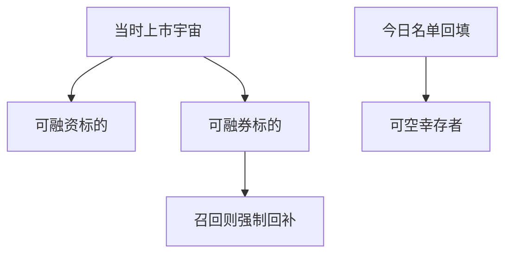

# 融资融券机制

多头杠杆借的是钱，空头杠杆借的是券；两套合约、两套可开仓名单、两套被召回的方式。回测里把空头写成负权重，等于假设券总能借到。

<footer>—— 据 D'Avolio, Journal of Financial Economics, 2002；Geczy, Musto and Reed, Journal of Financial Economics, 2002 整理</footer>

上一课[强平与缺口风险](/quant/liquidation-gap-risk)假设仓位已经存在、只是价格跳空。空头仓位能否存在，取决于融券；多头加杠杆，取决于融资。本课把保证金账户拆成**借钱**与**借券**两条腿。费率下一课专讲；本课先钉机制与回测里「可空」集合。

## 问题

无约束多空因子对每一只股票写正负权重。实盘空头需要找到出借人，且该券在当时的可融名单上。D'Avolio 描述了借券市场的供给如何随日变化：热门空头供给紧、容易被召回。Geczy–Musto–Reed 表明部分异象的空头侧在不可借或极贵时不可实施。缺口是形成日宇宙要再交一次集：当时可融资买入、当时可融券卖出。财务课的当时上市集合是超集；本课是可实施子集。

召回（recall）会强制回补，效果类似强平，但触发的是出借人要回证券，不一定是保证金击穿。

### 融券余额不是做空意愿的充分统计

可观察到的空头利息是成交后的存量，受供给约束。供给枯竭时，想做空做不成，余额不一定大。用高空头利息当「拥挤」可以，用低空头利息当「可以自由做空」不行。回测应以可借标志与借券库存为准，而不是以事后空头利息倒推当时可开仓。

中国融资融券有标的名单与保证金比例，名单调整本身是事件。用今日标的回填历史，是制度版幸存者。

## 方法

开空前检查：该证券在 $t$ 是否可借、要求的保证金、是否已被限定为只能平仓。开融资多头检查：是否在融资标的、折算率。召回到达时，按规则在限期内回补，成交价用当时可成交价，走上一课缺口逻辑。不要在回测结束时才丢掉「从未出现在借券库」的名字——那会留下易借的幸存者。

财务因子的空头往往是小市值、低质量、难借的券。可实施过滤会显著削弱纸面空头收益，这应被视为正确的衰减，不是要被「数据清洗」加回去的损失。

可融券名单按日求交之后，还要看是否「只能平仓、不能新开」。后者在 A 股标的调出、美股 hard-to-borrow 极端日都出现。回测把「只能平仓」写成当日空头增量上限为零、已有空头可回补。用空头利息高来反推「当时一定可借」，方向可能反了：利息高常常是供给已紧、增量更借不到。

## 机制

借券供给来自托管长仓、基金出借、库存券。供给紧时，后课费率上升，同时召回概率上升。保证金占用与借券约束叠加：即使维持线未破，召回也能把空头清掉。于是质量空头、盈余负意外空头在最拥挤时最不可实施。回测偏差的方向几乎总是：纸面策略空头赚得太多。

本课不进入限价簿谁先成交。能否借到券是开仓资格；排队与价差是后课 LOB 的事。

形成日负权重先与当时可融券名单求交；不在名单上则空头增量记零。召回按公告限期回补，价格走缺口规则。不要用期末才出现在借券库里的股票回填「一直可空」。A 股融资融券标的调整按生效日更新，今日标的不得覆盖历史。过滤前后空头收益的差，就是纸面异象里不可实施的那一块，应报告而不是加回。

## 边界

不写各市场融资融券管理办法汇编。下一课[借券费率](/quant/stock-loan-fee)把资格变成成本。回购是机构之间的抵押融资，机制相近但合约不同，再后一课。后课默认：负权重先过当时可借检查；今日可空名单不得回填。

后课费率把资格换成成本；没有资格则费率无意义。本课过滤后的空头截面，才是质量与 PEAD 空头真正能交易的那一截。今日可空名单、期末才进入借券库的名字，都不得回填。召回走缺口，不走「按收盘自愿回补」。

后课默认负权重先过当时可借检查；今日可空名单与期末才进入借券库的名字都不得回填。

出借人召回给出限期，不是即时市价成交。限期结束时若仍停牌，回补推到复牌第一笔。召回与停牌叠加是空头最差路径，必须允许成交落在限期之后的第一可成交价，而不是在停牌日用标记价假装回补。

可融券过滤前后的空头收益差要写入回测报告，那是纸面异象里不可实施的部分，不应加回。

## 小结

- 融资借钱、融券借券，可开仓名单不同。
- 负权重 ≠ 当时可实施空头。
- 召回是另一类强制回补，不必等到维持线。
- 空头利息是存量，不是供给的充分统计。
- 纸面空头收益偏高，是本课要修的回测偏差。
- 出处：D'Avolio (2002)；Geczy, Musto and Reed (2002)。
