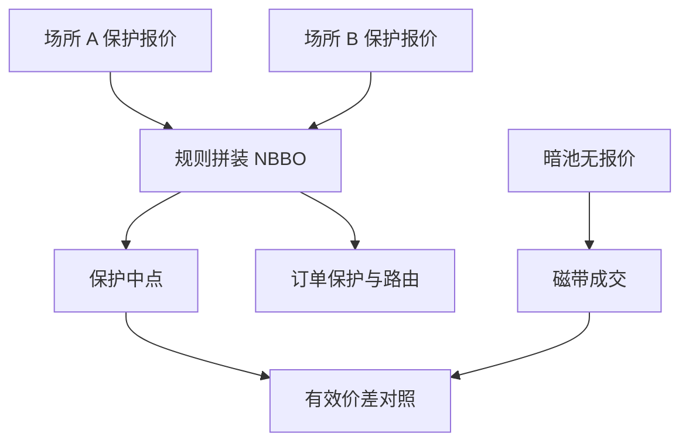

# 市场分割与 NBBO

同一只股票同时在许多场所报价和成交。全国最优买卖不是自然物体，是把各场所保护报价按规则拼出来的参照，拼的时钟和尺寸规则会改变「最优」二字。

<footer>—— O'Hara and Ye, Is Market Fragmentation Harming Market Quality?, Journal of Financial Economics, 2011；对照 Reg NMS 对保护报价与订单保护的制度表述</footer>

[暗池与中点单](/quant/dark-pool-midpoint)把一部分匹配移出展示簿。[手数](/quant/lot-size-odd-lot)说明保护报价可以不含零股。本课把多场所收成系统：碎片化（fragmentation）下，投资者面对的不是一张 [LOB](/quant/lob-structure)，而是一簇场所加上一个拼装出来的 NBBO。O'Hara 与 Ye 问碎片化是否损害质量；Foucault、Kadan、Kandel 与后续路由文献问订单如何在场所间分配。附录里的 [NBBO 构造](/quant/nbbo-construction)会把磁带对齐写细；本课写设计层：为什么需要一个全国最优、它保护什么、以及有效价差该对照哪一个中点。

## 问题

单场所课程序把 BBO 当成给定。多场所时，每个交易所、每个 ATS 有自己的 BBO（或没有 BBO）。Reg NMS 一类规则要求：保护报价上的订单不能以劣于另一场所保护报价的价格成交（订单保护 / trade-through 限制），于是系统需要一个全国最优买卖 NBBO $=(\max b_i, \min a_i)$。缺口是：这个 $\max$ 与 $\min$ 用哪一时戳、哪些尺寸、是否含锁定与交叉。锁定（lock）是买价等于另一场所卖价，交叉（cross）是买价高于另一场所卖价。碎片化加上延迟，锁定交叉会经常出现在某一条馈送上，而不出现在另一条上。

若研究用 SIP 的 NBBO，得到的是监管参照；若用直连拼装的「合成 NBBO」，得到的是更快但不一定受保护的参照。两者的中点可以差一个 tick，有效价差符号可以翻转。问题不是选一个「真」中点，而是声明对照的是保护 NBBO 还是可交易的合成最优，并且承认碎片化把价差分解的对象从一张簿变成了一个规则输出。

### 碎片化的质量是哪一类质量

O'Hara–Ye 用有效价差、实现价差、短时波动来谈质量。碎片化可能通过竞争压窄价差，也可能把深度拆薄、把时间优先拆到多条队列。做市商必须同时在多处维护报价，存货与撤单同步成本上升。暗份额上升时，展示 NBBO 可以很窄但可成交深度很小。因此「NBBO 价差变窄」不是充分统计量。还要看：保护深度、内部化份额、锁定交叉频率、以及跨场所的价差离散。

A 股竞价主板在连续时段基本是单一撮合，碎片化主要出现在港股、中美双重上市、以及期货–ETF–股票之间，而不是十几家股票交易所并行。把美股 NBBO 文献的数字当 A 股盘中成本，制度对象错了。

## 方法

构造每日每秒（或每事件）的保护 NBBO，记录贡献场所、是否锁定交叉、以及相对本所 BBO 的偏离。有效价差对照保护中点；另报对照本所中点，差额即路由与碎片化造成的参照差。Hasbrouck 信息份额或领先后滞后，用来看哪一场所的报价新息写入「共同有效价格」——注意暗池没有报价，份额会系统性偏向展示场所。

路由仿真（不是实盘抢跑说明书）应服从公开的订单保护：以劣于 NBBO 的价格吃本所，在规则下应被拒绝或被转发出去。回测若在本所吃穿 NBBO 而不付转发延迟，实施缺口被低估。费用见[maker-taker](/quant/maker-taker)：最窄的保护卖价未必是经济上最便宜的场所。

### 锁定、交叉与过时的「最优」

直连比 SIP 快时，本地看到的最优可能已经不是 SIP 的 NBBO。交易所以本地所见为据，监管以 SIP 为据，两套最优短暂分叉。研究应报告分叉时间占比。交叉若被允许存在于暗处或零售通道，公开 NBBO 仍显示未交叉的保护报价。把所有 BBO 内成交当规则违反，会把合法的内部化、零股和中点标成异常。

## 机制

订单保护把各场所的保护报价连成一个虚拟的全国簿，但这个簿没有统一的时间优先：同样的价格在两个场所是两条队列。竞争压缩展示价差；分割稀释每条队列的长度。知情交易可以选择在深度更厚或更暗的场所执行，非知情的展示做市商承担的逆向选择随分割变化。这与 [Glosten-Milgrom](/quant/glosten-milgrom) 的单一专家设定不同：现在有一群场所，信念更新不同步。

NBBO 中点作为公共锚，供给暗池中点协议使用。碎片化越严重、SIP 越慢，锚越容易过时，中点成交的「公平」越弱。于是市场设计的三个旋钮绑在一起：tick 与手数定义保护报价，费用定义路由激励，碎片化定义有多少张簿需要被拼成一个最优。

不要把 [Kyle](/quant/kyle-model) 的单市场 $\lambda$ 直接加总成「全国 lambda」。各场所 $y$ 相关，价格是共同的。应先合成全国流量再回归，或明确只估本所弹性。

### 费用调整后的最优不必等于保护最优

保护卖价最窄的场所，加上 taker 费可能不是经济最便宜。NBBO 管订单保护，不管经济价差。路由研究必须两套最优并排，否则会把收费方案当成碎片化损害。

## 边界

欧洲是另一套最佳执行与透明制度，没有美国式的单一 SIP NBBO。新兴市场的「分割」常常是官方市场加场外大宗，而不是一打注册交易所。本课不写如何利用 SIP 延迟做跨场所套利的操作步骤；那是附录延迟套利的对象。本课只要求：价差、深度、方向分类，在碎片化样本里必须声明报价源。

没有 SIP 的市场不要把「你覆盖的几张簿的包络」叫 NBBO。那是研究构造，没有订单保护的法律含义。

市场设计这一课序到此收束。下一课序价格形成从 [Roll](/quant/roll-model) 起，用成交回跳读有效价差；默认你已经知道，连续段的 $s$ 是某一套协议与某一套保护报价的输出，不是自然宽度。

## 小结

- NBBO 是保护报价按规则的拼装，不是一张真实的统一簿。
- 对照 SIP 中点还是直连合成中点，有效价差可以变号。
- 碎片化可能压窄价差同时拆薄深度；质量要用多指标。
- 锁定交叉、零股、暗池内部成交，使「BBO 内」不等于违规。
- 单市场价差分解与 Kyle lambda 在多场所必须重定义流量与价格。
- 出处：O'Hara and Ye, *JFE*, 2011；Reg NMS 公开规则；Hasbrouck 对多市场价格发现的度量；Angel, Harris and Spatt 对美国股权市场结构的综述。
