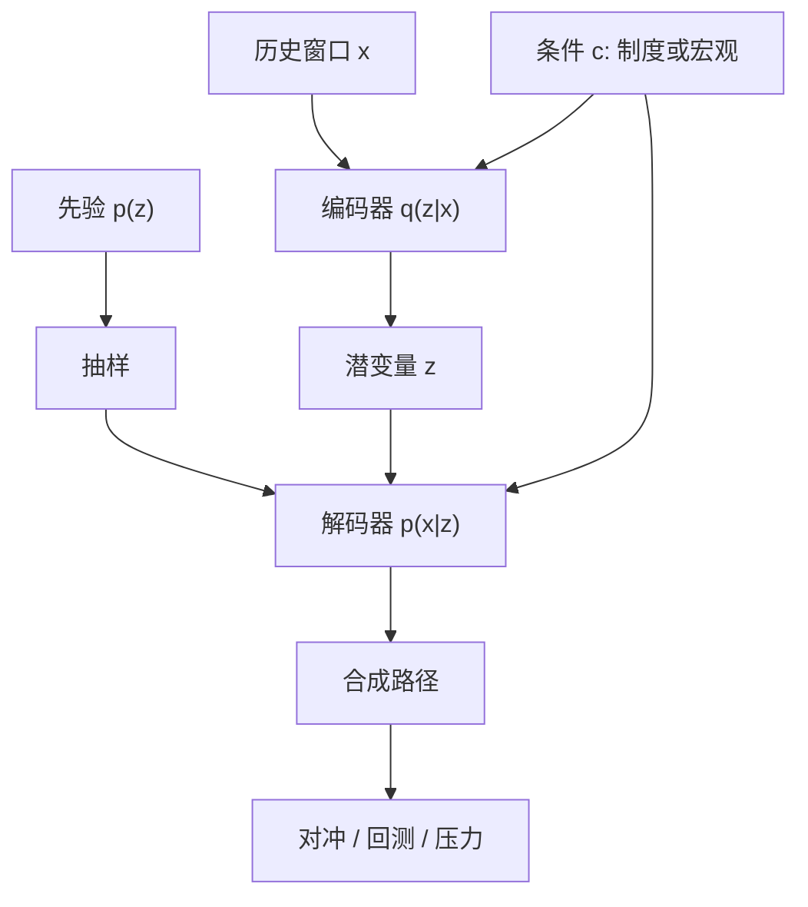

# Market Generator（VAE）

    
把一段市场轨迹压进低维潜变量，再从先验里抽样解码：生成器学的不是下一日的点预测，而是与历史同分布的情景族，供压力、对冲与回测去消耗。

    <footer>—— Kondratyev and Schwarz, The Market Generator, Risk, 2019；VAE 骨架见 Kingma and Welling, ICLR 2014</footer>

历史样本只有一条。对冲、[回测过拟合](/quant/backtest-overfitting) 检验、流动性压力，都需要「像真的、但不是那一条」的路径。经典做法是指定 [Heston](/quant/heston) 或局部波动，校准后再 [蒙特卡洛](/quant/mc-pricing)。Market Generator 把这条链倒过来：不先写 SDE，而用生成模型直接拟合路径测度。变分自编码器（VAE）是其中一条可训练、可条件化、潜空间可解释的路线。本篇写窗口如何进编码器、ELBO 与金融约束如何打架、以及它与 [Sig-Wasserstein GAN](/quant/sig-wasserstein-gan)、[Neural SDE](/quant/neural-sde) 的分工；不把 GAN 训练技巧再写一遍，也不把评估清单留给 [生成式回测的评估](/quant/generative-backtest-eval) 之外的即兴指标。

## 问题

设 $x$ 是一段已实现对象：日收益窗口、隐含波动切片、或订单流计数。真实测度 $\mathbb{P}$ 未知，样本 $\{x^{(i)}\}$ 有限且高度依赖。参数模型把 $\mathbb{P}$ 限制在一个薄流形上，校准残差会变成生成器的系统性偏差。非参数复制历史又无法回答「没发生过的几天」。生成式模型要的是一个可抽样的 $\widehat{\mathbb{P}}$，使下游任务——风险因子情景、[Deep Hedging](/quant/deep-hedging-buehler) 的模拟器、策略压力——在 $\widehat{\mathbb{P}}$ 上的表现能外推到 $\mathbb{P}$。

VAE 把 $x$ 写成 $p_\theta(x\mid z)\,p(z)$。编码器 $q_\phi(z\mid x)$ 近似后验。训练最大化证据下界（ELBO）

$$
\mathcal{L}(\theta,\phi)=\mathbb{E}_{q_\phi(z\mid x)}\bigl[\log p_\theta(x\mid z)\bigr]-\mathrm{KL}\bigl(q_\phi(z\mid x)\,\|\,p(z)\bigr).
$$

第一项逼重建，第二项把后验拉向先验，使无条件抽样合法。市场数据的麻烦是：重建损失若用高斯似然，会抹掉肥尾与波动聚集；KL 若过强，潜空间塌缩，情景多样性不够用。

### 窗口、重叠与「一条历史」

金融时间序列不是 i.i.d. 图片。把长轨迹切成长度为 $L$ 的窗口，相邻窗高度重叠，编码器看到的有效样本量被序列相关夸大。切太短，学不到聚集；切太长，样本数崩掉，潜变量被迫编码「哪一段日历」。Kondratyev 与 Schwarz 的市场生成器把收益率或风险因子的经验分布当作要复制的对象，强调的是情景集合而非逐步预测。工程上必须把窗口抽样方案写进实验记录：步长、是否按波动制度分层、是否丢掉危机段再单独条件化。否则 ELBO 好看，只是在背那一条路径。

VAE 的 $z$ 不是「隐因子」的因果识别。它是为了让解码器可抽样而引入的坐标。把 $z$ 的某一维解释成 HML 或期限溢价，需要额外的探针与冻结实验，不能从网络结构直接读出。

## 方法

**编码对象。** 常见输入是标准化对数收益、已实现波动与杠杆相关的联合窗口，或香草隐含点的截面。解码器输出同维向量，或输出逐步条件均值与方差再自回归展开。后者更像条件密度，前者更像「整段情景一次生成」。对冲模拟器通常需要整段一致的路径，一次生成更省事；若要在线续写，自回归解码更自然，但误差会累积。

**似然与尾部。** 高斯重建会把跳跃当成噪声抹平。实践上换 Student-$t$ 解码、分位数损失，或对收益做概率积分变换后再走高斯 VAE。波动必须保持正：在解码器末层用 softplus，或对 $\log\sigma$ 建模。无套利约束更硬——生成的期权切片若出现负蝶式，下游定价会立刻坏掉；可在解码后投影到允许集，或把凸性惩罚加进损失。那已经不是纯似然，是带约束的生成。

**条件化。** 无条件 VAE 适合「再要一千条像过去二十年的路径」。压力测试需要 $p(x\mid c)$：$c$ 可以是 VIX 分位、加息状态、或「已实现波动高于某阈」。条件 VAE 把 $c$ 拼进编码器与解码器；分类器自由变分（CVAE）是常用实现。条件不能泄漏未来：若 $c$ 含有窗口内部才知道的统计量，生成器就在作弊，回测不可用。

### 潜空间正则：$\beta$-VAE 与崩溃

标准 ELBO 里 KL 权重为 1。$\beta$-VAE 把 KL 乘上 $\beta$。$\beta$ 大，潜空间更接近先验、更好抽，但重建变糊，肥尾与杠杆效应消失；$\beta$ 小，重建好，却出现「只在训练窗附近能解码」的孔洞，先验抽样会打出非市场路径。金融里宁可要略糊但可抽的情景，也不要过拟合的完美重建——完美重建往往是记忆。监控手段是：从 $p(z)$ 抽 $z$，解码后检查自相关、杠杆相关、波动聚集是否仍在；再检查后验聚合是否覆盖先验（否则先验抽样越界）。

## 机制

VAE 把「像不像市场」拆成两件事：给定这段历史，后验 $q(z\mid x)$ 能否定位到一小块潜空间；给定先验里的 $z$，解码器能否吐出合法轨迹。第一件事保证压缩，第二件事保证生成。市场数据峰度高、依赖长，高斯潜变量加浅解码器表达力不够，网络会把危机压缩成潜空间里的孤岛；先验抽样几乎抽不到孤岛，于是生成器在平静期很像，在压力期不像。这不是优化没收敛，是测度支撑没对齐。

与对抗训练相比，VAE 有显式密度（至少在解码器假设下）和可编码的后验，适合做「把今日窗口映到 $z$，再在邻域扰动」的局部情景。GAN 类生成器往往样本更锐，但模式崩塌时会丢掉稀有制度，而稀有制度正是对冲残差最值钱的区域。Signature 把路径映到矩特征再配 [Wasserstein](/quant/sig-wasserstein-gan)，改的是距离，不是编码器结构；[Neural SDE](/quant/neural-sde) 则把生成器限制为扩散，先验是布朗，路径正则性有保证，但跳跃与隔夜缺口要另接。VAE 更像万能容器：约束少，幻觉也多。

### 从因子情景到路径测度

风险部门熟悉的是协方差情景：把因子冲几个标准差。Market Generator 输出的是路径测度，可以保留时序依赖，于是路径依赖支付、[离散对冲误差](/quant/discrete-hedge-error)、成交量同步都能被喂进去。代价是校准对象从「几个相关数」变成「整段过程的弱收敛」，验证必须走过程级统计，而不是只看边际均值方差。把 VAE 样本的截面协方差拿去替换历史协方差矩阵，等于把生成器最有价值的时序结构扔掉了。

重建误差小不代表生成器可用。自编码器在训练窗上本来就该重建得好。有用的是无条件或条件先验抽样的路径，是否通过过程级的双样本检验，以及下游策略排名是否随生成器种子稳定。

## 边界与工程取舍

VAE 不提供无套利保证。生成的现货与期权可以彼此矛盾；生成的限价簿可以自相交。用作 [Deep Hedging](/quant/deep-hedging-buehler) 模拟器时，对冲网络会利用生成器的伪影——假的可预测性、假的流动性——把样本内风险做成很小。因此生成器必须冻结在对冲训练之前，并用与训练生成器不同的窗口做下游评估，见评估篇。

计算上，卷积或 Transformer 编码器能吃更长窗口，但不改变「一条历史」的根本限制。数据增强（时间扭曲、波动缩放）会改变真实测度，必须声明。潜维选太大，KL 项形同虚设；太小，杠杆与期限结构抢同一坐标。不要把 Market Generator 写成预测模型：它的合法输出是情景，评分应是分布距离与下游决策稳定性，不是下一日 MSE。

RBM 版市场生成器与 VAE 分享「能量/潜变量、可抽样」这一层，不分享反传与条件化的工程。引用 2019 年 Risk 文章时，不要默认网络就是卷积 VAE；那一篇的重点是情景生成这一任务，实现后来才迁到深度生成模型。

把 VAE 接到订单簿 tick，维数与事件型时间会立刻压垮朴素窗口拼接。事件驱动仿真仍是 [规则智能体](/quant/hawkes-trades) 或专门的生成式订单流模型的地盘；VAE 更适合中低频风险因子与收益路径。

## 小结

- Market Generator 用可抽样模型逼近路径测度，VAE 以编码器后验加解码器似然实现情景生成，而不是点预测。
- ELBO 里重建项与 KL 项在肥尾、聚集、可抽性之间权衡；$\beta$ 与似然族必须按下游任务选，不能只看损失。
- 窗口切分、条件变量与无套利投影决定生成器是否泄漏未来、是否合法。
- 潜变量不是已识别的风险因子；先验抽样的过程级统计，才是可用性判据。
- 与 Sig-WGAN、Neural SDE 相比，VAE 约束少、幻觉多，适合中低频情景，不适合冒充微观结构。
- 出处：Kondratyev and Schwarz, *The Market Generator*, Risk, 2019；Kingma and Welling, *Auto-Encoding Variational Bayes*, ICLR 2014；对照 Wiese et al., Quant GANs, 2020。
