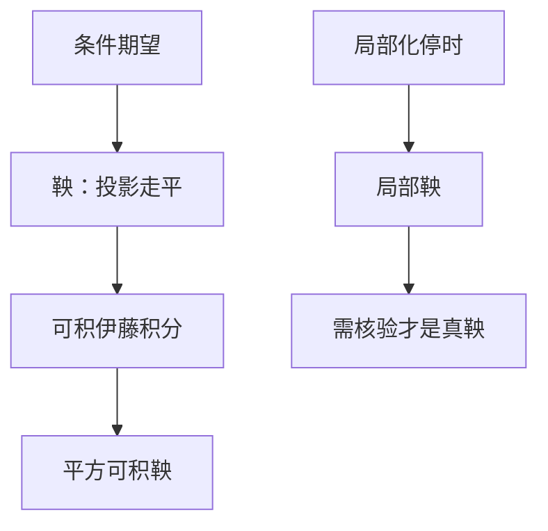

# 鞅与局部鞅

鞅是条件期望沿时间走平的过程：$\mathbb E[M_t\mid\mathcal F_s]=M_s$。伊藤积分在可积条件下是鞅；局部化之后是局部鞅。

<footer>—— 据 Karatzas and Shreve, 1991, 第 1、3 章；Shreve, Stochastic Calculus for Finance II, 2004, 第 4 章整理</footer>

上一课[条件期望作为投影](/quant/conditional-expectation-proj)给出了 $\mathbb E[\,\cdot\mid\mathcal G]$。缺口是把它沿信息流 $\{\mathcal F_t\}$ 排成过程，得到「公平游戏」的精确定义。没有鞅，风险中性定价只是一句口号：贴现资产为何该走平，还没有对象。本课只定义鞅与局部鞅，并声明伊藤积分落在哪一类。

## 问题

投影已经会做。缺口是时间一致性：对 $s<t$，今天对 $M_t$ 的预测应等于今天已经看到的 $M_s$，否则中间可以插入一个有偏的增量。适应、可积、加上这条投影关系，就是鞅。定价里还要处理 $\int\sigma S\,\mathrm d W$ 这类未必可积的积分——它往往只是局部鞅。把两者混成「都是公平游戏」，Girsanov 的指数过程何时真是鞅会说不清。

### 局部鞅不是「差一点的鞅」

局部鞅是：存在停时 $\tau_n\uparrow\infty$，使 $M^{\tau_n}$ 为鞅。它可以有漂移假象：正局部鞅若不是一致可积，期望可以严格下降（严格局部鞅）。金融里「贴现股票在 $Q$ 下是鞅」必须核验可积，不能只看到 SDE 没有 $\mathrm d t$ 项就下结论。本课先把定义分开，核验留给换测度课。

连续局部鞅加上 $[M]_t=t$，Levy 刻画说它是布朗运动。二次变差课留下的接口，在这里收口。

## 方法

过程 $M$ 适应、可积，若对 $s\le t$ 有 $\mathbb E[M_t\mid\mathcal F_s]=M_s$，则称鞅。上鞅把等号换成 $\le$（期望下降），下鞅相反。布朗运动是鞅；$\mathrm e^{\sigma W_t-\frac12\sigma^2 t}$ 在 Novikov 条件下是鞅。有限变差的补偿子把下鞅拆成鞅加增过程（Doob–Meyer），本课只需要：定价时把有补偿的部分叫漂移，无补偿的叫鞅部分。

伊藤积分 $\int_0^t H\,\mathrm d W$：若 $\mathbb E\int H^2<\infty$，则是平方可积鞅，且 $[\int H\,\mathrm d W]=\int H^2\,\mathrm d t$。若只有 $\int H^2<\infty$ a.s.，则是连续局部鞅。GBM 的随机项 $\int\sigma S\,\mathrm d W$ 先作为局部鞅出现；在真实测度下 $S$ 本身一般不是鞅，因为还有 $\mu S\,\mathrm d t$。

## 机制

塔性自动给出多期一致性：从 $t$ 投影到 $s$ 再投影到 $u$，等于一次投影到 $u$。这就是「没有可预见的漂移」。二次变差描述的是鞅部分的「能量」：连续鞅被 $[M]$ 唯一确定到一个布朗时变（Dambis–Dubins–Schwarz），本课不证，只用来读 $[M]$：没有二次变差就没有连续鞅噪声。

严格局部鞅在气泡模型里出现：价格可以是正局部鞅而期望下降。主干定价假设 Novikov 或 Kaza­maki，把指数局部鞅升级为鞅，从而 Girsanov 合法。后课换测度时默认已经做过这次升级。

## 边界

本课不证可选抽样（下一课），不引入半鞅分解的全部技术。离散时间鞅收敛、连续时间的 UI 条件只作为接口：需要 $\mathbb E[M_\infty\mid\mathcal F_t]=M_t$ 时，必须一致可积。后课默认：无漂移的伊藤积分先当局部鞅；写定价方程时默认已升级为鞅。下一课[停时与可选抽样](/quant/stopping-optional-sampling)处理「何时停下来仍然公平」。

## 小结

- 鞅：适应、可积、条件期望走平。
- 可积伊藤积分是鞅；一般只保证局部鞅。
- 局部鞅需核验，不能从「SDE 无漂移」直接当鞅。
- 连续局部鞅的能量由二次变差给出。
- 出处：Karatzas–Shreve 第 1、3 章；Shreve SDE II 第 4 章。
