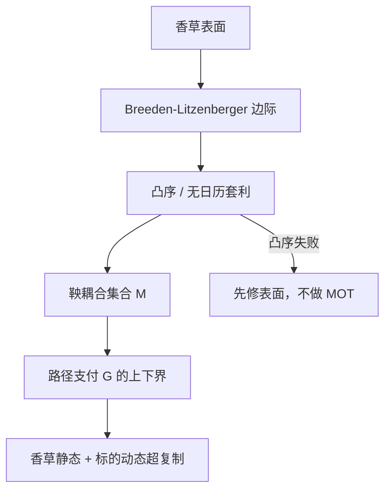

# Martingale Optimal Transport

在给定终端边际的所有鞅测度上取期权支付的上下界，就是带鞅约束的最优传输；界由香草表面钉住，中间的路径依赖支付被夹在可复制与不可复制之间。

<footer>—— Beiglböck, Henry-Labordère and Penkner, Model-independent bounds for option prices—a mass transport approach, Finance and Stochastics, 2013</footer>

香草期权在固定到期把风险中性边际 $\mu_T$ 几乎钉死，这是 Breeden–Litzenberger 的二阶导。路径依赖、美式、或两个到期之间的联合，则还取决于边际之间如何耦合。不选 Heston、不选局部波动，只要求价格过程是鞅（或贴现鞅），问某支付 $G$ 的无模型上、下界——这就是鞅最优传输（Martingale Optimal Transport, MOT）。Beiglböck、Henry-Labordère 与 Penkner（2013）把该问题写成带鞅约束的质量传输，并给出对偶：上界等于用香草与动态持有标的去复制的最便宜超复制。本篇写边际、鞅约束、与 [无套利波动曲面](/quant/gatheral-arb-free) 的接口。对象是公开香草表面给出的模型无关界，不是去找一个「正确」的随机波动参数。

## 问题

设 $S$ 为贴现后的标的（利率为零的叙述下即价格本身），$\mathbb{E}[S_T]=\mathbb{E}[S_0]$，$S_T\sim\mu_T$，其中 $\mu_T$ 由到期 $T$ 的香草带恢复。对支付 $G(S_{t_1},\ldots,S_{t_n})$ 或 $G(S_T)$ 的函数型，模型无关上界是

$$
\overline{G}=\sup_{\mathbb{P}\in\mathcal{M}(\mu)}\mathbb{E}^{\mathbb{P}}[G],
$$

$\mathcal{M}(\mu)$ 为具有给定边际、且 $S$ 为鞅的概率集合。下界对偶地取 inf。没有鞅约束的普通最优传输会给出更宽的界——质量可以任意耦合，均值可以漂移——那对衍生品定价过宽，因为无套利要求贴现价格为鞅。MOT 的难点正是这道约束：耦合既要匹配边际，又要满足 $\mathbb{E}[S_{t_{k+1}}\mid\mathcal{F}_{t_k}]=S_{t_k}$。

第二句话是可交易性。对偶一旦成立，上界对应一个由香草静态仓位加标的动态交易组成的超复制；若市场只能交易离散执行价、还有买卖价差，界要放宽。把 MOT 数字当成可执行套利，必须扣掉表面本身的无套利修补，见 Gatheral–Jacquier 一类 [无套利表面](/quant/gatheral-arb-free) 与 [SVI](/quant/svi-ssvi)。

### 边际来自香草，耦合不是

单一到期的欧式支付 $g(S_T)$ 的价格被 $\mu_T$ 完全决定（积分 $\int g\,d\mu_T$），MOT 无事可做。一旦 $G$ 依赖两个到期，或依赖运行中的最大最小、或依赖亚式平均，就需要联合律。局部波动模型挑选一种特定耦合（由扩散系数钉住的马尔可夫核）；随机波动挑选另一种。MOT 不挑选，只对所有鞅耦合取极端。因此 MOT 界包含一切无套利模型的价格，也因此往往很宽——宽不是计算失败，是信息不足：香草没说路径。

Breeden–Litzenberger 从香草恢复的是风险中性密度，前提是表面无日历与蝶式套利。输入一个自身已套利的微笑，MOT 的可行集可能是空的。先把表面投影到无套利，再做传输。

## 方法

**两点边际。** 最清晰的教科书情形：给定 $\mu,\nu$ 为 $S_{t}$ 与 $S_{T}$ 的分布，$t\lt T$，求 $\sup\mathbb{E}[G(S_t,S_T)]$ 使 $S$ 为鞅且边际匹配。Beiglböck–Henry-Labordère–Penkner 把原问题写成传输计划 $\pi(dx,dy)$ 上的线性规划，约束含 $\int y\,\pi(dy\mid x)=x$。对偶变量对应香草的静态仓位与可测的对冲策略。数值上可用离散化的 LP，或用 Skorokhod 嵌入等结构在一维上找最优耦合（左凸序、凸序是鞅耦合存在的经典条件：$\nu$ 必须凸序大于 $\mu$，否则不存在连接二者的鞅）。

**凸序检验。** 若较后的边际在凸序上并不大于较前的，香草表面已经蕴含日历套利，任何 MOT 都不应再求界，应先回到表面校准。这与 Dupire 局部波动要求期限结构可嵌入同一扩散是同一经济：不能把后到期的风险中性分布做得「更不分散」却仍是鞅。

**路径依赖。** 障碍、回望、方差交换的离散版本，都可以写成 $G$ 对路径泛函。界的宽窄取决于 $G$ 对耦合的敏感度。方差类支付往往对二次变差敏感，而仅有终端边际时二次变差几乎未被钉住，MOT 上界可以接近平凡（用极端振荡的鞅）。这时需要更多输入：方差互换报价、或中间到期的香草，把 $\mathcal{M}$ 缩小。信息集决定界的有用性。

### 对偶：超复制与次复制

上界等于 $\inf\{$静态香草成本 $+$ 动态对冲的可接受剩余$\}$，使得对一切鞅路径支付 $\ge G$。这把「模型无关」翻译成交易语言：你能用今天的香草簿加上可预测的 Delta 去包住 $G$，成本就是上界。买卖价差、保证金、离散对冲误差使真实超复制更贵。MOT 数字是零价差、连续或指定离散交易日、无缺口的理想界。工程报告应同时给理想 MOT 界与加价差后的可执行界。

## 机制

最优传输选择最昂贵（或最便宜）的耦合。没有鞅约束时，最优往往是单调分位数耦合（Hoeffding–Fréchet）。有鞅约束后，质量必须「往返」以保持条件期望，最优耦合呈现 tent / 左-右curtain 一类结构（一维 MOT 的典型图景）。经济含义是：最坏定价者在边际允许的范围内，把标的在中间时刻尽量推到对 $G$ 最不利的位置，同时保证还能在期末回到 $\mu_T$。这与「选一个波动模型把路径走得最毒」是同一件事的线性规划版。

与 [Heston](/quant/heston) 对照：Heston 给出一个内点价格；MOT 给出所有鞅模型的包络。若 Heston 价格贴近 MOT 上界，说明该支付的风险几乎已被香草决定，模型风险小；若落在区间中央且区间很宽，说明你在对未被香草观察的耦合下注，应加买更多香草或方差产品去缩界，而不是微调 $\kappa,\rho$。

### 离散到期与连续时间

实务只有有限到期的香草，MOT 在这些时刻上做多边际鞅传输。时刻之间的路径仍自由，障碍的连续监控会被高估或低估，取决于你是否把监控点放进边际列表。这与障碍的离散/连续监控基差是同一空隙，见障碍类产品的工程处理：要么买入更多中间到期香草，要么承认界针对离散监控。连续时间 MOT 与嵌入问题相连，理论强，但输入仍只能是你能交易的表面。

一维 MOT 相对干净；多标的 MOT（篮子、价差期权）需要联合香草或交叉香草，否则边际乘积加上各成分鞅，界极宽。没有交易的指数期权表面时，对篮子做 MOT 更多是教学装置。

## 边界与工程取舍

不要在有蝶式套利的表面上跑 MOT。不要把 MOT 上界当成可卖出的报价——那是零摩擦超复制。不要用 MOT 替代校准：它回答「香草已决定多少」，不回答「市场用哪一个耦合」。利率、分红、借券使「鞅」要写在远期或总回报过程上，币本位与现金本位的比特币期权（见 [DVOL](/quant/deribit-dvol)）不是同一鞅。跳跃存在时，鞅约束仍成立，但最优耦合的结构改变；局部扩散的 curtain 图不能原样搬到有跳的市场上。

Beiglböck、Nutz 与 Touzi 等后续工作把对偶在更弱条件下补全。工程上优先保证：输入表面无套利、凸序成立、支付 $G$ 的监控网格与可交易到期一致。界太宽时，正确反应是增加可交易工具进信息集，而不是换一个更紧的模型假装信息变多。

出处：Beiglböck, Henry-Labordère and Penkner, *Finance and Stochastics*, 2013。对偶补全见 Beiglböck, Nutz and Touzi。边际恢复见 Breeden and Litzenberger。无套利表面见 Gatheral 及相关条目。Hobson 的 Skorokhod 嵌入是 MOT 的前身直觉。

## 小结

- MOT 在给定香草边际的全体鞅测度上取路径支付的上下界，是带鞅约束的最优传输。
- Beiglböck–Henry-Labordère–Penkner（2013）给出传输原问题与超复制对偶；凸序是鞅耦合存在的条件。
- 单到期欧式被边际钉死；多到期与路径依赖才需要 MOT，界的宽度等于香草未观察的耦合风险。
- 输入表面必须先无套利；否则可行集为空或界无意义。
- 可执行性须另加价差与离散对冲；理想 MOT 数字不是自动的套利利润。
- 出处：Beiglböck, Henry-Labordère and Penkner, 2013；Beiglböck, Nutz and Touzi；Breeden–Litzenberger。
