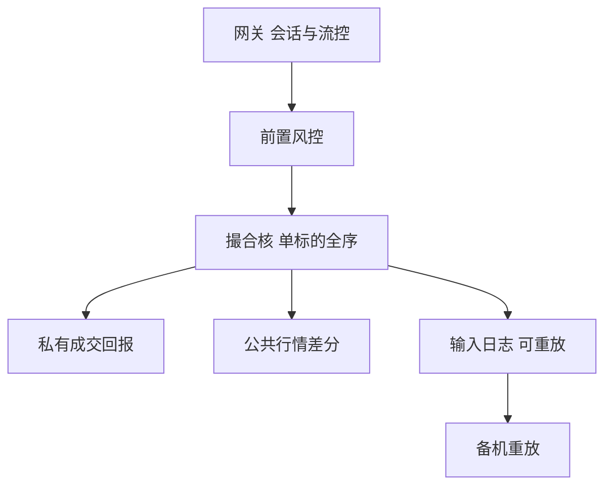

# 撮合引擎架构

连续市场上的成交不是「双方谈妥」的结果，而是一台按价格–时间（或比例）优先规则运行的确定性状态机：输入是报文，输出是成交、剩余与行情。

<footer>—— 据 Harris, Trading and Exchanges 对电子撮合与优先规则的论述；对照 Budish, Cramton and Shim, The High-Frequency Trading Arms Race, QJE, 2015</footer>

[上一课](/quant/ratio-sampling-error)把组合课序收在业绩比率的抽样误差：策略评价假设有一笔可执行的成交。本课打开课程「交易所、数据与工程」。缺口不是再讲[限价簿几何](/quant/lob-structure)，而是**那张簿在主机里如何被一台引擎推进**：单线程还是分片、确定性重放、故障切换、与清算的边界。后课从引擎的输出重建簿、再接到报文协议。后课默认已经读完本课对架构的约定。

## 问题

策略层看见的是 BBO 与成交打印。引擎层看见的是：报文到达网关、校验、进入撮合核、按优先规则改写订单容器、向外发成交回报与行情。Harris 把优先规则写成市场设计对象；实现上它必须是**可重放的函数**——同一输入序列必须得到同一成交序列，否则监管审计、灾备切换与客户争议无法裁决。问题是：如何把「一台逻辑引擎」映射到物理进程，而不破坏价格–时间优先。

分片是第一道工程选择。按标的分片（symbol partitioning）让每只证券有独立的撮合线程，跨标的没有全局时间优先，这与连续 LOB 的定义一致：优先权本来就是本簿的。按价格档分片则危险：同一标的的买卖必须看见彼此，否则交叉无法原子消除。Budish、Cramton 与 Shim（2015）指出连续簿把时间竞争压到微秒；架构若再引入跨核锁与不确定调度，优先规则会从「先到先得」退化成「调度器先得」。

### 确定性比峰值吞吐更优先

撮合核通常是单线程、无锁、忙轮询：所有改簿操作排成一条全序。网关可以多进程收包，但进入核之前必须序列化。多核「并行撮合同一标的」只有在能证明不破坏全序时才合法，实务上几乎不做。峰值吞吐靠的是：核内数据结构（价位图 + 每档 FIFO）、报文预解析、以及把行情发布移出核的关键路径。把撮合写成普通数据库事务，延迟与抖动都会毁掉时间优先的经济含义。

上交所、深交所、纳斯达克、CME 的产品名不同，逻辑同构：一个标的一条全序事件流。A 股还有集合竞价与涨跌停状态机，核必须切换规则，而不是另起一套簿。连续时段的优先仍见限价簿课，本课不重写阶梯图。

## 方法

把引擎拆成四段管道，界限必须可观测。**网关**：会话、鉴权、流控、会话层序号。**风险前置**：资金、持仓、涨跌幅、自成交（self-match prevention）。**撮合核**：对单个标的应用 add / execute / cancel / replace，输出成交与簿状态差分。**发布**：成交回报走私有通道，行情走公共馈送，两者的字段必须能对上同一引擎序号。研究用的「交易所时间戳」应取核内事件时间，而不是网关收包时间——后课时钟课会把这三套戳拆开。

灾备：热备机用同一输入日志重放，切主时以日志序号为权威。若主备用锁步（lock-step）双写，必须定义「以谁的成交为准」；若用主写备追，切换窗口内的未确认订单要按规则撤销或重放。架构文档里「RPO=0」只在输入日志先落盘再撮合时成立，而这会把磁盘写进关键路径——多数现货引擎选择内存撮合 + 异步持久化，于是故障时允许丢失极短窗口并以「未确认视为未成交」收场。这是产品选择，不是实现失误。

### 集合竞价与连续核是同一状态机的两种模式

开收盘拍卖把一段时间的申报收成一次出清，连续时段把每笔申报立即匹配。两者共享订单容器，切换的是匹配函数。把拍卖做成独立系统、收盘后再灌进连续核，容易在拍卖成交与连续簿之间丢掉序号。正确的接口是：模式标志进入同一全序，匹配函数按标志跳转。A 股 9:20 后不可撤、涨跌停锁定，都是核的模式，不是行情层的装饰。

## 机制

时间优先的经济内容，依赖于「到达」被定义在撮合核入口而不是光纤入口。主机托管把光纤差压到纳秒后，真正的排序权在核的入队锁与网卡中断。于是出现两条市场：客户以为的 FIFO，以及网卡–内核–用户态之间的调度 FIFO。后课低延迟工程处理第二条；本课只需承认：架构若把撮合核暴露在操作系统调度下，优先规则就不是合同里写的那一条。

成交与行情必须同源。核每改一次簿，应分配单调的引擎序号；成交回报与行情增量都携带该序号。客户用行情重建的簿，若与自己的成交回报冲突，问题在发布管道而不是「行情商算错」。后课重建簿默认：没有引擎序号的馈送，只能得到近似状态。

## 边界

本课不写如何插队、如何利用网卡暂停对手、如何构造自成交。自成交预防与异常申报是交易所规则对象，研究只能把它们当约束。加密资产链上撮合、RFQ 询价、楼层人工撮合不是本课的状态机。跨所智能订单路由发生在引擎之外，见市场分割课，不要把 SOR 画进本所核内。

清算不在撮合核里。引擎输出「成交发生」，中央对手方与存管接收的是已经成交的契约；后课 CCP 与结算失败从这里接走。把保证金计算塞进撮合核，会把风险系统的延迟写进价格形成。

## 小结

- 撮合引擎是单标的全序状态机；优先规则必须可重放，不能交给多核调度。
- 网关、前置风控、核、发布四段要可观测；研究用的时间戳取核内事件时间。
- 集合竞价与连续撮合是同一核的两种模式，不是两套簿。
- 出处：Harris, *Trading and Exchanges*；Budish, Cramton and Shim, *QJE*, 2015。
