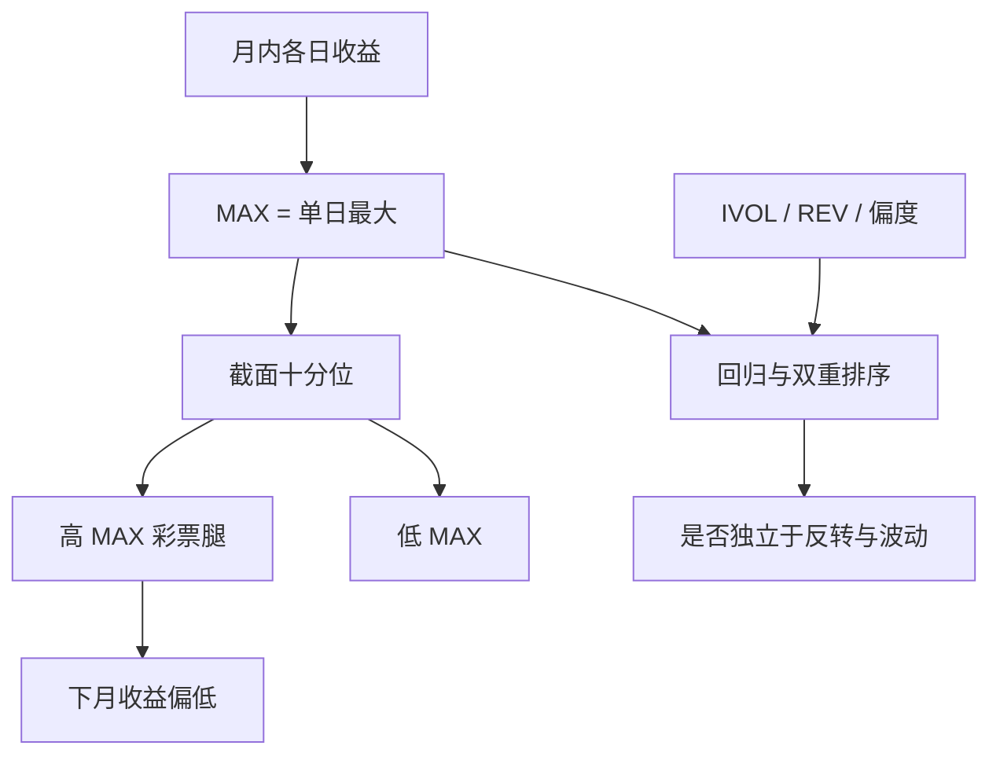

# MAX 极端收益效应

过去一个月里单日最大收益越高的股票，随后平均收益越低；投资者像在买彩票，为那根大阳线支付过高的价格。

<footer>—— Bali, Cakici &amp; Whitelaw, Maxing Out: Stocks as Lotteries and the Cross-Section of Expected Returns, Journal of Financial Economics, 2011</footer>

资产定价习惯用均值、方差、β 说话。Bali、Cakici、Whitelaw（2011）把一个极端的一阶矩放进截面：**MAX**，即过去一个月内日收益的最大值。高 MAX 股票随后显著低收益，低 MAX 随后更高。解释不是「风险低」，而是彩票偏好：累积前景理论下，投资者高估极小概率的巨额正收益，争相持有上月刚刚演示过这种可能的股票，推高价格、压低期望。MAX 与 [IVOL](/quant/ivol-anomaly)、特质偏度、低价股高度共现，是彩票需求最直接的已实现代理。本篇写定义、与反转的切割，以及它为何常在 horse race 里削弱 IVOL。

## 问题

若投资者只关心均值方差，上月某日涨了 30% 不应当系统性地预测下月为负——那根阳线已经过去。若投资者把股票当成彩票，上月的 MAX 是 salience：它提醒「这种事会发生」，需求在注意力驱动下上升。问题是测量与识别。MAX 几乎必然与上月收益、IVOL、偏度同向变动；一个月反转已经预测高上月收益者下月更弱。MAX 必须在控制这些变量之后仍然有斜率，才能称作独立的极端收益效应，而不是反转的另一个名字。

理论锚点是 Barberis 与 Huang（2008）把累积前景理论应用到正偏证券：投资者为偏度付费，正偏资产期望收益更低。MAX 不是偏度的解析估计，它是最粗糙、最可复制的「已经实现过的左尾反向」——单日最大涨幅。正是这种粗糙，使它在零售交易、低价股、高换手的子集里特别强。

### 用几天的 MAX 还是一天的 MAX

原文主度量是过去一个月内**单日**最大收益。稳健性用最大两日、三日之和或均值，结论通常同向，但经济幅度在「只用那一个最极端日」时最大。这符合注意力：投资者记得的是那根柱子，不是三日平均。用盘中最高价相对开盘的涨幅去替代日收盘收益，会混进开盘跳空与盘中噪声，不再是 2011 年的对象。用月内最大周收益会变钝，更接近动量而不是彩票。

MAX 对异常事件极度敏感：重组预期、摘帽、偶发的巨额订单、错误成交。清洗规则必须预先写死。事后剔除「不合理」的大涨，等于在样本里删掉彩票本身，溢价会被洗没。

## 方法

对股票 $i$ 在月份 $t$，

$$
\mathrm{MAX}_{i,t}=\max_{d\in t} R_{id}.
$$

月末按 MAX 排序，等权或价值加权十分位，持有下月。Bali 等的主结果在等权、全股票宇宙上最强；加入规模过滤或价值加权后减弱。回归里同时放入 MAX、IVOL、REV（上月收益）、偏度、换手、价格，MAX 的斜率往往仍然为负，且常使 IVOL 的斜率变弱甚至不显著。这被读成：IVOL 异象在相当程度上是「上月有过极端正收益」的股票被当成彩票。

双重排序：先按 IVOL 再按 MAX，或反过来。若 MAX 在 IVOL 组内仍单调，说明它不是单纯的二阶矩；若 IVOL 在 MAX 组内消失，说明二阶矩的定价来自极端正收益那一端，而不是对称的波动。经验上后一种模式经常出现，但并非所有市场、所有加权都如此。应报告两张双重表，而不是只保留好看的一张。

### 与短期反转如何分开

REV 用上月累计收益；MAX 用上月单日最大。一只股票可以月内先大涨再跌回，MAX 高而 REV 平庸；也可以平稳上涨，REV 高而 MAX 不高。两者相关为正，但不是 1。控制 REV 之后 MAX 仍负，说明市场惩罚的是「演示过彩票性质」，而不只是「上个月赚了很多」。反过来，MAX 组里的高换手与零售净买入，是需求侧证据：不是风险上升，是人在买。

价值加权与大盘过滤会削弱 MAX，因为彩票需求集中在小盘低价。这与「异象是否真实」不是同一问题：真实的错误定价可以没有容量。写成因子产品时必须用可投资宇宙，并计入交易成本——MAX 策略换手接近月度全换，单日大涨之后的股票往往流动性差、价差宽，账面 t 值几乎不可交易。

## 机制

累积前景理论对尾部概率超估，使正偏彩票在均衡里价格偏高、期望收益偏低。注意力把「可得到的彩票」锚定在最近演示过极端收益的股票上，于是 MAX 成为一个条件需求冲击：这个月的 MAX 高，下个月的持有者已经付过溢价。零售客户、期权市场上的虚值 call、低价股的换手，是同一机制的不同观测。机构若受基准与回撤约束，不会去填补这侧的空头，卖空约束再把高估维持到下个月。

风险解释几乎走不通。高 MAX 股票随后波动仍然高，若补偿波动，收益应更高而非更低。它们的市场 β 也不低。把它解释成「财务困境」与事实不符：上月刚出现过大阳线的公司，并不都是困境债；其中大量是主题炒作与注意力股票。更接近的是：MAX 抓的是需求，不是杠杆或违约。

### 为何 MAX 常「赢过」IVOL

IVOL 对正负残差对称：大跌和大涨都抬高 IVOL。彩票需求主要为**右尾**付费。MAX 只看右尾，于是更贴近偏好。一只上月暴跌的股票 IVOL 高、MAX 不一定高，它更像被抛售而非被当作彩票；其后续收益受反转、压力与卖空回补影响，符号不一定与高 MAX 相同。把两者捆成「波动异象」会把左尾压力与右尾投机加总，机制被搅浑。研究上应分开报告正半波动、负半波动与 MAX；交易上若已经做空高 MAX，再做空高 IVOL 往往重复同一组主题股。

MAX 效应在情绪高涨期、零售交易活跃期更强，这与 Baker–Wurgler 的「难以套利的股票在高情绪后收益低」一致。MAX 是个股特征，情绪是时序状态，两者相乘才是完整的需求故事。

## 边界与工程取舍

定义依赖日频收盘。分红、拆股必须用调整后收益，否则拆股日会制造假 MAX。涨跌停使 MAX 被截断：A 股上「涨停」把许多不同强度的彩票压成同一个数字，排序分辨率下降；应用涨停次数、封单或打开次数作为补充，但那已不是 Bali 等的 MAX。开盘集合竞价把隔夜信息写进第一笔，MAX 可能只是隔夜跳空——此时它与 [隔夜 alpha](/quant/overnight-intraday-alpha) 重叠，应拆开盘跳与日内最大来看。

不要把 MAX 做成日度信号还引用 2011 年的月度 t 值。不要在因子模型里加入一个「MAX 因子」却用等权微型股去解释大盘组合的 α。不要清洗掉停牌后复牌的一字涨停又声称复制失败——那正是样本里最彩票的观测。国际复制需处理不同的涨跌幅限制与最小报价单位；限制越严，MAX 的截面方差越小，效应越弱。

容量与拥挤：可交易的 MAX 空头是有期权、可借券的中盘主题股，账面十分位里的微型股必须丢掉。即使如此，主题退潮时流动性一起消失，空头腿的实现与纸面差距最大。MAX 更适合作为**其他因子的控制与诊断**（这只股票是不是在被当彩票炒），而不是作为一个单独的、高换手的风险因子去杠杆化配置。

出处：Bali, Cakici & Whitelaw, *Journal of Financial Economics*, 2011。理论见 Barberis & Huang, 2008。IVOL 见 Ang et al., 2006。彩票因子的多空构造见后续 lottery-demand 文献，不要把 MAX 特征直接叫做那个因子。

## 小结

- MAX 是过去一个月单日最大收益；高 MAX 随后低收益，解释是彩票偏好与注意力，不是波动补偿。
- 与 IVOL、REV、偏度相关但更盯右尾；双重排序与回归里常削弱 IVOL。
- 等权、小盘、低价上最强；价值加权与可投资过滤后变薄，换手极高。
- 涨跌停、拆股、隔夜跳空会改变度量含义；清洗规则不能事后删彩票。
- 宜作诊断与控制，不宜当作高杠杆的独立风格。
- 出处：Bali, Cakici & Whitelaw, *JFE*, 2011。
