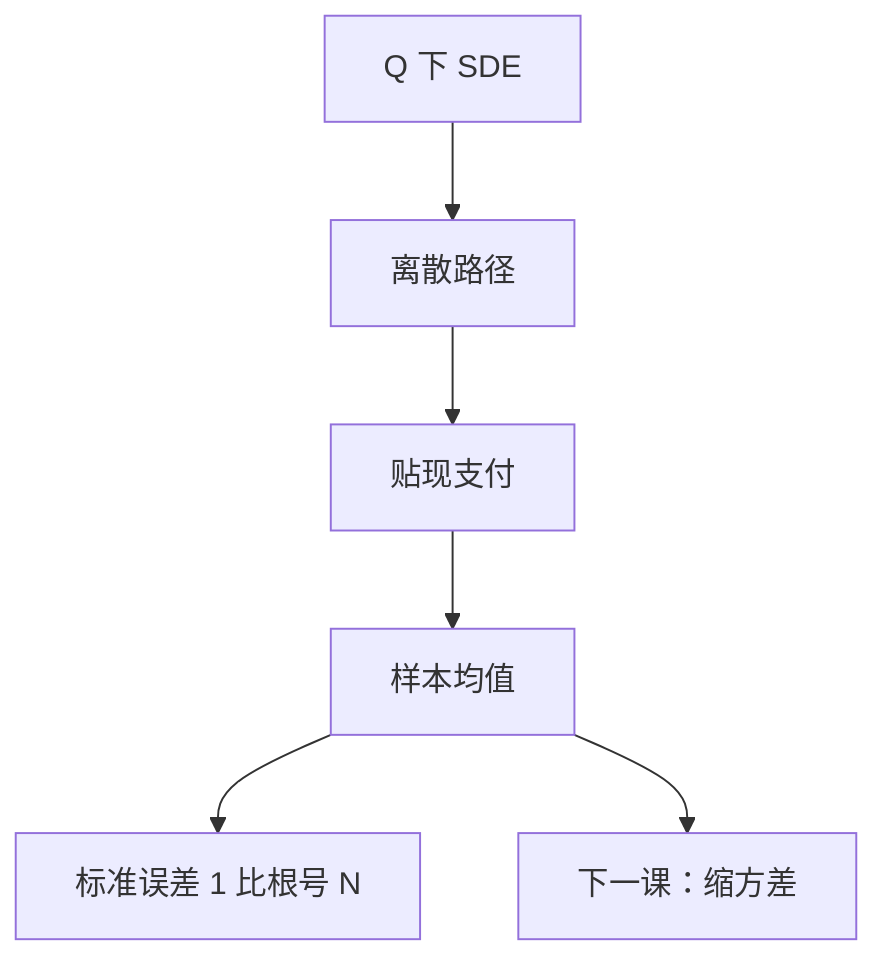

# 蒙特卡洛路径

风险中性价格是期望。用独立路径的样本均值去估这个期望：先按 SDE 造 $\{S^{(n)}\}$，再平均贴现支付。

<footer>—— 据 Glasserman, Monte Carlo Methods in Financial Engineering, 2003, 第 1–3 章；Shreve, Stochastic Calculus for Finance II, 第 5 章整理</footer>

上一课[美式提前行权与最优停](/quant/american-optimal-stop)把价格写成停时上的上确界。欧式则仍是普通期望。缺口是计算：PDE 在三维以上或路径依赖时迅速失效。本课只给路径模拟接口——从 SDE 到样本均值、偏差与方差的分解——不把方差缩减做完，那是下一课。本课程是定价数学，不是权重量化，也不在这里写限价簿撮合。

## 问题

$V=\mathbb E_Q[\mathrm e^{-rT}g(S_{0:T})]$。若能抽样与 $Q$ 一致的路径，大数定律给出 $\bar V_N\to V$。缺口是：抽样必须对准[随机微分方程的含义](/quant/sde-meaning)里的积分方程，而不是随便画折线。GBM 有精确转移；一般 SDE 用 Euler–Maruyama 或 Milstein，离散步长 $h$ 带来弱误差 $O(h)$（Euler）。统计误差另算：方差 $\mathrm{Var}(\xi)/N$，与步长无关。两条误差不能互相拿来当对方的诊断。

路径依赖（亚式、障碍监控）把 $g$ 写成整条离散路径的函数；监控网格必须与合约定义一致，否则估错的是另一个支付。

### 蒙特卡洛不是「在 $P$ 下用历史轨迹重放」

历史只有一条路径，是 $P$ 的实现。定价要的是 $Q$ 下的集合平均。把过去十年股价当 $N=1$ 的样本，没有 $\mu\mapsto r$ 的 Girsanov，估的不是期权价。回测与定价共用「路径」一词，对象不同。

弱收敛管期望的偏差；强收敛管路径与真解的距离。定价通常只需弱阶。对冲若沿同一条 $W$ 比较，才对强解敏感。

## 方法

算法：抽 $Z\sim N(0,I)$；对 GBM 用精确指数映射（几何布朗运动课已写）；否则 $X_{k+1}=X_k+\mu h+\sigma\sqrt{h}Z_k$。支付 $\xi^{(n)}=\mathrm e^{-rT}g(X^{(n)})$，$\hat V=N^{-1}\sum\xi^{(n)}$。标准误差 $\sqrt{s^2/N}$。随机 $r$ 用 $\exp(-\sum r_k h)$ 沿路径贴现，或在 $Q^T$ 下模拟远期。跳：在步内先抽泊松次数再抽跳幅。美式：不能只平均 $g(S_T)$，要在路径上估继续值（Longstaff–Schwartz 是后课可用的名字，本课不实现）。

## 机制

无偏（或弱阶控制的偏差）加独立同分布，中心极限定理给置信区间。瓶颈几乎总是 $\mathrm{Var}(\xi)$：深度虚值使多数路径贡献零，有效样本远小于 $N$。这不是随机数质量问题，是测度与支付不匹配——下一课用对偶、控制变量、重要性采样改这个方差。伪随机与拟随机（Sobol）改收敛速率，仍建立在同一路径对象上。步长 $h$ 与 $N$ 要配套：把 $N$ 加大而 $h$ 粗，会看到标准误下降、点估计却钉在错误的离散价格上。

种子与独立流：对冲差 $\hat V(S+\epsilon)-\hat V(S)$ 必须共用随机数，否则差分被独立噪声淹没。这是路径层的接口，不是新的定价理论。

## 边界

本课不写 GPU 实现，不比较生成器。不把 MC 用于估计限价簿队列。后课默认：欧式期望可用路径均值；误差报标准误；GBM 用精确格式。报价格不报标准误，等于没有完成模拟。下一课[方差缩减](/quant/variance-reduction)在同一批路径对象上降低 $\mathrm{Var}(\xi)$。加路径之前先问方差。本课程随后进入财务报表，不再加定价模型。

## 小结

- MC 估 $Q$ 下贴现支付的期望，不是重放历史。
- 离散偏差与 $1/\sqrt{N}$ 统计误差要分开。
- GBM 用精确指数映射；一般 SDE 用弱阶格式。
- 美式还要估继续值，不能只平均终端支付。
- 对冲差分必须共用同一条随机数。
- 出处：Glasserman, Monte Carlo Methods in Financial Engineering。
