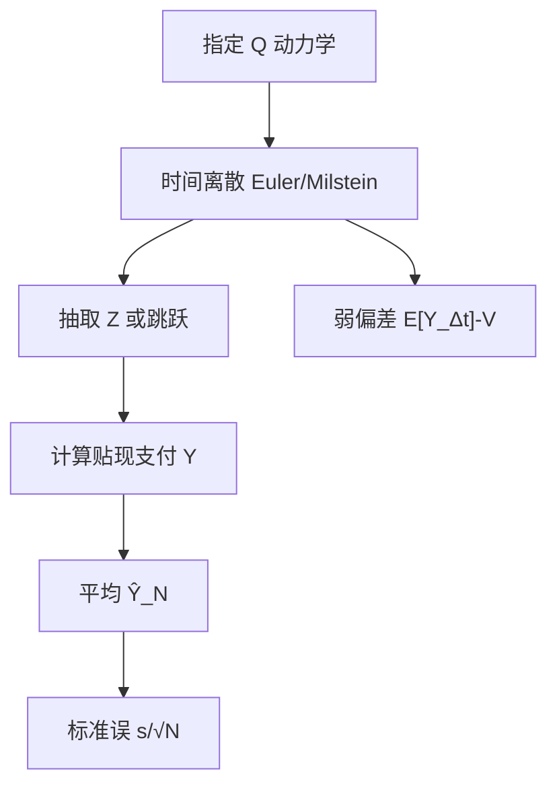

# 蒙特卡洛定价

    
当支付是标的路径的函数而维数又使网格失效时，在风险中性测度下抽取路径、平均贴现支付，即得价格的无偏估计——方差随路径数平方根下降。

    <footer>—— Boyle, Options: A Monte Carlo Approach, Journal of Financial Economics, 1977</footer>

Phelim Boyle 1977 年把蒙特卡洛引进期权：在几何布朗运动下模拟到期价格，平均看涨支付并贴现，数字收敛到 Black-Scholes。想法朴素，却打开了路径依赖与多资产的计算门。此后二十多年，Glasserman 的专著把随机数、离散格式、希腊值、美式与方差缩减收成金融工程的标准工具箱。模拟的对象是 [风险中性](/quant/risk-neutral-pricing) 期望，不是真实测度预测。欧式香草用模拟没有优势——闭式更快更准；模拟的理由是维数、路径泛函、随机波动与跳跃的组合。美式不能直接平均支付，要改策略估计，见 [Longstaff-Schwartz](/quant/american-exercise)。方差缩减单写一篇：[对偶、控制变量、重要性采样](/quant/mc-variance-reduction)。

## 问题

价格是 $V= \mathbb{E}^{\mathbb{Q}}[e^{-rT} f(X_{[0,T]})]$。$X$ 可以是一只股票、一篮子、带随机波动的因子。网格法在状态维数升高时节点数爆炸；树同样。积分若能写成低维期望，抽样比求积更划算。问题是构造无偏（或偏差可控）的估计量 $\hat V$，给出标准误，并在弱条件下保证 $\sqrt{N}(\hat V-V)\to\mathcal{N}(0,\mathrm{Var}(Y))$，其中 $Y$ 是单条路径的贴现支付。还要处理时间离散：连续支付依赖整条路径，模拟只在 $0,\Delta t,\ldots,T$ 取值，Euler 或 Milstein 带来弱收敛阶，偏差与方差必须分开谈。

希腊值是第二句话。价格对 $S_0$、$\sigma$ 的导数若用有限差分再跑两遍 MC，噪声会被差分放大。路径级方法（似然比、路径导数 / IPA）在同一组随机数上求微分，是 Broadie-Glasserman（1996）以来的主题。本篇以价格估计为主，只指出希腊值与模拟共用路径。

### 欧式对数正态的基准

$S_T=S_0\exp\bigl((r-q-\sigma^2/2)T+\sigma\sqrt{T}Z\bigr)$，$Z\sim\mathcal{N}(0,1)$。看涨

$$
\hat C_N = e^{-rT}\frac1N\sum_{i=1}^N \max(S_0 e^{(r-q-\sigma^2/2)T+\sigma\sqrt{T}Z_i}-K,0).
$$

这是 Boyle 的原始做法，无时间离散偏差。标准误是样本标准差除以 $\sqrt{N}$。它应用来核对随机数与贴现，而不是用来「计算」Black-Scholes。任何复杂模型的实现都应先在这一极限上复现公式，再打开路径依赖。

必须在 $\mathbb{Q}$ 下抽样：漂移用 $r-q$，不是历史 $\mu$。用 $\mathbb{P}$ 路径配无风险贴现，得到的是错误的测度下的数字，方差缩减救不了这个偏差。

## 方法

一般步骤：在 $\mathbb{Q}$ 下离散 SDE；抽独立路径；计算支付 $f$；乘贴现（利率随机则沿路径累乘 $e^{-\int r}$）；平均。Euler 格式

$$
X_{t+\Delta t}=X_t + b(X_t)\Delta t + \sigma(X_t)\Delta W_t
$$

弱一阶；Milstein 对扩散加 $\tfrac12\sigma\sigma'( (\Delta W)^2-\Delta t)$ 项，强一阶。Heston 的 CIR 方差要用保正格式（Andersen 2008 的 QE 等），朴素 Euler 会得到负方差。跳跃扩散在时间步上叠加泊松事件。路径依赖：亚式累加观测日的 $S_{t_j}$，回望记录运行最大最小，障碍检查是否触及——离散观察与连续观察不同，连续障碍可用布朗桥在步内补概率，否则有观察偏差。

估计量 $\bar Y_N$ 的误差分解成 $\mathbb{E}[Y_{\Delta t}]-V$（弱偏差）与 $\bar Y_N-\mathbb{E}[Y_{\Delta t}]$（统计误差）。加密 $\Delta t$ 降偏差、加密 $N$ 降方差，二者的计算预算要权衡；多重时间步的 Multilevel Monte Carlo（Giles）把细网格差分成望远镜，常比单层加密更省。

### 随机数与希腊值

伪随机（Mersenne Twister 等）配中心极限定理；拟随机（Sobol'）在合适的维数与 Payne-Walsh 置乱下常更快收敛，但对不连续支付（数字期权、障碍）要平滑或桥接，否则低差异序列的优势打折。同一组 $Z$ 上对 $S_0$ 微调再差分，是 common random numbers，比独立两套路径稳定。路径导数在扩散系数光滑、支付 Lipschitz 时给出无偏 $\Delta$；似然比不要求支付可微，但方差在到期附近可能爆炸。Glasserman 把这些方法写成可核对的算法，而不是口号。

## 机制

大数定律保证平均趋向期望；中心极限定理给出置信区间。支付越不连续、尾部越重，有效方差越大，同样 $N$ 的区间越宽。这是香草看涨比数字期权好模拟、亚式比回望好模拟的原因。维数在 MC 里主要增加每条路径的成本，不指数增加节点，这是相对树的优势；但维数也增加拟随机的有效维，Sobol' 不是免费午餐。

无偏性依赖两件事：测度和离散。测度错则期望错；Euler 在有限 $\Delta t$ 下一般有偏。报告一个 MC 价格而不报标准误、不报 $\Delta t$，等于只报了噪声实现。与树比较：树在低维有结构化偏差但无抽样方差（确定性算法）；MC 在离散格式固定后主要是方差。二者都可以有离散时间偏差。校准后的复杂模型几乎总是 MC：局部波动还可以走 PDE，随机波动加跳跃加篮子就只剩模拟。

置信区间 $\hat V\pm 1.96 s/\sqrt{N}$ 假定 i.i.d. 与有限方差。重要性采样改变了抽样测度，必须用似然比还原，否则区间不是对原期望的。对偶成对相关，有效样本量不是 $2N$ 条独立路径。

### 路径依赖与观察偏差

亚式、回望、障碍的支付依赖整条路径，模拟只在离散时刻取值。离散观察的亚式是市场常见合约，与连续平均不是同一价格。连续障碍若只在 $\Delta t$ 网格上检查，会漏检触及，敲出低估、敲入高估；步内布朗桥给出条件触及概率，偏差降到可接受量级。回望记录离散运行极值，同样偏于连续回望。报告路径产品价格时必须声明观察约定，否则无法与树或 PDE 的连续边界对照。

## 边界

美式最优停时不是路径泛函的朴素平均，直接 MC 会当作欧式。必须嵌套模拟、对偶或 LSMC。严格连续障碍在有限步上有漏检；利率与信用混合的支付对贴现路径敏感，随机 $r$ 必须模拟进去而不能事后用常数 $r$。模型参数来自校准时，MC 的标准误只覆盖抽样，不覆盖参数不确定；把标准误当成「价格风险」会低估。

极端虚值期权支付几乎全是零，朴素 MC 的相对误差可以达到百分之百，这是重要性采样的动机，不是再加两个数量级 $N$ 就能体面解决的。随机波动的相关系数、杠杆效应必须在 Cholesky 或谱分解里正确注入，否则微笑的动态是错的，价格碰巧在香草上校准也不保证路径产品。Boyle 1977 年处理的是单资产欧式；今天的生产代码是同一期望，换了一族更脆的生成器。

Glasserman（2004）是方法书，不是一篇给出新闭式的论文。引用时应指向具体章节：离散格式、VR、美式或希腊值，而不是把整本书当成单一定理。

## 小结

- Boyle（1977）用风险中性抽样平均贴现支付，欧式对数正态上复现 Black-Scholes。
- 模拟服务高维与路径依赖；低维香草应使用闭式、树或 PDE。
- 误差 = 时间离散偏差 + $O(N^{-1/2})$ 统计误差；二者要分开压。
- 必须在 $\mathbb{Q}$ 下用 $r-q$ 漂移；利率随机则贴现沿路径。
- 希腊值优先路径导数或似然比，避免幼稚有限差分放大噪声。
- 美式、连续障碍、深虚值各有专门偏差来源，不能靠加大 $N$ 一笔勾销。
- 出处：Boyle, *Journal of Financial Economics*, 1977；系统论述见 Glasserman, *Monte Carlo Methods in Financial Engineering*, 2004；希腊值见 Broadie and Glasserman, *Management Science*, 1996。
