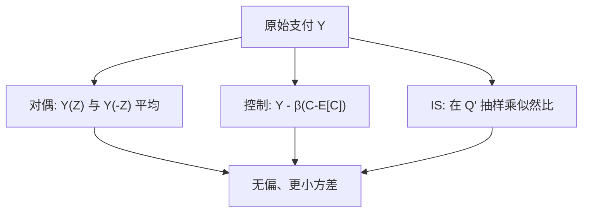

# 对偶、控制变量与重要性采样

    
蒙特卡洛的误差由支付的方差支配；对偶路径、与已知期望的控制变量、以及把抽样移向有贡献的区域，可以在不改变期望的前提下把方差压下去。

    <footer>—— Glasserman, Monte Carlo Methods in Financial Engineering, Springer, 2004</footer>

朴素模拟的标准误是 $\sigma_Y/\sqrt{N}$。$N$ 加一百倍只能把误差降十倍，深虚值、数字与障碍的 $\sigma_Y$ 往往与价格同阶甚至更大。Boyle 1977 年已经使用对偶变量；此后控制变量、分层、重要性采样成为金融 MC 的常规。Glasserman 把这些方法放在同一套无偏性约束下：变换抽样或用协变量，必须仍对原 $\mathbb{Q}$ 期望无偏（或偏差可证）。Heidelberger、Shahabuddin 与 Glasserman 对路径依赖期权给出渐近最优的重要性采样漂移。本篇是 [蒙特卡洛定价](/quant/mc-pricing) 的续篇，只写方差，不重写 Euler 格式。

## 问题

设 $Y=e^{-rT}f(X)$，$\mathbb{E}[Y]=V$。要构造 $Y'$ 使 $\mathbb{E}[Y']=V$ 且 $\mathrm{Var}(Y')<\mathrm{Var}(Y)$，从而同样计算量下区间更窄。对偶利用分布对称：若 $Z$ 与 $-Z$ 给出的支付负相关，成对平均更稳。控制变量利用一个期望已知、且与 $Y$ 相关的 $C$，用 $Y-\beta(C-\mathbb{E}[C])$ 减方差。重要性采样换一个更容易抽到大支付的测度 $\mathbb{Q}'$，再乘似然比还原。问题是：何时相关足够强、$\beta$ 怎么取、换测度会不会让似然比把方差弄得更大——尤其是在重尾与不连续支付上。

分层抽样、条件蒙特卡洛、准蒙特卡洛也可以降方差，机制不同。本篇三件套是最常被写成几行代码、也最常被用错的：对偶在非对称支付上可能几乎无用；控制变量若 $\mathbb{E}[C]$ 算错，无偏性直接死；重要性采样若忘记似然比，得到的是另一个产品的价格。

### 方差与计算预算

比较 VR 方法要用「达到同一标准误的工作量」，而不是只看 $\mathrm{Var}(Y')/\mathrm{Var}(Y)$。对偶每对用两次支付、一次随机数，若相关系数只是弱负，可能不如把预算全给独立路径。控制变量几乎总该用——若 $C$ 是同一路径上的欧式闭式，边际成本很低。重要性采样要改漂移、存 Radon-Nikodym，实现与调试成本高，适合稀有事件，不适合已经实值的香草。

方差缩减不修复错误的测度或错误的离散格式。$\mathbb{P}$ 漂移配 $r$ 贴现的偏差、Euler 的弱偏差，VR 之后仍然在。先把期望做对，再谈 $\sqrt{N}$。

## 方法

对偶：抽 $Z\sim\mathcal{N}(0,I)$，令 $Y^+=(Y(Z)+Y(-Z))/2$。若 $Y(-Z)$ 与 $Y(Z)$ 负相关，

$$
\mathrm{Var}(Y^+)=\frac12\mathrm{Var}(Y)+\frac12\mathrm{Cov}(Y(Z),Y(-Z)).
$$

看涨对 $Z$ 单调，协方差为负，有效。数字期权、单边障碍的对称性弱，收益有限。随机波动里对偶应对驱动布朗做，且注意平方项 $(\mathrm{d}W)^2$ 对符号不敏感的部分。

控制变量：取

$$
Y(\beta)=Y-\beta(C-\mathbb{E}[C]),
$$

最优 $\beta^*=\mathrm{Cov}(Y,C)/\mathrm{Var}(C)$，可用同一批路径估计。经典选择：$C=S_T$ 或同一模型下的欧式看涨闭式（若存在）。几何亚式常以几何平均的闭式为控制，算术亚式方差可以降一个数量级。$\beta$ 用样本外或公式 $\beta=1$ 在 $C$ 与 $Y$ 同量纲、几乎线性时也可。关键是 $\mathbb{E}[C]$ 必须解析已知或独立高精度已知；用同一 MC 估 $\mathbb{E}[C]$ 再减，等于没控制。

### 重要性采样的似然比

把期望写到新测度：

$$
V=\mathbb{E}^{\mathbb{Q}'}\bigl[Y\,\mathrm{d}\mathbb{Q}/\mathrm{d}\mathbb{Q}'\bigr].
$$

对布朗运动，常把漂移从 $0$ 改到 $\mu$，似然比为

$$
\frac{\mathrm{d}\mathbb{Q}}{\mathrm{d}\mathbb{Q}'}=\exp\bigl(-\mu\cdot W^{\mathbb{Q}'}-\tfrac12|\mu|^2 T\bigr)
$$

（路径上按 Girsanov 写成离散和）。$\mu$ 应指向支付变大的区域：虚值看涨把终点均值推向 $K$ 以上；障碍把路径推向障碍。Glasserman-Heidelberger-Shahabuddin（1999）对路径依赖给出基于大偏差的渐近最优漂移，避免手调 $\mu$ 调到似然比爆炸。自适应 IS 用试抽样估最优漂移，再正式抽样。IS 与对偶、控制可以叠，但相关结构要重新检查。

分层把 $Z$ 的分布切成等概率层，每层固定配额，对单调支付常接近对偶与分层的混合收益。条件 MC 把部分随机性积掉，例如给定终点再对桥过程取条件期望，障碍的布朗桥就是一例。

## 机制

对偶是反射对称：几何布朗的对数以均值为对称，支付若近似单调，一对路径一个大一个小，平均贴近期望。控制变量是线性回归：把 $Y$ 中能被 $C$ 解释的部分减掉，残差再平均；$\beta^*$ 就是回归系数。重要性采样是改概率权重：在稀有事件上多抽样，用小似然比压回去，使 $Y L$ 的波动小于 $Y$。若改得太猛，少数路径带巨大 $L$，方差可以比原来更大，这是 IS 的著名陷阱。

无偏性在对偶与线性控制上几乎自动（$\mathbb{E}[C]$ 正确时）。IS 的无偏性依赖 $\mathbb{Q}'\sim\mathbb{Q}$ 且似然比算对；支撑集不能切掉原测度下有质量的区域——例如把终点方差收到零，虚值看涨的极端尾会丢失。实践上要监控权重 $L$ 的分布：有效样本量 $N_{\mathrm{eff}}=(\sum L)^2/\sum L^2$ 远小于 $N$ 时，说明 IS 失败。

$\beta$ 用全样本估计时引入的偏差阶是 $O(1/N)$，通常可忽略，但在小样本加高维控制时会过拟合。严谨做法是分批：一部分估 $\beta$，一部分估价格，或用公式 $\beta=1$ 当控制就是同执行价欧式时。

### 分层、条件期望与组合使用

分层把正态分位数切成等概率层，每层抽固定数量，对近似单调的欧式常接近把方差降到对偶同一档。条件蒙特卡洛积掉一部分随机性：给定终点，障碍的步内触及可用布朗桥条件概率代替 0-1 指示，方差立刻下降。这些方法与控制变量兼容——先条件化再减 $C$。与重要性采样叠用时，分层要在新测度下做，否则配额对着错误的密度。选择顺序通常是：有闭式就控制，稀有事件再 IS，对称扩散加对偶，不连续支付优先条件化。

## 边界

对偶对非单调、多模态支付弱。控制变量需要一个「又相关、又知道期望」的 $C$；随机波动模型里欧式若无闭式，控制本身还要数值，误差会漏进 $Y(\beta)$。Heston 常用近似公式或 PDE 价作控制，必须保证控制价与模拟是同一参数、同一测度。重要性采样在随机波动加跳跃时，最优变测度很难，错误的漂移让权重崩溃。拟随机与 IS 同时用时，平滑性被似然比破坏，收敛阶不确定。

美式 LSMC 的方差缩减更窄：对偶仍可用在路径上，但回归阶段的偏差不随 VR 消失。VR 也不能替代离散观察偏差的修正。报告结果时应给出：方法、估计的方差比、是否保持无偏、有效路径数。只写「使用了重要性采样」无法复核。

Boyle 的对偶是早期例子；渐近最优 IS 的金融表述见 Glasserman, Heidelberger and Shahabuddin, *Mathematical Finance*, 1999。不要把一般统计教科书里的 IS 直接当成障碍期权已经调好的漂移。

## 小结

- 标准误由 $\mathrm{Var}(Y)$ 决定；VR 在保持 $\mathbb{E}[Y']=V$ 的前提下减小方差。
- 对偶用 $Z$ 与 $-Z$ 的负相关，适合单调欧式；对数字与强路径依赖收益有限。
- 控制变量用已知期望的 $C$，最优 $\beta=\mathrm{Cov}(Y,C)/\mathrm{Var}(C)$；几何亚式控算术亚式是经典。
- 重要性采样改测度后必须乘 $\mathrm{d}\mathbb{Q}/\mathrm{d}\mathbb{Q}'$，并检查权重有效样本量。
- VR 不消除测度错误与时间离散偏差；预算比较要计入额外支付计算。
- 稀有事件优先 IS；有闭式相关变量优先控制；对称扩散优先对偶。三者可组合。
- 出处：Glasserman, *Monte Carlo Methods in Financial Engineering*, 2004；Boyle, *JFE*, 1977；路径依赖 IS 见 Glasserman, Heidelberger and Shahabuddin, *Mathematical Finance*, 1999。
