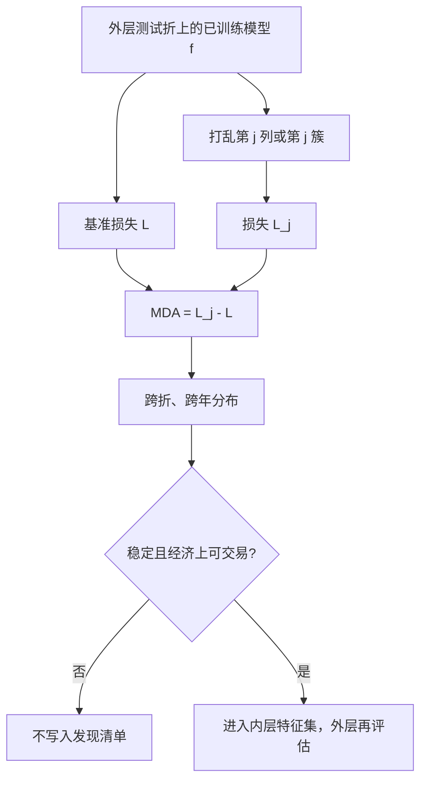

# MDA 特征重要性

    
打乱某一列之后预测精度下降多少，才是该列对模型的贡献；分裂增益会把重要性记在共线族里最先被问到的那一列上。

    <footer>—— 据 Breiman, Random Forests, Machine Learning, 2001；López de Prado, Advances in Financial Machine Learning, Chapter 8, 2018</footer>

树模型训练完之后，总会有一张「哪一列有用」的表。默认的均值下降不纯度（MDI / gain）按分裂时损失减少来记账，计算便宜，却在共线特征上不稳定：价值的十个近亲会把增益拆散，或集中到随机先被分裂的那一列。Breiman 给出另一种定义：均值下降精度（Mean Decrease Accuracy, MDA），也叫置换重要性——在验证样本上打乱某一列，看误差上升多少。López de Prado 在 *AFML* 第 8 章把 MDA 放到金融截面上，并强调必须对**相关特征簇**一起置换，否则共线会让单列 MDA 接近零。本篇写 MDA 的对象、与 MDI / SHAP 的差别，以及它不能当作因果识别或因子发现的 $t$ 统计量。

## 问题

设模型 $f$ 在点-in-time 特征 $X$ 上预测标签 $y$（未来收益、残差或涨跌）。训练误差低并不告诉你哪一列在起作用，更不告诉你去掉它之后样本外是否变差。MDI 是训练过程的会计：它看见的是样本内不纯度，偏向高基数列，且对共线分配任意。单列相关（把 $X_j$ 与 $y$ 做 IC）忽略交互与其余列的条件。需要一种条件于已训练模型、且在**未见样本**上定义的重要性。

MDA 的操作是：在测试折（或袋外样本）上计算基准损失 $L$；将第 $j$ 列的值在样本间置换，破坏 $X_j$ 与 $y$ 及与其他特征的联合，得到 $L^{(j)}$；重要性 $\mathrm{MDA}_j=L^{(j)}-L$。上升越大，模型越依赖该列的真实配对。置换保留了 $X_j$ 的边际分布，只打断依赖，这比把该列设为零更公平——零可能在训练里从未出现。

### 为什么金融里必须在样本外做

样本内 MDA 会把过拟合进来的噪声列评得很高：模型记住了某段特异路径，打乱它训练误差就升。正确做法是在 [嵌套](/quant/nested-cv) 的外层测试折上算 MDA，或在每条 [CPCV](/quant/cpcv) 路径的检验块上算，再报告跨路径的分布。Breiman 的随机森林可用袋外样本，GBDT 没有自然 OOB 时不要用训练行做置换。时间序列上置换应在时间块内或只打乱截面（同一 $t$ 上打乱股票），以大致保留波动聚类；把十年收益全局打乱会混进体制破坏，重要性难解释。

MDA 高不是「该特征是风险溢价」。它只说明当前这个 $f$ 在这段评估样本上用了该列的配对信息。换模型、换宇宙、换标签地平，表会变。把它写成经济学发现，是把算法的偏导数当成结构参数。

## 方法

**单列置换。** 对每个测试折、每个 $j$，重复若干次置换以降低随机性，报告均值与分位。损失应与交易目标对齐：截面 rank IC、扣费后组合收益，而不是逐点 MSE——MSE 会被高波动年份主导，使 MDA 变成隐性的波动重要性。分类准确率在金融里几乎无意义，见 [GBDT](/quant/gbdt-alpha) 对损失的讨论。

**簇置换（clustered MDA）。** López de Prado 建议先按特征收益或特征取值的相关做聚类，对一整簇同时置换。单列 MDA 在共线下会全部接近零（模型可改用近亲），簇 MDA 才能显示「这一族作为整体有用」。报告应同时给出簇名（例如价值族、微观结构族）与族内代表列，避免把十个近亲当成十个独立发现。这与 [多重检验](/quant/multiple-testing-factors) 计有效试验次数是同一精神。

**与 MDI、SHAP 对照。** MDI 快，适合训练监控，不适合发表。SHAP 给出逐样本贡献，可加总，但对树的路径依赖与计算成本敏感，且同样不是因果。MDA 不需要可加性假设，代价是每次置换都要重推一遍预测。三者不一致时，应信样本外 MDA 与经济约束，而不是信训练 gain 最高的那一列。

### 置换设计里的泄漏

若特征在全样本上做过标准化或 PCA，测试折的列已经含有训练外信息，MDA 会量到泄漏而不是预测力。管道必须折内 `fit`。若标签与特征因 [重叠持有期](/quant/label-horizon-overlap) 共享路径，打乱 $X_j$ 仍可能留下经由 $y$ 的相关，MDA 被压低或扭曲；先 purge 再评估。截面 rank 特征在每一日重新排序，置换「列」时要定义清楚是打乱原始量还是打乱 rank；通常应打乱进入模型的那一列，并在同一日截面内打乱，以免破坏 rank 的定义。

把 MDA 当特征选择的内层目标、再用同一折报外层绩效，等于非嵌套。筛列属于内层；外层只评估已选定的子集。AFML 把重要性当作研究工具，不是又一个可优化的夏普。

## 机制

置换打断的是 $X_j$ 与 $(y,X_{-j})$ 的联合。若 $f$ 的预测强依赖该联合，损失上升。若 $f$ 从未分裂该列，或总可以通过 $X_{-j}$ 重建同样的信息，损失几乎不动。因此 MDA 是**模型依赖**的：线性模型的 MDA 近似于该列被删去后的 $R^2$ 下降；深度树的 MDA 含交互——只有在特定区域才用到的列，平均 MDA 可能被稀释，需要分组或条件 MDA。

噪声列在样本外的期望 MDA 接近零或略负（置换有时碰巧更好）。显著为正需要跨折的稳定性：某一年 MDA 很高、其余年为零，更像体制或过拟合。应报告时间上的 MDA 路径，而不是全样本一个点。这与因子研究要求发表后样本是同一纪律。

### 不要把重要性当成交易信号

按 MDA 排序再做多空，是把评估工具当成 alpha，尝试次数等于特征个数，必须进入 [PBO](/quant/pbo) 与 DSR。更干净的用法是：用簇 MDA 决定哪些族值得保留在下一代模型里，用经济故事约束族的构造，用外层滚动决定是否交易。Israel、Kelly 与 Moskowitz 问机器能否学会金融，Avramov 等人加上可交易性后增益下降——MDA 高的微观结构列往往换手昂贵，重要性表不会自动扣成本。

## 边界与工程取舍

MDA 对置换次数、测试折长度和损失定义敏感。短测试折上打乱截面，估计方差很大，应用重复置换与跨折合并。极端共线（相关系数 $\gt 0.99$）时，即使簇置换也可能不稳定，应先在内层训练折上做代表列选择或岭化，再谈重要性。缺失值的置换要保持缺失模式，否则重要性会混进「缺失机制」。

不要用 MDA 替代点-in-time 审计。一列若含未来函数，MDA 会很高且稳定，那是泄漏的症状。也不要在全市场、全历史一次置换后宣称「成交额最重要」——那往往是规模与流动性的代理，需先做 [截面 rank](/quant/cs-rank-features) 与中性化，再看残差列的 MDA。计算上，特征很多时应对簇而不是对每一列做完整置换，单列只对簇内代表抽查。

随机森林教材里的 MDA 常在分类准确率上定义。收益预测应改写为「打乱后 rank IC 或组合效用下降多少」。准确率从 52% 降到 51% 看起来很小，对夏普可能已经致命，也可能毫无经济意义——所以损失必须是钱，不是分类表。

## 小结

- MDA 用样本外置换后的损失上升定义特征重要性，条件于已训练模型，而不是训练分裂的会计。
- 共线时单列 MDA 会消失，应对相关簇同时置换；MDI/gain 不适合发表。
- 置换必须发生在嵌套外层或袋外样本上，管道的标准化与筛列不得看见测试折。
- MDA 不是因果、不是风险溢价证明、也不是可直接交易的排序信号。
- 损失应对齐扣费后效用或截面 IC，并报告时间稳定性。
- 出处：Breiman, *Machine Learning*, 2001；López de Prado, *Advances in Financial Machine Learning*, Wiley, 2018，第 8 章；Strobl et al. 对置换重要性偏误的讨论。
