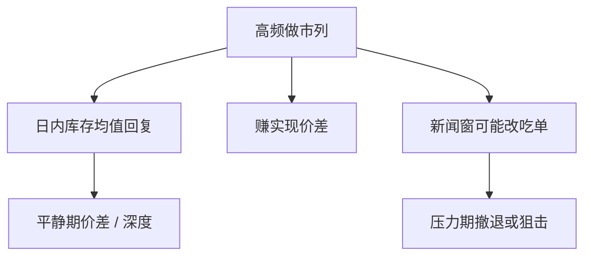

# Menkveld 高频做市实证

高频交易者可以是新的市场做市商：一天进出成千上万次，隔夜几乎不持仓，用速度管理库存而不是用宽价差硬扛。他们占成交的份额高，不等于占库存风险的份额高。

<footer>—— Menkveld, High frequency trading and the new market makers, Journal of Financial Economics, 2013</footer>

[速度竞赛](/quant/speed-race-sniping)把 HFT 写成狙击。缺口是经验：至少一部分高频参与者的日内轨迹更像 Ho–Stoll 做市，而不是只在新闻窗口吃过时报价。Menkveld（2013）跟踪 Chi-X 与欧洲样本里的大型高频做市商：多场所同时报价、库存均值回复、隔夜接近平仓。本课写这条实证画像，不把 HFT 定义成单一策略。

## 问题

理论给出两种高频：狙击者与做市者。数据若只有匿名成交，两者都显示为高消息率、高成交份额。要分开，需要看：(i) 是否经常双边挂单；(ii) 库存是否围绕零快速回复；(iii) 利润来自价差还是来自方向性中点移动；(iv) 新闻窗口行为是否与平时不同。Menkveld 的案例表明，新做市商用多市场对冲把库存风险压到日内，进入成本是技术而不是交易所席位。这与 Grossman–Miller 的 $M$ 内生一致：技术降低在场成本，$M$ 增加，折让下降——在平静期。

问题是把「新做市商」写进市场质量：价差、深度、发现，哪些改善来自他们的在场，哪些恶化来自他们的撤退与狙击腿。

### 隔夜库存接近零的含义

传统专家隔夜持仓，要求隔夜风险溢价，开盘价差含库存。高频做市商把风险扔回隔夜投资者，自己做日内即时性。开收盘的流动性因此更依赖愿意隔夜的人，高频在场的时段与不在场的时段质量可以分叉。这不是道德评价，是风险分担的时间重分配。

Menkveld（2016）年审综述把 HFT 经济学收成更宽的地图。本课以 2013 年做市商画像为机制，避免把综述写成词条。

## 方法

识别某一列 HFT：交易所或数据商的标记、账户层科研数据、或行为过滤（高撤单、低隔夜、双边）。刻画库存过程：半衰期、对中点的偏度（是否符合 Ho–Stoll）、跨市场净头寸。利润分解：实现价差 vs 随后中点走失（Stoll 会计）。比较该列在场与不在场的时段（工具：系统中断、费用变更、托管开通）。

Hendershott、Jones 与 Menkveld（2011）用自动报价引入作为算法交易的冲击，发现流动性改善。那是更宽的 AT，不单是 HFT 做市，但同方向：自动化降低做市的处理成本项。

## 机制

速度对做市的合法用途是更新报价与跨市场对冲，使库存方差在给定成交量下更小，从而能报更窄。这与狙击用同一技术栈。政策若一刀切限制速度，可能同时砍掉做市腿与狙击腿。设计更好的是改变先到者通吃（FBA、颠簸），而不是禁止低延迟库存管理。

与 Glosten 曲线：高频做市商把曲线的近端变得更厚更闪——平均形状近端浅（寿命短）但补给快。宏观形状的驼峰与「有效可成交深度」因此分叉，执行算法不能只看平均 L2。

## 边界

单一做市商案例不能代表全体 HFT。美国碎片化、期权、期货各有结构。标记误差会把狙击账户混进做市样本。压力期他们没有义务在场，2010 年闪电崩盘会显示撤退；不能用平静期的价差下降外推危机。中国与欧洲的程序化规则另论，本课不写监管清单。

成交份额 50% 的 HFT 若库存半衰期以秒计，他们承担的五年风险可能仍小于一个隔夜做市商。份额不是风险分担份额。

## 小结

- Menkveld（2013）显示部分 HFT 是日内高频做市：双边、库存回复、隔夜近零。
- 速度用于报价更新与对冲时，可压低平静期价差；同一技术也可用于狙击。
- 风险被重分配到隔夜持有者，开收盘质量不必同比改善。
- 出处：Menkveld, *Journal of Financial Economics*, 2013；算法交易与流动性见 Hendershott, Jones and Menkveld, *Journal of Finance*, 2011。
