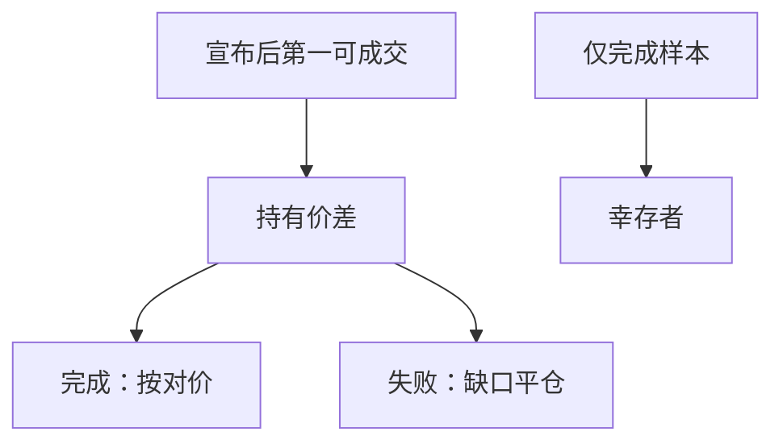

# 并购套利

宣布后的价差不是无风险利润：它补偿交易失败、延迟、融资与借券。用成交价回填宣布前持仓，或忽略失败路径，价差会看起来像 alpha。

<footer>—— 据 Mitchell and Pulvino, Journal of Finance, 2001；Baker and Savasoglu 对并购套利收益的讨论整理</footer>

上一课[业绩公告作为事件](/quant/earnings-event-driven)把财报变成可交易事件。并购是另一类公告：目标价与时间表被写出，价差可观测。本课补并购套利的回测偏差与资金约束，不写反垄断法汇编，不把要约流程做成法务课。

## 问题

Mitchell–Pulvino 指出并购套利收益有保险性质：平时收价差，市场下跌时交易失败扎堆、损失非线性。纸面回测常见三错：（1）用事后已完成的交易样本，丢掉失败与撤回——幸存者；（2）在宣布前一日按宣布后价格成交——前视；（3）现金要约当无融资、换股当无借券。缺口是：宇宙为**当时已宣布、尚未完成或失败**的交易，成交从宣布后第一可成交价起，失败路径保留，资金按现金腿与股票腿分别占用。

财务课的退市在这里变成完成日：成功并购常以退市结束，要用成交对价，而不是把最后交易日价格冻到样本末。

### 价差不是无风险利率

价差 / 剩余日历日年化后常高于 $r_f$，因为它含失败概率与延迟。把年化价差当 alpha 再乘杠杆，忽略失败凸性，会在 2008 一类月份爆仓——保证金与融资课已经预告了这条路径。本课把失败当作缺口强平的事件版本：交易破裂日的跳空，不是平滑收敛到要约价。

换股合并还要空头收购方。收购方股票未必可借，费率可能 special。纸面多目标空收购方假设了无限借券。

## 方法

宣布日盘后或次日开盘建立：多目标，现金要约融资按回购/融资利率占用；换股则对冲收购方，过可借与借券费。持有至完成、撤回或明确失败。失败以公告日第一可成交价平仓，走缺口。完成按对价结算，注意结算周期：现金到账日不是宣布日。样本必须含后来失败的交易，用当时已宣布集合，不能用「最终完成清单」回填。

杠杆受保证金与集中度限制：套利组合高度相关，haircut 在压力中上调会强制减仓，恰好发生在价差扩大时。

失败公告当日的跳空，按缺口课成交，不要用破裂前收盘「提前平掉」。现金要约的融资占用贯穿持有期，完成日才按对价与结算日释放。换股比率调整、竞争性报价出现时，更新对冲比率，但只用当时公告，不用最终谁赢了的终局结构回填宣布周。完成清单回填与宣布前成交，是本课两条红线。

## 机制

价差的期望补偿失败与延迟；可交易收益还要减融资、借券、强制减仓。压力中三件事同时发生：失败率上升、融资变贵、价差扩大需要追加保证金。纸面线性收敛回测没有这条螺旋。与业绩事件相比，并购持有期更长、占用更久，资金底的利率项权重大于单日缺口项，但失败日的缺口可以是致命的一跳。

不要在此进入要约收购的限价簿排队。本课只处理事件日历与资金；撮合交给后面 LOB 课。

样本 = 宣布日当时已公开、尚未终止的交易，含后来失败的。开仓价 = 宣布后第一可成交。现金要约计入融资占用；换股计入收购方可借与借券费。失败按破裂公告后缺口平仓；成功按对价与结算日。禁止用完成清单回填，禁止在宣布前一日用要约价成交。压力月单独报告，检查线性收敛假设是否破裂。

## 边界

不评估反垄断概率模型，不写各国要约规则对照表。下一课[指数调入调出](/quant/index-rebalance)是另一类日历，被动资金流替代失败风险。后课默认：并购套利样本含失败；开仓在宣布后可成交价；换股空头过借券账单。

后课指数事件没有「失败要约」，但有生效日买不到。本课失败路径必须留在样本。宣布前成交与完成清单回填是两条禁止。换股空头过可借。压力月非线性是保险性质，不应当成被「异常值剔除」删掉的坏点。

后课默认并购样本含失败路径，开仓在宣布后可成交价，换股空头过借券账单。

竞争性报价会改变价差与对冲比率，但只有公告后才进入状态。用最终赢家的交换比率回填宣布后第一周，等于把后来才知道的结构写成当时可交易的对冲，这是并购版前视。

压力月的非线性损失留在样本里，当作保险性质，不要当异常值从净值里剔掉。

## 小结

- 宣布后价差补偿失败与延迟，不是无风险利率。
- 只用完成交易 = 幸存者；宣布前成交 = 前视。
- 失败日按缺口平仓，完成日按对价与结算日。
- 换股空头受可借与费率约束。
- 压力中失败、融资、保证金同时变差，线性收敛回测没有这条路径。
- 出处：Mitchell and Pulvino (2001)；Baker and Savasoglu。
