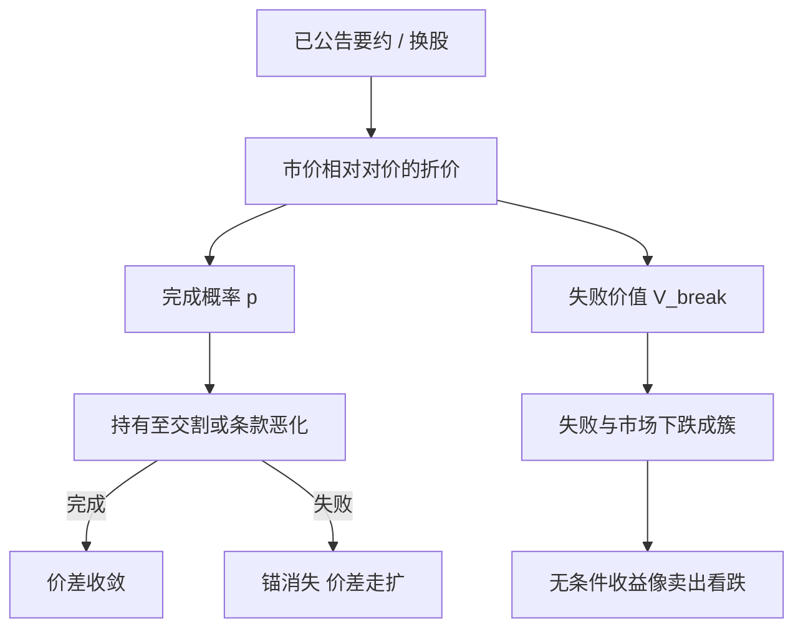

# 并购套利

要约价与目标公司市价之间的折价，补偿的是交易未能按公告条款完成的风险；收益路径在多数完成的案例里像收息，在少数失败的案例里像卖出了一份深度虚值的市场看跌。

<footer>—— Mitchell and Pulvino, Characteristics of Risk and Return in Risk Arbitrage, Journal of Finance, 2001</footer>

并购套利（risk arbitrage）做的是**已公告**交易的价差，不是预测谁会被收购，更不是利用未公开信息。现金要约下，目标股交易在要约价之下，折价 $S=(P_{\mathrm{offer}}-P_{\mathrm{target}})/P_{\mathrm{target}}$（或按要约价标准化）；换股则做多目标、按换股比例做空收购方，交易股比与公告比之间的基差。Mitchell 与 Pulvino（2001）把这类策略的收益写成：完成则赚收敛，失败则目标价回到交易前附近，且失败在市场大跌时更密集，无条件分布像卖出看跌。本篇写完成概率、条款风险与学术价差，作为事件驱动相对价值，对照价差类的 [OU](/quant/ou-spread)：并购价差的「回复」以交割日为锚，失败则锚消失，不是平稳扩散的均值。

## 问题

公告后，目标价格通常不立刻等于要约对价，因为完成是不确定的：反垄断、股东投票、融资、重大不利变化（MAE）、分手费与竞标。把折价当成无风险收敛，等于把 Bernoulli 完成变量当成 1。公平描述是

$$
P_{\mathrm{target}}\approx p\cdot V_{\mathrm{complete}}+(1-p)\cdot V_{\mathrm{break}}- \text{时间与流动性补偿},
$$

$p$ 为风险中性或主观完成概率，$V_{\mathrm{break}}$ 为失败后的目标价值（常与市场 beta 相关）。问题是估计 $p$ 与 $V_{\mathrm{break}}$，以及价差是否足够补偿：**失败发生在左尾成簇时**的系统性风险，而不是补偿「平均完成率」这个标量。

换股合并还有对冲比：公告换股比例 $\beta_{\mathrm{deal}}$ 与可交易 $\beta$ 因领口（collar）、选举权、分批交割而不相等。用股票对的协整 $\beta$ 去对冲换股并购，对象错了——锚是契约比率，不是历史回归。现金要约则几乎是单边目标股，收购方对冲次要，风险是完成跳跃而非相对价值扩散。

### 价差、隐含概率与日历

粗略隐含完成概率常把 $V_{\mathrm{break}}$ 设为公告前价格或行业倍数，反解 $p$。这不是无套利抽出的概率：折现、借券、成交不活跃与条款凸性都会进价差。学术工作用的是可复现的定义：例如现金交易用 $(P_{\mathrm{offer}}-P)/P_{\mathrm{offer}}$ 作为年化前的原始价差，再除以至预期交割的时间。Jetley 与 Ji（2010）记录价差随资本进入而变窄，完成风险的补偿下降，拥挤本身成为后续亏损的来源。日历锚是交割日、股东大会、监管决定日；与 OU 的平稳均值不同，时间流逝在 $p$ 不变时会压缩价差（theta），$p$ 跳变时价差跳跃。

本策略的信息集是公开公告、申报文件、监管日程与市场价格。把「听说要有竞标」写成研究过程，就越过了学术并购套利的边界。模型只对已公开条款下的完成风险定价。

## 方法

**现金要约。** 多目标、现金持有或对冲市场指数（因为失败时目标带市场 beta）。仓位规模按：价差、至交割时间、借券与冲击、$V_{\mathrm{break}}$ 的压力情景（例如公告前价再跌一段）。Mitchell–Pulvino 的关键实证是：策略在市场大跌月份的收益显著更差，线性 beta 低估了左尾——完成概率 $p$ 本身是市场状态的函数。因此风险预算应按非线性：跌市中提高失败相关，而不是用形成期 OLS beta。

**换股。** 多目标、空收购方，比率用公告 $\beta_{\mathrm{deal}}$，领口内比率随收购方价格变，必须按条款重算，而不是 Kalman 一条随机游走 $\beta$。两边的不同步与停牌用执行规则处理，协方差的高频问题见 [Hayashi–Yoshida](/quant/hayashi-yoshida)，但主导风险仍是交易失败跳跃，不是分钟 Epps。

**完成概率。** 学术上可用：历史同类交易的 logit（行业、换股还是现金、是否敌意、分手费、监管辖区），再结合价差反推的 $p$ 做交叉检验。两套 $p$ 差很大时，要么市场在定价未进模型的条款，要么拥挤把价差压破了风险补偿。不要用样本内把 logit 调到夏普最大。Officer 等对终止费与竞标保护的工作说明：契约改变的是失败时的支付，从而改变 $V_{\mathrm{complete}}$ 与 $p$，应读文件而不是只读价格。

### 与均值回复装置的对照

并购价差在完成路径上单向收敛到 0（或到领口内的 parity），不是围绕 $\mu$ 的 OU。用半衰期去过滤「哪些并购做得」会选到快要交割的交易，那是日历效应，不是 $\kappa$。失败路径上价差扩大且不回到要约锚，[最优停时](/quant/ou-optimal-stopping) 的双障碍不适用：没有「回到均值平仓」，只有「持有至结果或在 $p$ 恶化时止损」。止损规则必须定义 $p$ 或价差的哪一类变动算恶化（监管意见、股东反对、融资破裂），而不是 $|z|\gt 2s$。CUSUM 可监听「相对公告条款的定价」是否在漂移，但一次监管否决是跳跃，累积和不是为跳设计的。

## 机制

经济机制是：完成是带时变危险率的一次性事件，危险率依赖监管、融资与市场。投资者提供资本锁定到交割，要求补偿锁定期间的跳跃风险与流动性。Mitchell–Pulvino 把无条件收益比作卖出虚值看跌：多数时候收权利金（价差收窄），市场崩溃时 $p$ 与 $V_{\mathrm{break}}$ 同时恶化，损失成簇。这与统计套利的协整破裂同属「左尾在压力期相关」，但触发器是交易文件与监管，不是 $\beta$ 估计。

拥挤机制：资本多则公告后价差窄，期望收益接近资金成本，一旦一笔大交易失败，同类基金同时减仓，未完成交易的价差一并走扩。Jetley–Ji 的变窄是拥挤的价格表现。容量不是 ADV 的固定比例，而是「同时存在的未完成交易的总折价」相对风险资本。

换股套利的市场中性是契约中性，不是统计中性。收购方在交易期的独立新闻仍进入空头。用行业中性再滤一层，会改变的是 $V_{\mathrm{break}}$ 的暴露，不是完成跳跃本身。

### 条款凸性：领口、选举、分拆

领口规定换股比随价格在区间内浮动，目标股东的支付被局部封顶或保底，套利的 $\beta_{\mathrm{deal}}$ 是价格的函数，delta 要按条款求导，而不是常数股数。现金或股票选举权把持有人选择写成期权，市场价差里含这些期权的价值，用简单 $p$ 反推会把期权费算进「完成概率」。分拆、合资、监管资产剥离改变 $V_{\mathrm{complete}}$。这些都是公开条款的衍生品结构，应进定价，而不应进「信息优势」。

## 边界与工程取舍

不要把未公告传闻、私人谈判或内幕当成研究输入。不要用目标股在公告前的异动当回测信号——那是另一套非法或不可复现的信息集。不要在涨跌停与停牌时假设可以按模型 $p$ 调仓。跨境交易的完成风险含外汇与两个监管时钟，价差货币要与对冲一致。

小样本：一年可交易的大额公告有限，夏普极噪。应按交易笔数与失败聚类报告，而不是按日历日收益的 $t$ 值宣称「稳定 alpha」。失败案例要逐笔写进文档，否则平均值会被大量小额完成掩盖。

出处以 Mitchell–Pulvino（2001）的风险特征为主，辅以价差变窄与契约条款的后续实证。策略名称里的 arbitrage 是行业习惯，学术上它是承担完成风险的保险费，不是无风险收敛。

## 小结

- 并购套利交易已公告交易的公开价差，补偿完成不确定性与失败时的市场相关左尾，不是预测未公告并购。
- Mitchell–Pulvino（2001）表明收益非线性、在市况差时更差，像卖出看跌；线性 beta 不够做风险预算。
- 现金与换股的对冲对象不同：后者以契约比率为锚，不是历史协整 $\beta$；领口使比率随价格变。
- 价差不是 OU：完成则向交割锚收敛，失败则锚消失；不要套半衰期与 2σ 开平。
- 拥挤会压缩价差并在失败时造成同步平仓；容量由未完成交易的风险资本衡量。
- 出处：Mitchell and Pulvino, *Journal of Finance*, 2001；Jetley and Ji, *Financial Analysts Journal*, 2010；终止费与条款见 Officer 等。
