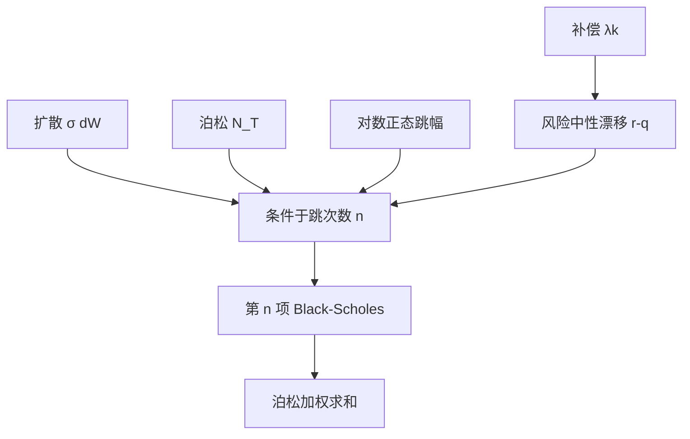

# Merton 跳扩散

    
若股票收益由连续扩散加上复合泊松跳跃构成，且跳跃风险可由充分分散被消掉，欧式期权价格就是以跳次数为条件的 Black–Scholes 公式按泊松权重混合。

    <footer>—— Merton, Option Pricing when Underlying Stock Returns are Discontinuous, Journal of Financial Economics, 1976</footer>

Black–Scholes 的路径连续。1976 年 Robert Merton 把不连续写进同一套或有索取权：在几何布朗运动上叠加复合泊松过程，每次跳乘一个对数正态因子。若假设跳风险可分散——像 idiosyncratic 的公司新闻而不是系统性崩盘——则跳不要求额外溢价，定价仍在「复制加分散」的逻辑里，公式变成泊松混合的 Black–Scholes。这一规格是后来一切跳扩散的参照点：[Bates](/quant/bates) 把它接到随机波动上，Kou 改跳的幅度分布，Lévy 模型再把有限活动换成无穷活动。本篇写 1976 年的混合公式、鞅补偿与市场不完全，不把 [跳跃检验](/quant/jump-tests) 的高频统计重做一遍。

## 问题

连续对冲在跳跃发生的瞬时失效：Delta 组合的增益与期权的跳跃不匹配，残差与 $\Delta S$ 不成比例。若坚持「所有风险都可复制」，有跳的市场一般不完全，期权价格不唯一。Merton 的解决办法是经济假设而不是完备化：把跳当作可分散的非系统性风险，组合的跳残差在充分分散下期望为零，于是定价像在扩散部分做 Black–Scholes，再对跳的随机次数取期望。问题收成两问：在这一假设下欧式价格的显式混合是什么；若跳其实不可分散（指数崩盘），公式还剩多少作为计算工具、多少作为理论定价。

经验上，混合公式能产生比对数正态更肥的尾和微笑，尤其是短到期。这是它作为参数化存在的理由，即使「可分散跳」在股指上几乎不成立。

### 补偿与鞅条件

写

$$
\frac{\mathrm{d}S_t}{S_{t-}}=(\mu-\lambda k)\,\mathrm{d}t+\sigma\,\mathrm{d}W_t+(J-1)\,\mathrm{d}N_t,
$$

$k=\mathbb{E}[J-1]$，$\lambda$ 为强度。减去 $\lambda k$ 是为了让漂移 $\mu$ 仍表示总期望收益：跳的平均贡献被提前扣掉。风险中性（在 Merton 的可分散假设下把 $\mu$ 换成 $r-q$）后，

$$
\mathbb{E}^{\mathbb{Q}}[S_T]=S_0\mathrm{e}^{(r-q)T},
$$

与有没有跳无关。漏补偿会让远期变成 $S_0\mathrm{e}^{(r-q-\lambda k)T}$ 或相反，微笑的水平整条错位。$J$ 的分布在原文取对数正态，使条件于 $N_T=n$ 时 $S_T$ 仍对数正态，这是混合 Black–Scholes 能写出来的代数原因。

Merton 1976 与 Black–Scholes–Merton 1973 不是同一篇文章。1973 年是连续路径的理性定价；1976 年才把泊松跳放进股票。引用「Merton 跳」不要链到公司债那篇，也不要链到 1973 的 Bell Journal。

## 方法

条件于 $N_T=n$，总方差为 $\sigma^2 T+n\delta^2$，对数均值吸收 $n$ 次跳的均值与补偿。看涨价格

$$
C=\sum_{n=0}^\infty \mathrm{e}^{-\lambda'T}\frac{(\lambda'T)^n}{n!}\,C_{\mathrm{BS}}(S_0,K,T,r_n,\sigma_n),
$$

其中 $\lambda'=\lambda(1+k)$，$r_n$ 与 $\sigma_n$ 按原文把跳的均值方差折进每个 $n$ 的 Black–Scholes 输入。实践截断到泊松尾可忽略的 $n$，短到期、中等 $\lambda$ 只需十几项。这比特征函数反演更直，也更适合作为数值基准。特征函数仍然简单：

$$
\phi(u)=\exp\bigl(iu\ln S_0+(iu(r-q-\sigma^2/2-\lambda k)-\tfrac12\sigma^2 u^2)T+\lambda T(\mathrm{e}^{iu\mu_J-\delta^2 u^2/2}-1)\bigr),
$$

便于与 Bates、VG 对照，但定价不必走傅里叶。

### 微笑形状与期限

固定 $T$，混合把峰度注入 $S_T$，虚值期权相对 Black 变贵，形成微笑；$\mu_J\neq 0$ 则不对称，出现偏斜。$T$ 增大时，泊松次数变多，中心极限定理把对数价格拉回正态，微笑变平——速度由 $\lambda$ 决定。这与随机波动不同：Heston 的长端由 $\theta$ 钉住水平，弯曲虽衰减但波动仍随机；Merton 的长端在参数恒定时趋向 Black，没有独立的方差期限结构。要用 Merton 去拟合整张曲面，往往被迫让 $\lambda$ 或 $\delta$ 随 $T$ 变，那已经离开单一过程，变成逐到期的参数化。

希腊字母：Delta 是泊松加权的 Black Delta，但真实对冲在跳到来时缺口等于 $(C(JS)-C(S))- \Delta S(J-1)$。可分散假设说这种缺口的期望被风险溢价忽略；交易账上它是事件风险。短到期虚值看跌的大部分价值来自「至少一跳」的那些项，Delta 对 $S$ 可以很陡，接近数字。

## 机制

生成元是扩散生成元加强度乘跳跃补偿算子。密度是对数正态的泊松混合，左尾由负跳或大 $\delta$ 抬起。相对 [局部波动](/quant/dupire)，Merton 不能精确重现任意微笑：只有有限个形状参数，短端可以像，整张 Dupire 曲面一般不能。相对 Heston，没有波动聚类：跳完之后瞬时扩散系数仍是常数 $\sigma$，除非再跳。这是「跳扩散」与「随机波动」在自相关上的差别，也是 Bates 要把二者相乘的原因。

市场不完全是机制的一部分。即使接受可分散假设，个别期权仍不能被标的连续交易完美复制；价格唯一性来自假设，不是来自完备市场定理。若跳是系统性的，需要指定跳的市场价格，等价鞅测度不唯一，Merton 混合只是其中选择「跳的风险中性分布与物理相同、只改漂移」的那一个。股指期权隐含的 $\lambda$ 通常高于历史计数，正说明溢价存在，1976 年的可分散假设在指数上应被视为计算约定。

### 与 Kou 及无穷活动的差别

Kou 用双指数跳，向上向下强度不同，有利于非对称短端，且某些路径依赖有解析。VG 与 CGMY 让小跳无穷多，短区间内几乎必然有许多微跳，二次变差的跳部分是无穷活动。Merton 在任意小区间内以正概率完全连续，大缺口来自稀疏的大跳。拟合极短到期的光滑翼部时，无穷活动往往更自然；拟合「几天一次的事件」时，泊松更可解释。不要用 Merton 的 $\lambda$ 去对 CGMY 的 $C$ 做无换算比较。

混合公式是条件对数正态的结果。若跳幅不是对数正态，就没有逐项 Black–Scholes，必须改特征函数或 MC。实现里把 $J$ 改成双指数却仍调用 BS 混合，是规格错误。

## 边界

连续对冲误差在跳日集中爆发，Gamma 对冲也只能减轻扩散部分。障碍会被一跳穿越，离散观察与连续观察的差别与纯扩散时不同。美式提前行权在跳下要用树或积分方程，混合公式只管欧式。利率与分红若在跳时同时变，超出原文。

实证上单过程 Merton 很难同时拟合多到期；它更适合作为短端补丁、教学基准、以及 Bates 的跳部件。1976 年论文的贡献是不连续收益下的期权公式与可分散假设，不是高频跳跃检验，也不是随机波动。

泊松强度在日历时间和在交易时间里不是同一回事。把 $\lambda$ 写成每年次数时，要声明到期用的是年化日历分数，与交易日计数一致。

## 小结

- Merton（1976）在 GBM 上加对数正态复合泊松跳，欧式价格是泊松加权的 Black–Scholes 混合。
- 补偿项保证远期正确；漏写会使整条微笑平移。
- 可分散跳使测度选择简单，但股指上跳风险通常有溢价，隐含 $\lambda$ 大于历史跳频。
- 微笑随期限变平、无波动聚类，是相对 Heston 的结构性差别；长曲面需要逐到期参数或升级到 Bates / Lévy。
- 市场一般不完全，连续 Delta 在跳时留下缺口。
- 出处：Merton, *Journal of Financial Economics*, 1976；连续情形见 Black and Scholes, *JPE*, 1973；随机波动加跳见 Bates, *RFS*, 1996。
