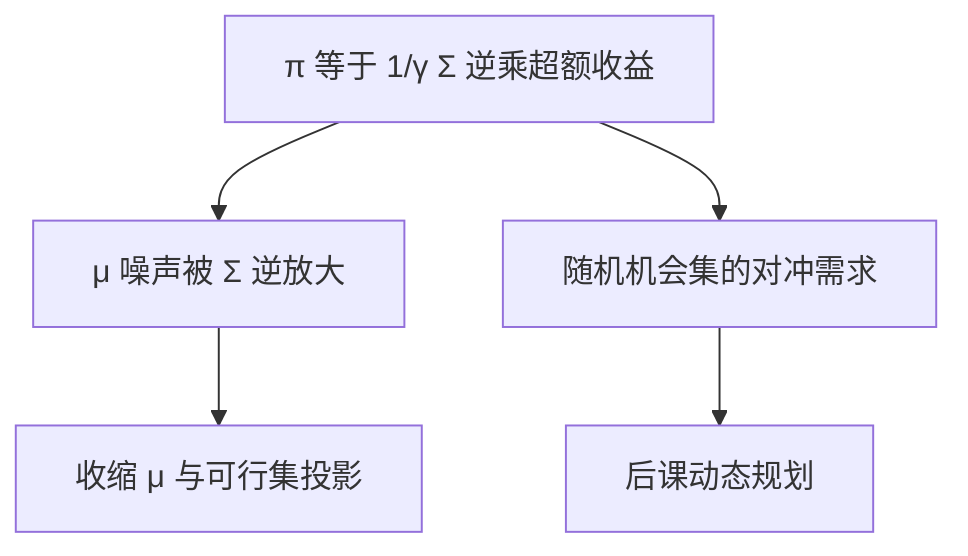

# Merton 组合：实现与校准

连续时间对数或幂效用下，风险资产权重是超额收益对 $\sigma^2$ 的比；把这个比当成已知常数去下单，校准误差会比公式本身更大。

<footer>—— Merton, Lifetime Portfolio Selection under Uncertainty: the Continuous-Time Case, Review of Economics and Statistics, 1969</footer>

[上一课](/quant/shifted-lognormal-negative-rates)收口利率移位。本课打开组合进阶：主干 [Markowitz](/quant/markowitz) 是单期二次，[Kelly](/quant/kelly-sizing) 已写出连续极限 $f\approx\mu/\sigma^2$ 与分数化。缺口是 **Merton 公式的实现**：估计 $\mu,\sigma$、对冲需求（对随机机会集）、以及为什么机构几乎从不下满公式仓。后课动态规划把离散再平衡写进同一问题。

## 问题

Merton（1969/1971）在连续时间、完备市场、幂效用下给出：无随机利率与无随机 $\mu$ 时，风险资产权重 $\pi=\frac{1}{\gamma}\Sigma^{-1}(\mu-r\mathbf{1})$。对数效用 $\gamma=1$ 即 Kelly。问题不是再推 HJB，而是：**$\mu$ 的估计误差被 $\Sigma^{-1}$ 放大**，与 [协方差收缩](/quant/cov-shrinkage) 同一病。公式当 $\mu,\Sigma$ 已知；实现必须把估计、约束、交易费用放进去，否则权重会像样本前沿一样炸。

第二层：机会集若随机（随机 $\mu$ 或随机 $r$），最优仓还含对冲需求，对冲用的是状态变量上的衍生暴露。忽略对冲需求、只下 myopic $\frac{1}{\gamma}\Sigma^{-1}(\mu-r)$，在持久的预期收益因子上会系统性偏。

### 校准的是增长，不是下一季的均值

$\mu$ 用历史均值，噪声极大，Stambaugh 与 Merton 自己都强调预期收益难估。实务用：收缩 $\mu$ 向均衡（[Black–Litterman](/quant/black-litterman)）、用更慢的状态变量、或直接放弃绝对 $\mu$、改风险预算。$\sigma$ 相对好估，但仍有体制。把回测夏普代入 $\pi=\mathrm{SR}/(\gamma\sigma)$，与 Kelly 课的警告相同。

本课是金融组合实现，不是权重量化、也不是神经网络的权重量化。Merton 的 $\pi$ 是资金权重。

## 方法

估计：$\Sigma$ 用收缩或因子协方差；$\mu$ 用 BL 或宏观先验，禁止用短窗口股票均值。效用：$\gamma$ 从机构风险预算反推，不要从「我们是对数效用」宣布。约束：杠杆、卖空、行业，把闭式 $\pi$ 投影到可行集，见 [组合约束](/quant/portfolio-constraints)。随机机会集：列出状态（收益率水平、估值、vol），用后课 DP 或对冲项的线性近似。对冲工具：债券、vol 衍生品，而不是把对冲需求再折进股票 $\mu$。

## 机制

幂效用下 myopic 需求与对冲需求可加。Myopic 项吃的是瞬时夏普；对冲项吃的是状态对财富边际效用的相关。实现上前者被 $\mu$ 噪声淹没，后者被错误的状态变量淹没。所以「先把 myopic 做成可交易的风险平价，再小权重量对冲」往往比「全公式一次估齐」稳——这是工程分层，不是否定 Merton。

## 边界

不完备市场、交易费用、不可交易劳动收入，闭式消失。破产约束与杠杆上限使分数 Kelly 成为默认。连续再平衡假设与后课费用、税冲突。不要用 Merton 公式去给杠杆 ETF 的路径当「最优」，杠杆拖累在再后面一课。

## 小结

- Merton 权重在 $\mu,\Sigma$ 已知时优雅；实现的主风险是 $\mu$ 估计与可行集。
- 随机机会集带来对冲需求，不能只用 myopic 项。
- $\gamma$ 从风险预算反推；$\mu$ 要收缩或改用 BL。
- 出处：Merton, *REStat*, 1969；*JET*, 1971。
