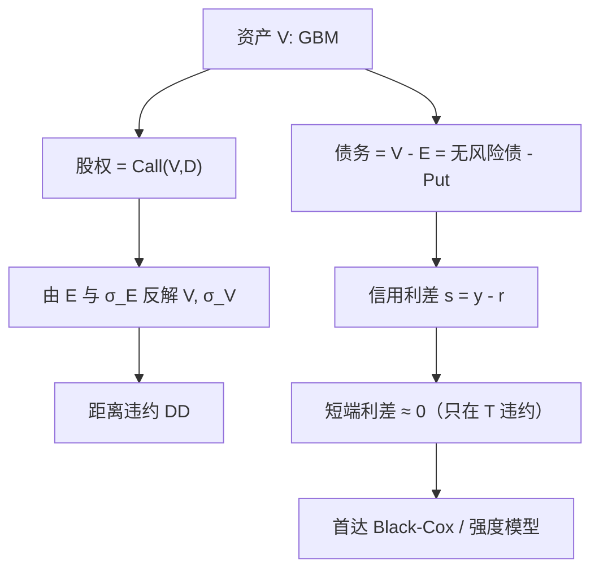

# Merton 结构模型

    
公司债是对公司资产的或有要求权：股权是以负债面值为执行价的看涨，债务是无风险债减去一份看跌；信用利差来自那份看跌的价值。

    <footer>—— Merton, On the Pricing of Corporate Debt: The Risk Structure of Interest Rates, Journal of Finance, 1974</footer>

[上一课](/quant/key-tenor-dv01)把曲线风险收成关键点 1bp 冲击下的货币价值：三因子管大方差，关键桶管折缝。缺口是信用利差还没有微观故事——利差若只当外生贴现，无法回答股权波动、杠杆和到期如何共同决定违约损失。本课写 Merton（1974）结构模型：股权是以资产为标的、负债为执行价的看涨。不重讲 DV01 分桶。后课 Black–Cox 默认已经读完：原文违约只在到期发生，短端利差结构是错的，只把它当中长端杠杆叙事。

## 问题

关键期限已经能解释无违约曲线怎么扭。承诺收益高于国债的那一段，要在无套利下由违约损失解释。若只把利差当成外生贴现，无法回答：股权波动、杠杆和到期如何共同决定利差，以及股东与债权人的利益如何冲突。结构模型的答案是：违约不是外生跳，而是资产价值相对负债的或有事件；可观测的股价与负债面值应能反推 $V$ 与资产波动 $\sigma_V$，再给债务标价。

问题立刻变成可识别性。$V$ 不交易，能看到的是 $E$ 与股权波动 $\sigma_E$。Merton 给出两者由看涨公式相连，于是可解。但原文假设：违约只在 $T$ 发生，负债是单一零息，无破产成本，绝对优先，资产可连续交易且无股利或股利已知。真实资本结构是息票、契约、滚动融资与谈判，短端 CDS 还有跳到违约的成分。结构模型解释截面与杠杆的比较静态很好，拟合一个月期 CDS 往往失败——这正是强度模型存在的原因。

### 违约只在到期：短端利差塌缩

几何布朗运动连续，到期前 $V_t>D$ 时，剩余时间内打到 $D$ 以下的概率随期限缩短而迅速变小（除非已经贴在 $D$ 上）。因此短期限信用利差在 Merton 里接近零，而市场短端 CDS 显著为正。这不是参数没校准好，是模型禁止了「今晚突然违约」。Black–Cox 把边界改成首达，Leland 把边界改成内生，强度模型则直接允许不可料的跳。选用 Merton 原文，等于接受短端利差结构是错的，只把它当中长端杠杆叙事。

KMV / Moody's 的距离违约把 Merton 改成实务：用经验映射把 DD 变成实际违约频率，而不是相信风险中性看跌就是历史违约率。结构公式负责相对排序，违约概率表负责校准，二者不要合成「模型已经匹配 CDS」。

## 方法

资产动态在风险中性下为

$$
\mathrm{d}V_t= (r-\delta)V_t\,\mathrm{d}t+\sigma_V V_t\,\mathrm{d}W_t,
$$

$\delta$ 为资产支出率。到期负债面值 $D$，股权

$$
E_t=V_te^{-\delta\tau}N(d_1)-De^{-r\tau}N(d_2),\qquad
d_{1,2}=\frac{\ln(V_t/D)+(r-\delta\pm\sigma_V^2/2)\tau}{\sigma_V\sqrt{\tau}},
$$

$\tau=T-t$。债务 $B_t=V_t-E_t$。承诺收益率 $y$ 由 $B_t=De^{-y\tau}$ 反解，信用利差 $s=y-r$。看跌保护了债权人相对无风险债的缺口，利差随 $\sigma_V$ 与杠杆 $D e^{-r\tau}/V$ 上升。Geske（1977）把付息债写成复合期权：付息才买到下一期期权，否则违约，从而把息票结构接进同一框架。

**校准。** 股权市值 $E^{\mathrm{mkt}}$ 与股权波动 $\sigma_E$（由股价估计）满足

$$
E^{\mathrm{mkt}}=C(V,\sigma_V),\qquad \sigma_E E^{\mathrm{mkt}}=\frac{\partial C}{\partial V}\sigma_V V.
$$

迭代解 $(V,\sigma_V)$。距离违约常用

$$
\mathrm{DD}=\frac{\ln(V/D)+(\mu-\sigma_V^2/2)\tau}{\sigma_V\sqrt{\tau}},
$$

$\mu$ 是真实测度漂移（资产回报），与定价用的 $r$ 不同。Bharath 与 Shumway（2008）比较「朴素」DD 与迭代 Merton，发现简单杠杆与股权波动已经解释大部分，迭代的增量有限——提醒：结构模型的力量在变量选择，不一定在精确反解 $V$。

### 随机利率与优先级

原文利率常数。把 $r$ 换成 Hull–White 或确定的远期，债务变成随机利率下的看跌，仍可数值解；与国债曲线的相对利差才是信用。绝对优先在破产法里不总成立，回收可能高于或低于 $V_T$ 的理论分配，利差会留下一个回收残差。对手方暴露是随机的，CVA 需要整条暴露路径，Merton 只给出发行人自身的违约机制，见[对手方信用](/quant/counterparty-credit)。可转债里股权与信用同源，结构故事最干净，但逐日标记仍多用股价加强度，见可转债篇。

## 机制

经济机制是期权平价：债权人把无风险债卖给了股东一份以企业为标的的看跌， premia 表现为利差。杠杆越高、看跌越实值，利差越大；资产波动越高，看跌越贵，利差越大；期限的作用非单调——极短期限来不及违约（连续路径），极长期限折现与资产增长可能改善偿付，中段利差往往最高。这给出「高波动成长股的债不便宜」和「去杠杆收窄利差」的比较静态，而不需要外生强度。

股东有激励增加 $\sigma_V$（资产替代）因为看涨凸性；债权人相反。Merton 框架把这种冲突写成希腊字母：股权对 $\sigma_V$ 的 vega 为正。契约、抵押和首达边界（Black–Cox）是对这一激励的法律约束。没有边界时，股东可以让 $V$ 在到期前任意接近 $D$ 而不触发违约，短端债权人得不到补偿——又回到短端利差塌缩。

风险中性利差不是历史违约损失的期望。$\sigma_V$ 与风险溢价进入 $V$ 的真实漂移，历史 DD 用 $\mu$，CDS 用风险中性。把 KMV 的 EDF 直接当 CDS 强度，会把股权风险溢价误当成违约补偿。

### 与强度、首达的边界

Merton：违约时间在 $\{T\}\cup\{\infty\}$，信息是连续的资产价值。Black–Cox：违约时间是首达，仍由 $V$ 完全预见（对看门口的人）。强度：违约是不可料跳，可拟合任意 CDS 期限结构，但杠杆与股价的联系要外生塞进 $\lambda(S)$。交易 CDS 用强度；讲资本结构和可转债稀释用结构；讲契约与破产触发用首达。不要用 Merton 封闭公式去拟合整条 CDS 曲线再宣称「结构模型校准完成」。

## 边界与工程取舍

不要对滚动短期债务假装存在一个远在几年后的 $T$。不要忽略股利、回购与投资：$\delta$ 不是装饰。不要用股权期权隐含波动当 $\sigma_E$ 却不处理杠杆导致的波动倾斜——股权是看涨，$\sigma_E$ 随 $V$ 变。复杂负债（优先、银行贷款、或有可转）需要 Geske 式的多层或直接数值模拟。利率波动与信用的相关（长期债）超出原文，可用 Longstaff–Schwartz（1995）一类扩展，但那已靠近首达加随机利率。

结构模型给错向风险一个自然相关：对手方 $V$ 下跌时既更容易违约、又可能与你的组合同向。这比外生相关矩阵更有故事，校准仍然困难。资本公式与限额不要单独依赖 DD，短端与跳跃要用 CDS。

出处必须是 Merton, *Journal of Finance*, 1974，而不是 Black–Scholes 1973 本身。1973 年给了看涨公式；1974 年把公司债写成该公式的资本结构应用，并讨论风险结构（利差期限结构）。

## 小结

- Merton（1974）把股权写成资产上看涨、债务写成无风险债减看跌，信用利差是看跌的价格。
- 由股权市值与股权波动反解资产价值与资产波动；距离违约是实务排序工具。
- 违约只发生在到期，连续路径使短端利差过低，这是模型特征不是校准失误。
- Geske 复合期权处理息票；随机利率与破产成本是后续扩展。
- 与 Black–Cox 首达、Duffie–Jarrow–Lando 强度分工：结构讲资本结构，强度拟合 CDS。
- 出处：Merton, *Journal of Finance*, 1974；Black & Scholes, 1973；Geske, *Journal of Financial and Quantitative Analysis*, 1977；Bharath & Shumway, *Review of Financial Studies*, 2008。
