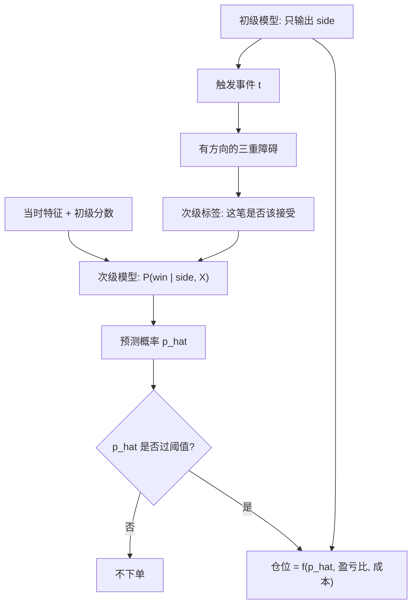

# Meta-labeling

初级模型决定方向；次级模型只回答要不要下这个注、下多大。把「边」和「大小」拆开，是为了提高精度、并把仓位写成预测概率的函数。

<footer>—— López de Prado, Advances in Financial Machine Learning, Chapter 3, 2018</footer>

一个分类器同时学方向与置信度时，两类错误缠在一起：它可能方向对但该放弃的噪声段没放弃，也可能方向错却仓位很大。López de Prado 的 meta-labeling 把问题拆成两段。初级模型（规则、因子、已经存在的信号）只输出 side $\in\{+1,-1\}$；次级模型的特征可以包含初级分数、波动、广度、微观结构状态，标签则是：**在初级已经给出方向的前提下，三重障碍这笔赌注是否赢**。次级输出的是「接受或拒绝这笔初级赌注」的概率，并据此决定是否交易以及多大。它不是又一个方向模型，而是一层仓位与过滤。方向标签的路径定义见 [Triple Barrier](/quant/triple-barrier)。

## 问题

初级信号往往召回高、精度低：趋势过滤会抓住大部分行情，也在震荡里反复止损。直接把初级的 $\pm 1$ 拿去交易，期望被大量假阳性吃掉。把初级推倒重来、换成更深的方向模型，不一定提高精度——方向问题的信噪比仍然低，过拟合空间却更大。Meta-labeling 问的是一个通常更容易的问题：给定方向已经选定，当前环境是否像「这类方向赌注会赢」的环境。次级的类别可以更平衡（只在初级触发时取样），特征也可以专门服务过滤，而不是重新发明方向。

标签必须与初级的执行规则一致。初级看多时，止盈在上、止损在下；初级看空则对调。次级的 $y=1$ 表示这笔有方向的三重障碍赢了（通常是先触止盈，或垂直壁垒时仍有正的扣费后收益），$y=0$ 表示不该接受这笔赌注。若次级仍去预测无方向的涨跌，它就退化成第二个初级模型，拆分没有意义。

### 不要用未来方向当次级特征

初级的「事后正确方向」不能进入次级的 $X$。次级在 $t$ 只能看见初级当时给出的 side 与当时可获得的特征。用全样本调好的初级阈值再生成次级标签，初级的选择偏差会传给次级：次级看起来很强，只是因为它在给一个已经偷看过的过滤器打补丁。合法协议是：初级规则预先冻结，或在每个训练折内单独拟合初级，再在同一折内生成次级标签，见[交叉验证泄漏](/quant/cv-leakage-finance)。

把初级的样本内夏普当次级特征，是把评估器写进特征。次级会学到「最近回测好看就下单」，这是对过拟合的放大，不是过滤。

## 方法

样本构造。只保留初级触发的事件。每个事件跑有方向的三重障碍，得到二元标签（赢/输）以及 $t_{i,1}$。特征建议包括：初级分数或距阈值的距离、当时波动与价差、事件并发数（广度）、盘口状态、距离上次同类事件的间隔。不要把初级已经用过的原始价格路径再原样塞一遍，除非你明确要让次级学残差模式；重复特征会让次级变成初级的模仿者。

训练目标是精度导向的：假阳性（不该下却下）直接亏损，假阴性（该下没下）只是机会成本。非对称损失或对 $y=1$ 的校准阈值应在训练折内选，并用概率校准（Platt / isotonic，仅在训练折拟合）。仓位把预测概率 $\hat p$ 写成赌注大小，例如 $m=2\hat p-1$ 截断到 $[0,1]$，或写入分数 Kelly；方向仍由初级锁定。López de Prado 强调这一步的好处：即使初级只是简单规则，次级也可以把杠杆从「永远满仓」改成「只在高 $\hat p$ 时下」。

### 报告精度、而不是再报一个方向准确率

次级的混淆矩阵应在「初级已触发」的条件分布上算。关键数字是：接受率、被接受赌注的胜率、平均每笔（扣费后）、以及拒绝掉的那一部分若交易会怎样（反事实）。若拒绝集的期望也显著为正，次级过严；若接受集期望不高于初级全体，次级没有增加价值。不要把次级的 AUC 和初级的方向准确率画在一张图上比较——样本空间不同。

嵌套评估。外层时间切分上，先拟合或冻结初级，生成次级标签，再拟合次级，最后只在外层测试事件上交易。超参（概率阈值、仓位函数）不得看外层。尝试次数计入 [DSR](/quant/bailey-dsr) 的 $N$：初级网格 × 次级网格是乘积，不是「我们只加了一层过滤」。

类别不平衡时，次级很容易学成「几乎永远拒绝」。看起来精度很高，交易次数接近零。必须报告接受率的下限，并把「拒绝一切」当作明确的基准，而不是当作模型成功。

## 机制

Meta-labeling 起作用的机制，是把市场分成「初级 edge 存在的状态」与「初级失效的状态」。震荡期里趋势规则的三重障碍多数撞止损，次级若能识别低波动区间或高换手噪音，就能提高精度。它不能把负期望的初级变成正期望：若初级在所有状态下期望为负，次级只是少亏，除非它实质上学到了反向——但协议禁止它改方向。发现次级在大量改变有效方向（例如只在初级空头时才接受、等价于不对称地关掉一边），应视为初级失效，而不是次级神奇。

统计机制是条件概率 $\mathbb{P}(\text{win}\mid \mathrm{side},X)$。初级给出的 side 是一个已经很强的非线性特征；次级在这个条件切片上建模，有效假设空间更小，过拟合相对「同时学方向」往往更轻。代价是：初级错了的那些事件，次级再强也只是决定要不要把错做大。因此初级仍需有经济意义（结构、执行约束、已有因子），不能是随机符号。

### 与仓位函数的衔接

$\hat p$ 进入仓位之后，策略的 PnL 对校准误差敏感：概率高估会导致过度杠杆。应在训练折内做可靠性图，并给 $\hat p$ 设上限。Meta-labeling 与 [Kelly](/quant/kelly-sizing) 的接口是：Kelly 需要优势与赔率，三重障碍的盈亏比提供赔率，$\hat p$ 提供优势；两者都必须是扣费后的。用毛收益估计的 $\hat p$ 去驱动净收益 Kelly，是常见的破产路径。

## 边界与工程取舍

不要把次级做成全样本特征选择后再嵌一层的「终极模型」。不要让次级改写初级方向。不要在极低接受率上宣称高精度。A 股涨跌停会使初级方向无法成交，次级标签应在可交易路径上生成，否则学到的是「涨停打不进去」的执行状态，部署到另一类订单上会失效。

Meta-labeling 增加一层模型，也就增加一层泄漏与一层搜索。评估必须 purge 次级标签的 $t_{i,1}$，并用 [CPCV](/quant/cpcv-lopez) 看接受规则是否只在某几段历史上有效。它是执行与仓位层的工具，不是新 alpha 的证明。

初级若已经在同一特征上训练过，次级再用同一特征，信息增益有限。更有效的次级特征往往是初级没用过的状态变量：波动、价差、并发事件数、时钟（距开收盘）。

## 小结

- Meta-labeling 让初级管方向、次级管是否交易与多大，目标是提高精度并把仓位写成校准概率的函数。
- 次级标签必须来自有方向的三重障碍；初级规则在每个训练折内冻结，禁止用未来方向当特征。
- 报告接受率、接受集的扣费后每笔、以及「拒绝一切」基准；AUC 不能替代这些。
- 它不能挽救期望为负的初级，并且自身的阈值与特征都计入尝试次数。
- 出处：López de Prado, *Advances in Financial Machine Learning*, Wiley, 2018，第 3 章；仓位与概率校准应与扣费后边缘一致，见 [净边缘](/quant/net-edge)。
