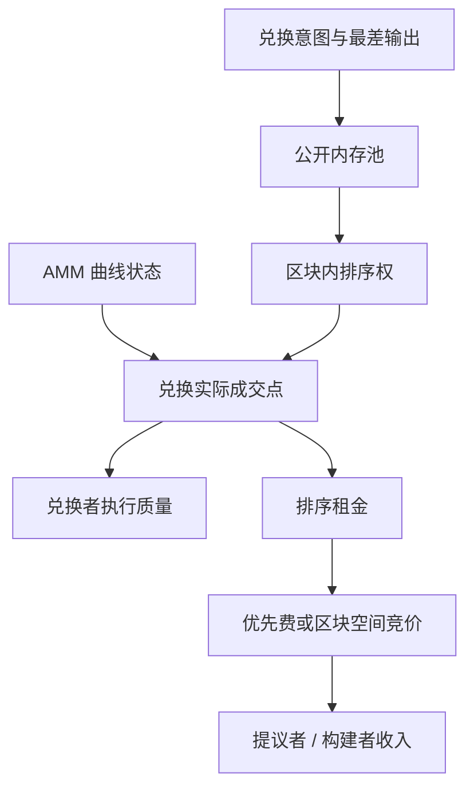

# MEV sandwich

    
透明内存池里的一笔兑换，把交易者已经写明的滑点容忍变成公共信息；区块提议者对交易排序、插入与审查的权限，使这部分剩余成为可被竞争的链上租金。

    <footer>—— Daian et al., Flash Boys 2.0, IEEE S&amp;P 2020；机制概述见 Ethereum.org, Maximal extractable value (MEV)</footer>

Philip Daian、Steven Goldfeder、Tyler Kell、Yunqi Li、Xueyuan Zhao、Iddo Bentov、Lorenz Breidenbach 与 Ari Juels 在 *Flash Boys 2.0* 里把去中心化交易所上的可提取价值写成市场结构问题：交易在进入区块之前是公开的，矿工（以及后来的验证者、构建者）决定顺序，于是出现优先 gas 拍卖（priority gas auction, PGA）和对排序敏感的利润。Ethereum.org 把同一对象称为最大可提取价值（maximal extractable value, MEV）：通过包含、排除或重排交易，超出标准区块奖励与手续费的那部分价值。三明治（sandwich）是文献与官方文档都讨论过的一类**经济机制**：一笔带滑点上限的 AMM 兑换，在公开队列里暴露了「愿意接受的最差价格」；排序权可以把该兑换夹在两笔方向相同的库存调整之间，使成交落在交易者已经授权的最差端附近，剩余从兑换者转移到拥有排序权或赢得排序竞争的一方。本篇只写这一租金从何而来、谁在支付、它与 [延迟套利](/quant/latency-arbitrage) 的相似之处。不写如何构造、如何选择对象、如何报价或如何执行。

## 问题

AMM 的兑换不是以「当前中点」成交，而是沿曲线走到某个均价，见 [恒定乘积](/quant/uniswap-cpmm)。交易者为了在异步、可能被插入其他成交的环境里不至于无限滑点，必须预先声明一个可接受的最差输出。该声明一旦出现在公开内存池，就不再是私有约束：任何人都能读到「这笔需求在曲线上最多愿意走到哪」。若区块内还可以安排其他成交改变曲线状态，则这笔兑换的实际执行点，可以在「无人插入」与「刚好满足最差输出」之间滑动。问题是：滑动所转移的剩余，在经济上是什么，为什么它会在透明排序的市场里成为均衡租金，而不是偶然的摩擦。

Daian 等人强调，这与传统「抢跑」叙事并不完全相同。传统抢跑依赖私有渠道或代理违规；这里的信息是**协议默认公开**的，排序是**共识角色的合法权限**。租金来自市场设计：先透明、后排序。Ethereum.org 把三明治列为 MEV 的常见形态之一，并把它放在用户体验与协议演进（分离提议者与构建者、私有订单流、批量拍卖）的语境里。量化要回答的是会计：剩余从哪条曲线上被拿走，竞争如何把租金从搜索者再分配给提议者，而不是回答如何参与分配。

### 滑点上限是一张公开的剩余支票

记池的当前状态给出无插入时的输出 $q_0$，交易者授权的最小输出为 $q_{\min}\lt q_0$。差额 $q_0-q_{\min}$ 是交易者为不确定性预留的缓冲。缓冲的经济含义是：交易者对执行价格的弹性，直到 $q_{\min}$ 为止都已被自愿放弃。若排序能使曲线在兑换发生前先沿同一方向移动，兑换者仍能得到不少于 $q_{\min}$ 的输出，交易不会回滚，但实际均价更差，缓冲被耗尽。被耗尽的部分，以库存与费用的形式出现在夹住这笔兑换的其他交易的损益里。这是**已授权剩余的再分配**，不是对未授权资金的扣划。授权越宽，公共支票越大；授权为零（精确等于 $q_0$）则几乎没有可再分配的缓冲，成交也更容易因任何插入而失败。

文献中的 sandwich 是对这种「授权缓冲被排序耗尽」的命名，不是一份步骤清单。公开讨论应停在剩余、排序权与竞争；把缓冲设紧、使用私有广播或批量撮合，是用户与协议层的风险选择，同样不是攻击教程。

## 方法

会计对象有三方：兑换者、流动性提供者、拥有或竞得排序权的一方。兑换者的损失是实际输出相对无插入输出的差额（以资产计，再换成共同记账单位）。LP 的曲线被额外的成交推动，其手续费与再平衡损益要单独记账：插入的成交本身也付费、也改变库存，LP 不是简单的旁观者，但兑换者的滑点缓冲主要转移到排序敏感的库存交易上，而不是变成 LP 的额外无风险收入。排序权一方的毛利润，在竞争下会转化为优先费或对构建者、提议者的支付——Daian 等人用 PGA 描述早期以太坊上这种竞争如何把租金抬到接近利润本身，使「搜索」的净利变薄、区块生产者的收入变厚。

Ethereum.org 后续把同一机制放进提议者—构建者分离（PBS）的叙事：构建者组装区块，提议者选择出价最高的合法区块。三明治这类排序租金没有消失，只是竞价场所从链上 gas 拍卖部分转移到区块空间市场。度量上，公开研究使用的是**已上链的可观测模式**与利润上界估计（例如 Qin、Zhou、Gervais 等对可提取价值的量化），而不是某次私有策略的复现。对风控与市场质量，有意义的矩是：带宽滑点授权的兑换在成交时相对模拟无插入路径的额外冲击、该额外冲击占成交额的比例、以及优先费/构建者支付中可归因于排序权的部分。

### 与延迟套利、毒性流的对照

[延迟套利](/quant/latency-arbitrage) 里，公共价格已经在一处更新，另一处的过时报价变成免费期权。三明治的信息不是另一张簿的成交价，而是**同一条曲线上尚未成交的、带限额的需求**。相似点是：二者都把「别人已经暴露的、对价格不敏感的部分」变成排序或速度的奖品；不同点是：前者的信号是外部价格，后者的信号是本人的限额单。Glosten–Milgrom 意义上的毒性仍然成立——LP 面对的流里混进了只在对自己有利时才成交的排序流——但兑换者支付的那一层，是对自己限额的执行质量，会计上应与 LP 的 LVR 分开。把所有 AMM 滑点都叫做 MEV，会高估排序租金、低估曲线凸性本身（即使无私有内存池、随机排序，大单也会冲击）。正确分解是：曲线冲击（机制必然）+ 授权缓冲被排序耗尽（市场设计）。

## 机制

透明与排序权合在一起，产生一种内生税。税基是交易者因不愿承担回滚风险而写宽的限额；税率由竞争决定，并最终进入区块生产者的目标函数。这解释了为何「只谴责搜索者」在机制上不完整：没有排序权，公开限额无法被确定性地夹在两笔库存调整之间；没有公开限额，排序权也没有这张特定的支票。Flash Boys 2.0 的标题指向传统市场的速度竞争，但论文的核心警告是共识层：当排序租金足够大，生产者可能重组、审查或偏离中立的包含规则，稳定性成为经济问题。三明治只是使该租金对普通兑换者可被感觉到的一种形态；同一排序权还作用于清算、套利与其他对顺序敏感的状态机。

协议层的公开回应方向（Ethereum.org 与后续 PBS 讨论所记载的）包括：让用户把意图交给不公开广播的通道，使限额不再成为内存池公共品；用批量拍卖或意图撮合让同一区块内的可交换需求同时定价，削弱「夹在前后」的时间结构；把构建者竞争规范化，使租金至少以竞价形式被提议者捕获，而不是以混乱的 gas 战争破坏手续费市场。这些是市场设计，不是保证执行质量的承诺。用户侧与限额同义的保护是：把可接受的最差价格写成真正可接受的价格，而不是复制界面默认的宽缓冲——这是对授权范围的选择，其效果是缩小税基。

### 剩余的归属不是道德分类

在自愿、透明、可回滚的约束下，兑换者得到的是「不低于 $q_{\min}$」的合约权利，不是「等于 $q_0$」的权利。$q_0$ 是反事实：若区块内没有其他相关成交。反事实没有被代币标准保证。因此三明治在合约意义上可以不违约，同时在市场质量意义上构成执行成本。监管与研究文献把它当 MEV 的一种，是因为排序权的分配与透明度是协议参数，可以改，而不是因为需要把合法包含写成入侵。量化记录应使用执行短差、限额宽度与区块内相关成交的共现，而不是使用「攻击成功/失败」这种把机制道德化的标签。

Flash Boys 2.0 度量的是优先费竞争与 DEX 上的可提取价值，并讨论其对共识稳定性的压力。它不是三明治的操作规范。引用该文应落在 PGA、透明内存池与排序权，而不是落在任何可复现的交易模板。

## 边界与工程取舍

本机制依赖：（1）状态在交易间可被同一区块内的其他交易改变；（2）意图在排序前可被观察；（3）用户给出了非零的执行弹性。私有订单流削弱（2）；批量同步撮合削弱（1）的时间结构；紧限额削弱（3），并以更高的失败率为代价。集中流动性改变的是曲线形状和穿越 tick 的冲击路径，不取消限额作为公共信息的事实，见 [v3](/quant/uniswap-v3-clmm)。跨域 MEV、中继与构建者市场会改变租金的分成，不自动改变兑换者执行短差的来源。

不要把「存在 MEV」写成「AMM 不可用」，也不要把「使用了私有通道」写成「已无执行风险」——通道、中继与构建者仍是排序权的下游。Daian 等人给出的是去中心化交易所在透明排序下的经济分析；Ethereum.org 给出的是面向开发者的机制概述与演进方向。二者都足够用来做风险会计与协议比较，都不足以、也不应当被读成如何从其他用户处提取价值的说明书。

回测链上成交若用事后区块内已实现均价当「无摩擦 AMM 价」，会把排序租金与曲线冲击混进 alpha。应至少构造无插入反事实（用该笔交易前的池状态重放）并把差额单列。这是度量，不是策略。

## 小结

- 三明治租金来自透明内存池中已声明的滑点缓冲与区块排序权的结合，是市场设计问题。
- 交易者合约上保证的是最差输出，不是无插入均价；二者之差是可被竞争的剩余。
- 竞争通过优先费或区块空间市场把租金推向提议者/构建者，搜索的净利润不是社会损失的全部画面。
- 与延迟套利同属「公共信息 + 顺序」的执行税，会计上应与 AMM 曲线的固有冲击分开。
- 出处：Daian et al., *Flash Boys 2.0*, IEEE S&amp;P, 2020；Ethereum.org, *Maximal extractable value (MEV)*；可提取价值的规模见后续公开度量研究。
