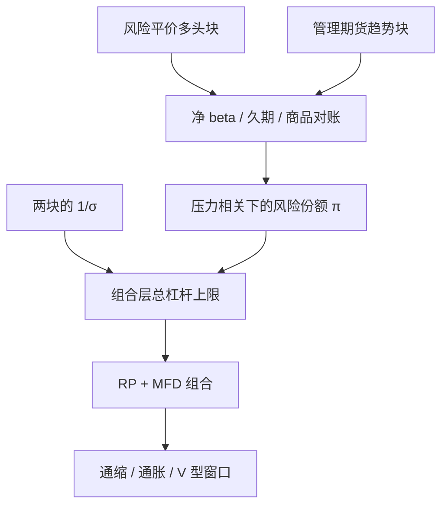

# 管理期货风险平价

风险平价把风险预算均分给底层资产类的多头溢价；管理期货把同一套期货工具写成时变多空的趋势。两者可以共用波动缩放，却不是同一个组合。

<footer>—— 对照 Hurst, Ooi & Pedersen 对趋势跟踪的长样本证据；风险平价实践见桥水 / AQR 一脉的风险预算论述</footer>

风险平价（risk parity）按风险贡献而不是按名义资本来配股、债、商品、信用：低波动的债券拿到更大名义，以求各类对总波动的贡献接近。管理期货（managed futures, CTA）用趋势符号在同一期货池里做多或做空，再按波动缩放。把二者写进一个账户，是机构常见的「全天候 + 危机凸性」拼盘。问题是它们的杠杆、相关与失败模式会缠在一起：都用 $1/\sigma$，都会在波动跳升时去杠杆，股指腿可能重复。本篇写合成规则、风险预算如何分给 MFD 与 RP，以及何时这个拼盘只是加倍的 vol target。

## 问题

纯风险平价在增长崩溃且宽松的危机里，债券腿往往救命；在 2022 年一类股债同跌、波动齐升的通胀危机里，两类多头一起亏，vol target 再砍仓，回撤可以很难看。CTA 的[危机 alpha](/quant/crisis-alpha) 恰恰声称能在持续压力里翻空股票。直觉上互补。需要写成可检验的句子：在预先定义的窗口里，RP+MFD 的最大回撤与条件夏普是否优于同等波动的纯 RP，以及代价是否为震荡年的 CTA 磨损。

第二个问题是重复暴露。RP 已经超配债券名义；CTA 在降息趋势里也会多债券。股指上，RP 永远偏多，CTA 有时空——这是真正的对冲。商品上两者都可能正，且都吃展期。合成前必须按腿对账，而不是看两个产品低相关就相加。

### 风险预算：把趋势当成一类资产，而不是「再平衡余量」

设目标组合波动为 $\sigma_{\mathrm{port}}$。一种干净的分法是：先给管理期货一个风险份额 $\pi_{\mathrm{MFD}}$（例如 20%–40% 的风险预算），剩余 $1-\pi$ 给风险平价多头。每一块内部再做各自的等风险。不要先做满 RP 再用「剩余保证金」去叠 CTA——保证金是约束不是预算，剩余会在平静期膨胀、在压力期消失，使 $\pi_{\mathrm{MFD}}$ 变成最错误的时变。

$$
\sigma_{\mathrm{port}}^2
\approx \pi^2\sigma_{\mathrm{MFD}}^2
+(1-\pi)^2\sigma_{\mathrm{RP}}^2
+2\pi(1-\pi)\rho\,\sigma_{\mathrm{MFD}}\sigma_{\mathrm{RP}}.
$$

全样本 $\rho$ 往往很低；压力期 $\rho$ 会因共同 vol target 而上升。应用压力 $\rho$ 来反推 $\pi$，而不是用宣传册上的 0.1。

「管理期货风险平价」有时被用来指 CTA 内部的等风险配权，有时指 RP 组合外挂 CTA。两者杠杆含义不同。本文指后者：多资产风险平价与 CTA 的组合层合成。前者见波动缩放与跨资产趋势相关。

## 方法

RP 块：股指、国债、信用、商品的多头期货或掉期，类内 $1/\sigma$，类间等风险或明确超配抗通胀/抗通缩。MFD 块：TSMOM 或多尺度趋势，合约层 $1/\sigma$，组合层目标波动独立校准。合成：用压力相关把两块缩放到 $\sigma_{\mathrm{port}}$；对股指、久期、商品的净 beta 设限额，超出则先砍重复的那一侧（通常是 RP 的股指或 CTA 的商品），而不是按比例同时砍——按比例会把危机里真正提供负相关的腿一起削弱。

回测对照：纯 RP、纯 CTA、50/50 风险预算、以及「RP 用全样本相关、忽略压力相关」的错误合成。验收窗口至少包括：2008 类通缩去杠杆、2013 类利率意外、2020 类短促崩溃与反弹、2022 类股债双杀。每一窗口分别看两块贡献。

### 共同 vol target 是隐形高相关

两块都在 $\hat\sigma$ 上升时降杠杆，等于在组合层面对全球波动做空。这在 Moreira–Muir 意义上可能提高无条件夏普，也在拥挤意义上制造同步减仓。工程响应：两块的波动估计窗错开（例如 RP 用更慢的 $\sigma$，CTA 用更快的 $\sigma$），或对总杠杆设独立于两块的上限，由组合层一次缩放，避免 $1/\sigma$ 乘两次。保证金在期货账户里是共用的，必须按最坏相关估占用，不能按块加总后再乘 0.7 的「分散化折扣」而不做压力。

## 机制

RP 卖的是风险溢价的分散持有：股权溢价、期限溢价、可能还有商品与信用。其脆弱性是溢价在同一宏观状态下一起为负。MFD 卖的是趋势可预测性与危机路径上的凸性，脆弱性是震荡与突然反转。互补来自状态或有：增长崩溃时 CTA 空股、RP 靠债券；通胀趋势里 CTA 空债或多商品，补 RP 的久期伤口。不互补的状态是「无趋势的高波动」：两块都磨损，vol target 再把未来的风险溢价暴露砍掉。

资金层面，两块都是杠杆期货，融资与保证金螺旋相同，见 Brunnermeier–Pedersen。拼盘没有消除中介约束，只是改变了方向性。拥挤上，RP 与 CTA 的投资者基础不同，但执行日可能重叠（波动跳升日）。合成产品的容量按重叠日的 $Q/D$ 估，不要按两块 AUM 相加估。

### 展期与债券 Carry 会被两边各记一次

RP 的商品多头吃被动展期；CTA 的商品趋势含总收益里的展期。RP 的债券超配吃 roll-down；CTA 的债券趋势在降息周期同向。归因若只看产品级夏普，会以为有四条 alpha，实际可能是两条溢价被两个规则重复加载。应强制分列：RP 的静态溢价、CTA 的方向切换、以及曲线 Carry 的单独账，见[期限结构 Carry](/quant/ts-carry) 与[趋势对展期](/quant/trend-vs-roll)。

把拼盘叫做「全天候」并不自动覆盖股债双杀。全天候的原意是对增长与通胀四种天气做风险均衡；CTA 是第五个天气——趋势是否存在。没有趋势的通胀冲击，拼盘仍可能只是杠杆多头。

## 边界与工程取舍

不要用剩余保证金决定 CTA 权重。不要用全样本低相关给 $\pi_{\mathrm{MFD}}$ 加杠杆。不要在同一经纪商账户里让两块独立 vol target 而不设总闸。国内可交易的债券与股指期货工具集更窄，RP 的「四类天气」与 CTA 的空头腿都可能残缺，拼盘要按当地工具重新定义，而不是把全球回测换汇。

与纯风险平价、纯 CTA 的选择：若投资者的危机定义是慢熊，CTA 份额可以更高；若主要怕通胀下的股债同跌，应检查 CTA 是否真能空久期，而不是假设「管理期货总会救场」。产品层把 MFD 风险平价当成一个词出售时，尽调附件必须有净暴露路径。

出处：趋势长样本见 Hurst, Ooi & Pedersen, *A Century of Evidence on Trend-Following Investing*；TSMOM 见 Moskowitz, Ooi & Pedersen, JFE, 2012。危机验收见 Kaminski。风险平价作为风险预算方法属于桥梁水与后续量化实践，不要把某一家的商标当成论文定义。波动管理见 Moreira and Muir, JF, 2017。

## 小结

- 管理期货风险平价指用风险份额合成「多头风险平价」与「趋势 CTA」，不是 CTA 内部等权的别名。
- 互补来自危机路径上的方向切换；共同 vol target 与重复的债、商品腿会削弱互补。
- $\pi$ 应用压力相关校准，总杠杆只在组合层缩放一次，保证金按最坏占用估。
- 归因要拆开静态溢价、趋势切换与展期，防止两条溢价被记成四条 alpha。
- 出处：Hurst–Ooi–Pedersen；Moskowitz et al., 2012；Kaminski；Moreira–Muir, 2017。
