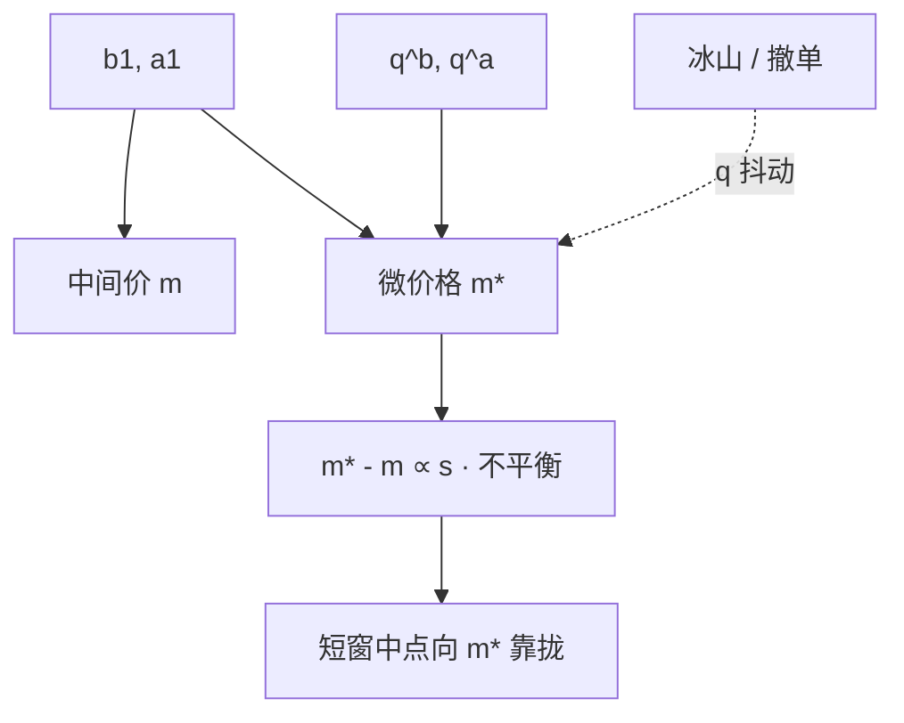

# 微观价格

用两侧最优档的量去做权，中间价会被推向量更薄的一侧——下一步更可能被打穿的那一侧，而不是几何中点。

<footer>—— 据 Stoikov 对 micro-price 的论述，以及 Cont 等人对限价簿几何与价格冲击的研究整理</footer>

中间价 $m=(b_1+a_1)/2$ 把买卖报价对称平均，默认两侧同样可能成为下一笔成交价。限价簿几乎从不对称：[队列不平衡](/quant/queue-imbalance-alpha) $I_1$ 偏离零时，薄侧先被消耗，$m$ 的条件期望并不在中点。微观价格（microprice）把这一几何写进一个仍以货币为单位的读数，通常是

$$
m^\ast=\frac{a_1 q^b_1+b_1 q^a_1}{q^b_1+q^a_1}.
$$

买档厚则 $m^\ast$ 靠近卖价，相当于把公允读数推向薄的卖侧。它仍是 BBO 与最优档量的函数，不是 Hasbrouck 意义下的有效价格，也不是模型里的 $V$。[LOB 结构](/quant/lob-structure) 的边注已经提到这个公式；本篇把它展开成短时公允价的构造、与中点的均值回复、以及它和 [深度加权中间价](/quant/depth-mid) 的分工。

## 问题

做市与短窗信号都需要一个「现在的价」：标记存货、判断吃哪一侧、衡量有效价差。用成交价会弹跳；用中点会忽略深度不对称；用微价格是在问：若下一笔随机主动单到来，期望成交价或期望中点移动指向哪里。问题是把簿几何收成一个标量价格，既要能高频更新，又不要把瞬时队列噪声当成价值发现。

第二个问题是命名。文献里 microprice、weighted mid、imbalance-adjusted mid 经常混用。有的公式用 $I_1$ 对 $b_1,a_1$ 线性插值，与上式相同；有的把权放到多档，那是下一篇的深度加权。必须先锁定价位范围，再谈它预测的是下一跳中点、下一笔成交价，还是更长窗的有效价格。

### 最优档加权把中间价推向薄侧

上式等价于 $m^\ast=I_1 a_1+(1-I_1)b_1$ 在 $I_1=q^b_1/(q^b_1+q^a_1)$ 时的写法（注意此处 $I_1$ 是买量份额，与有符号不平衡只差一个仿射变换）。$q^b_1\gg q^a_1$ 时 $m^\ast\approx a_1$：市场更可能在卖价成交或把中点推向卖价。价差 $s=a_1-b_1$ 内，$m^\ast$ 相对 $m$ 的偏离是

$$
m^\ast-m=\frac{s}{2}\cdot\frac{q^b_1-q^a_1}{q^b_1+q^a_1},
$$

即半价差乘有符号不平衡。微价格相对中点的「信号」与 $I_1$ 完全共线，只是带了 $s/2$ 的单位。tick 大、价差常钉在一档时，这个偏离可达半个 tick，对做市报价有一等意义；价差极窄时偏离小于噪声。

不要把 $m^\ast$ 当成可以无冲击成交的价格。立刻买仍付 $a_1$，立刻卖仍得 $b_1$。微价格是标记与预测用的读数，不是第三种可执行报价。

## 方法

在 L2 快照上，每次 BBO 或最优档量变化就重算 $m^\ast$。时间戳与 [事件时间](/quant/event-time) 对齐。预测检验：用 $m^\ast_t-m_t$ 回归随后 $\Delta m$，短窗应显著为正——中点向微价格靠拢。这是几何均值回复，不是价值发现的证明。对照应包括纯 $I_1$、纯 OFI：三者共线时，报告哪一个在给定延迟下更稳即可，不必三个都当独立因子。

标记存货时，用 $m^\ast$ 比用 $m$ 更少在一侧深度被抽空时假装「公允价没动」。有效价差若仍相对 $m$ 计算，会与微价格信号重复计算不平衡。研究应预先声明标记价。跨合约比较时，$m^\ast-m$ 有价格单位，除以 $s$ 或除以 tick 后才可截面排序。

### 向微观价格的均值回复

若主动单方向近似随机、深度暂时固定，中点的下一步期望指向薄侧，于是 $m$ 向 $m^\ast$ 移动。一旦发生移动或增撤，$m^\ast$ 自己也跳，回复目标在走。因此「回归到微价格」是对极短窗、深度尚未重写时的条件陈述。窗一长，OFI 累积、冰山补量、暗池成交都会让目标失效。经验上数十毫秒到数秒常见显著；数分钟往往被公开信息和趋势淹没。

Stoikov 把微价格做成做市中间报价的候选：存货围绕 $m^\ast$ 而不是 $m$ 来偏置，相当于把可见不平衡提前写进报价。这与 Glosten–Milgrom 的信念更新不同：那里移动的是对 $V$ 的期望，这里移动的是对下一跳几何的期望。两者可以同时存在——先用 $m^\ast$ 处理几何，再用成交方向更新信息。

## 机制

机制就是队列不对称下的消耗。不需要知情者，也不需要 Kyle 的批量拍卖：只要市价单沿现有 BBO 到达，薄侧先破。O'Hara 框架里订单流仍可携带信息，于是 $m^\ast-m$ 里混有信念成分；要把几何从信息里分开，可看不平衡在随后是否反转（几何耗尽后深度重建）还是变成永久中点移动（信息）。[价差分解](/quant/spread-decomposition) 的暂时/永久切分在这里同样有用。

与 Hasbrouck 有效价格对照：有效价格是随机游走成分，微价格是当前簿的函数，通常高度平稳、随 $I_1$ 抖动。把 $m^\ast$ 序列拿去估信息份额没有意义，它不是另一个市场的报价，而是同一张簿的另一种读数。[Hasbrouck 信息份额](/quant/hasbrouck-is) 需要多市场或至少多个带噪声的价格序列共享共同趋势。

### 与有效价格、信息份额不是同一对象

微观结构噪声文献把观测价写成有效价加定价误差。中点、成交价、微价格都是候选观测。微价格可能减小与深度相关的那一部分误差，但会引入队列噪声：大单进队、随即撤走，$m^\ast$ 大幅跳动而有效价值未变。高频已实现波动若用 $m^\ast$ 会与用 $m$ 不同，不能直接比较。选择哪一个做 RV，取决于你想滤掉的是买卖弹跳还是深度抖动。

冰山使显示 $q$ 偏小，微价格会过度推向「看似薄」的一侧。这与队列因子相同的测量误差。检测补量模式可以修正 $m^\ast$，仍属研究口径，不是展示策略。

## 边界

$q^b_1+q^a_1\to 0$ 时公式崩溃，应回退到中点或暂停信号。涨跌停一侧无对手价，微价格无定义。集合竞价没有连续 BBO 的同一含义。多档深度与隐藏量被忽略，大单的冲击路径看 [深度加权中间价](/quant/depth-mid)。最小报价单位使 $m^\ast$ 往往不是可报价网格上的点，做市商还要再圆整，圆整误差在一档价差时不可忽略。

不要用微价格变化当成交方向的替代去估 PIN：它不是买卖计数。不要把它与 OFI 同时当正交特征。延迟下，$m^\ast$ 比 $m$ 更吵，信号可能先于稳定的中点消失。A 股三档或五档行情若没有可靠的最优档量，公式退化。

$m^\ast$ 对最优档的一个大单极为敏感。风控标记若用微价格，需对单笔占该档比例设上限，否则某人的一张可见单就能把你的存货盈亏刷成另一副样子——这是标记脆弱，不一定是信息。

## 小结

- 微观价格用最优档量加权买卖价，把读数推向薄侧；相对中点的偏离等于半价差乘不平衡。
- 它是标记与极短窗预测的几何读数，不是可执行报价，也不是 Hasbrouck 有效价格。
- $m^\ast-m$ 与 $I_1$ 共线；与 OFI、多档深度加权应分工而不是堆叠。
- 向微价格的靠拢在深度尚未重写的短窗成立，更长窗被流量与信息主导。
- 冰山、极薄档、涨跌停与圆整构成使用边界。
- 出处：Stoikov 对 micro-price 的讨论；簿事件与冲击见 Cont, Kukanov and Stoikov, 2014；有效价格语言见 Hasbrouck, 1993/1995。
