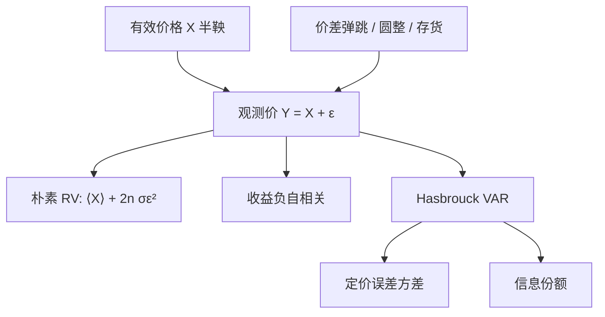

# 微观结构噪声

    
观测到的成交价等于有效价格加上一个暂时的定价误差；误差会反转，有效价格才是信息进入市场的那条鞅。

    <footer>—— Hasbrouck, Assessing the Quality of a Security Market: A New Approach to Transaction-Cost Measurement, Review of Financial Studies 1993</footer>

把成交价当成有效价格的直接观测，高频统计会立刻坏掉：采样越密，[已实现波动](/quant/rv-noise) 越大，收益出现负的一阶自相关，买卖之间像在弹跳。这些现象不是「市场越看越险」，而是观测值里有一层**微观结构噪声**——买卖价差、最小报价单位、存货、暂时流动性冲击。Roll 用价差弹跳解释收益协方差；Hasbrouck 把成交价拆成随机游走的有效价格与平稳的定价误差，用向量自回归估计误差方差，作为市场质量。本篇写噪声作为数据生成过程，以及它如何污染朴素统计量；如何从 RV 里把噪声抠掉，是下一篇的修正方法。

## 问题

记有效价格（信息充分反映后的证券价值）为 $X_t$，通常假定为半鞅。观测价格 $Y_t=X_t+\varepsilon_t$。$\varepsilon_t$ 来自：成交发生在买或卖一侧（Roll 弹跳）、价格必须落在离散网格、做市商存货导致的暂时偏离、以及报告延迟。$\varepsilon_t$ 可以与 $X$ 相关（信息不对称时，方向与后续 $X$ 同向），也可以有自己的序列相关（同一侧连续成交）。

若假装 $\varepsilon=0$，用很密的采样算 $\sum (\Delta Y)^2$，噪声的二次变差不会消失：i.i.d. 噪声下，这一项以采样次数的速度爆炸。若用日收益，噪声被日波动淹没，但又浪费了日内信息。问题是承认 $Y$ 不是 $X$，再决定：哪些问题必须对 $X$ 提问（波动、beta、信息份额），哪些问题本来就要对 $Y$ 提问（成交价、执行成本）。

### Roll 弹跳是噪声的最小模型

Roll（1984）设有效价格随机游走，成交价在有效价格上加减半个价差：$Y_t=X_t+\frac{s}{2}Q_t$，$Q_t=\pm 1$ 为买卖方向。若方向不相关，收益的一阶协方差 $\mathrm{Cov}(\Delta Y_t,\Delta Y_{t-1})=-s^2/4$，从而 $\hat s=2\sqrt{-\hat\gamma_1}$。协方差一旦为正，公式崩溃——现实里信息与存货会让 $\gamma_1$ 变号。Roll 不是失败的价差估计那么简单，它说明：**负自相关是噪声的指纹**，但指纹会被信息涂改。

噪声不是测量仪器的电噪声，虽然录入错误也是一种 $\varepsilon$。经济噪声有符号结构：主动买倾向于 $+\varepsilon$，随后若无信息，$Y$ 应回到 $X$。这就是实现价差会小于有效价差的微观基础。把 $\varepsilon$ 当成高斯白噪声，是为了写 RV 极限定理，不是对订单簿的完整描述。

## 方法

**加性噪声的 RV 偏差。** 在 $[0,1]$ 上 $n$ 等分采样，$r_{i}=Y_{i/n}-Y_{(i-1)/n}$。若 $\varepsilon$ 为 i.i.d.、方差 $\sigma_\varepsilon^2$，与 $X$ 独立，则

$$
\mathbb{E}\sum_{i=1}^{n} r_i^2 \approx \langle X\rangle_1 + 2n\sigma_\varepsilon^2.
$$

真实积分波动被一项与 $n$ 成正比的噪声主导。这解释了「越密越抖」的签名图（signature plot）：横轴采样频率，纵轴 RV，曲线在高频端上翘。

**Hasbrouck 定价误差。** 把中点或成交价的变动与订单流放进 VAR，把价格分解为随机游走（信息）与平稳成分（定价误差）。定价误差的方差衡量市场质量：越小，观测价越贴近有效价。信息份额（Hasbrouck 1995）在多市场同时交易同一证券时，把随机游走方差的贡献分给各市场——回答「价格发现在哪发生」，不是回答「噪声方差是多少」，但共用同一套有效价格 vs 误差的语言。

**相关噪声与内生时间。** 真实 $\varepsilon$ 往往与交易强度、方向相关。等间隔日历采样会在交易稀少时重复同一个过时价格（零收益插值），制造额外的自相关。这把噪声问题与 [不等间隔采样](/quant/irregular-sampling) 绑在一起：采样方案本身在制造 $\varepsilon$ 的表观结构。

### 签名图作为诊断，而不是模型

画不同 $\Delta$ 下的 RV$(\Delta)$，是确认噪声是否主导的第一步。若五分钟已经平坦、一分钟仍上翘，噪声在一分钟尺度可见。若全日都平坦，要么噪声极小，要么你的「成交」其实已被交易所聚合成分钟线。签名图不能给出 $\sigma_\varepsilon$ 的无偏估计——那需要 [两尺度 RV、核或预平均](/quant/rv-noise)——但它决定你有没有资格用朴素 RV。

## 机制

价差弹跳的机制是会计恒等式：一轮买上一轮卖，价格必须走一个来回，有效价值可以没动。离散报价的机制是圆整：有效价格在网格间连续移动时，观测值长时间不动，然后跳一个 tick，零收益与一跳交替，看起来像噪声。存货机制是暂时供给：做市商被卖单击中后降价吸引买家，价格偏离 $X$，随后回归。信息不对称则让 $\varepsilon$ 与未来 $\Delta X$ 相关：主动买之后 $X$ 上移，暂时成分与永久成分混在一笔 $\Delta Y$ 里。

Hasbrouck 的 VAR 机制是：用订单流与滞后收益去预测下一笔价格变化，把可预测的部分归为暂时，把新息的累积归为信息。识别依赖模型设定（包含哪些滞后、用成交还是中点）。它给出的误差方差是**相对**市场质量，不是 SI 单位下的物理噪声。

中点相对成交价更干净，因为买卖弹跳被平均掉一半；但中点不是可成交价格，且交叉报价、一档空洞会让中点乱跳。研究价格发现常用中点，研究执行成本必须用成交价。噪声的定义跟着你问的 $Y$ 走。

### 噪声与 PIN 不是同一层

[PIN](/quant/pin) 描述知情到达如何改变买卖强度；噪声模型描述观测价如何偏离有效价。知情交易会同时抬高逆向选择（价差变宽、冲击变大）和改变 $\varepsilon$ 与 $X$ 的相关。把 PIN 高读成「噪声大」是错的：PIN 高往往是永久冲击大，暂时噪声甚至可能因知情者少用中间价而改变形态。VPIN 的批量分类把价格变化当方向，等于把 $\Delta Y$——含噪声——写进订单流，高频噪声会直接污染毒性指标。

## 边界与工程取舍

加性 i.i.d. 噪声是为了写出 $2n\sigma_\varepsilon^2$ 这一项。现实里噪声随波动、随深度、随会话变化，开盘的 $\sigma_\varepsilon$ 大于午后。圆整是离散的，不是高斯。估计方法若假定独立噪声，在小 tick、高换手股票上偏差较小，在 tick 占波动很大的股票上偏差很大。

不要用收盘价的 Roll 估计去替代盘中有效价差：前者是日度协方差，后者是逐笔会计。不要把签名图上翘全部归因于买卖价差——[未清洗的错价](/quant/outlier-trades) 会造成更猛的上翘。不要在噪声主导的频率上估 beta、相关、对冲比率，除非已经做噪声修正或降低采样频率。日历效应与隔夜跳变是另一层：隔夜 $\Delta Y$ 几乎没有买卖弹跳，却有信息，把隔夜和日内噪声当成同一种 $\varepsilon$ 会错。

Hasbrouck 的市场质量是定价误差方差，不是价差本身。价差可以宽但中点很接近有效价格（报价保守），也可以窄但中点被订单流推着暂时偏离。报告市场质量应同时给价差、冲击与定价误差，单看一个会把做市商的风险补偿和信息效率混在一起。

## 小结

- 微观结构噪声是观测价相对有效价格的暂时偏差：弹跳、圆整、存货与延迟，不是仪器电噪声。
- i.i.d. 加性噪声使朴素 RV 以 $2n\sigma_\varepsilon^2$ 的速度膨胀，签名图在高频上翘是诊断。
- Roll 协方差与 Hasbrouck 定价误差从两个方向刻画同一件事：暂时成分会反转，信息成分留下。
- 噪声与 PIN/价差冲击相关但不相同；采样方案本身会制造表观噪声。
- 问波动应对 $X$，问执行成本应对 $Y$；频率选在噪声尚未主导处，或进入 RV 修正。
- 出处：Hasbrouck, *Assessing the Quality of a Security Market*, Review of Financial Studies 1993；Roll, *A Simple Implicit Measure of the Effective Bid-Ask Spread*, Journal of Finance 1984。RV 极限中的噪声项见随后 Barndorff-Nielsen 与两尺度文献。
