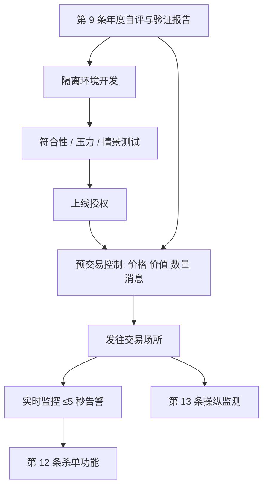

# MiFID II RTS 6

    
从事算法交易的投资公司应具备有效的系统与风险控制，确保交易系统具有韧性、有足够容量、设有适当交易限额，并防止发送错误订单或以可能导致混乱或滥用市场的方式运作。

    <footer>—— MiFID II 第 17 条；组织要求由 Commission Delegated Regulation (EU) 2017/589（RTS 6）具体化</footer>

MiFID II（Directive 2014/65/EU）第 17 条给算法交易加了一层组织义务。欧盟委员会 2016 年 7 月 19 日的授权规则 (EU) 2017/589——市场所称 RTS 6——把这些义务写成可检查的条款：治理与人员、研发与生产隔离、符合性与压力测试、年度自评与验证、杀单功能、操纵监测、业务连续性、预交易控制、实时监控、事后控制，以及高频技术的订单记录。ESMA 在后续监管简报中重申：算法与算法交易的口径、外包与测试，是各国主管机关容易分叉、因而需要对齐的地方。本篇把 RTS 6 读成策略与工程的**公开约束**：控制是动作掩码与独立闸门，不是优化目标。它不提供如何设计更具侵略性的下单节奏。

## 问题

算法交易把下单速度推到人工来不及逐笔判断。第 17 条担心的是错误订单、容量不足、无限额，以及策略以造成混乱或构成市场滥用的方式运行。RTS 6 不管「这套信号赚不赚钱」，管的是：谁对算法负责、上线前测过什么、盘中谁能停、限额是否在订单离开公司前生效。量化研究若只在回测里调参，会把这些控制当成事后可贴的标签；文本的顺序相反——没有通过测试与控制的算法，不应当出现在生产环境。

定义上要分开。投资决策算法决定买卖什么；执行算法在决策之后生成并提交订单或报价。RTS 6 序言与交易报告字段都承认这一划分。高频算法交易技术另有记录义务（第 28 条及附件表格）：提交后立即按指定字段记下每一笔订单细节。是否构成第 17 条的算法交易，以 MiFID II 的法定定义为准，不能用「我们只是把人工单拆细」自动豁免——若系统自动决定提交、修改或撤销，就进入组织要求的射程。

### 生产与测试必须是两套环境

第 7 条要求：对符合第 5 条若干准则的测试，在**与生产分离**、专用于算法系统开发与测试的环境中进行。第 10 条把压力测试放进年度自评：系统与第 12–18 条的程序控制应能承受订单流增加与市场压力，且测试本身不得影响生产。这直接约束研究—模拟—实盘的拓扑：用生产网关「试一下新参数」，是文本禁止的模式。符合性测试针对交易场所的接口与规则；压力与情景分析针对自身策略在高消息量、高延迟、行情缺口下是否仍守限额。ESMA 的监管简报强调外包开发并不转移测试责任。

年度自评（第 9 条）由风险管理职能撰写验证报告，并告知合规职能缺陷。没有独立风险职能时，义务落到第 23 条意义上的替代职能。自评不是营销材料：它要覆盖治理、控制、连续性以及与第 17 条的整体符合，并与业务的性质、规模、复杂度相称。

## 方法

把 RTS 6 映射到交易系统，是一组硬约束，而不是一组可微惩罚。

预交易控制（第 15 条）对所有金融工具在订单进入时实施：价格项圈，自动阻挡或取消不符合价格参数的订单；最大订单价值；最大订单数量；最大消息限制，防止对订单簿提交、改单、撤单过多。已发往交易场所的订单须立即计入这些限额。策略若在模拟器里靠「多撤多改」维持队列，会在真实控制下触达消息上限被切断——这是约束改变可行集，应在回测里就关掉这类动作，而不是上线后惊讶。反复自动执行节流：同一算法策略重复执行达到预定次数后，系统自动禁用，直到指定人员重新启用。市场与信用风险限额须基于资本、清算安排、策略与风险容忍，并随价格与流动性变化调整。无权交易某工具的交易员订单应被自动阻挡。被预交易控制挡住、仍想提交的订单，只能在例外、临时、逐笔、并经风险职能核实与指定人员授权后放行。

杀单功能（第 12 条）要求能够立即取消发往任一或全部已连接交易场所的未成交订单，覆盖交易员、交易台以及适用时的客户来源，并能识别每笔订单对应的算法与责任人。这与内部[风控闸门](/quant/trading-kill-switch)对齐，但 RTS 6 把它写成对主管机关与场所可展示的能力，而不是策略参数。实时监控（第 16 条）在发送订单的时段内，由负责该算法的交易员以及独立于该交易员的风险控制共同进行；告警应在相关事件后五秒内产生，并覆盖可能触发场所熔断的情况。事后控制与对账补上盘后的暴露与日志一致性。

$$
a_t\in\mathcal{A}_{\mathrm{legal}}(s_t)\cap\mathcal{A}_{\mathrm{pre}}(s_t),\qquad \mathcal{A}_{\mathrm{pre}}=\{\,a:\text{价格、数量、价值、消息速率均在限额内}\,\}.
$$

动作掩码属于第 15 条；策略网络或规则只在掩码内优化。把限额写进奖励再希望智能体学会不越界，与文本不符：控制应在提交前自动阻挡。

### 操纵监测是另一条流水线

第 13 条要求对经由其系统发生的全部交易活动（含客户）监测《市场滥用条例》(EU) No 596/2014 第 12 条意义上的潜在操纵，并维持自动监测系统：告警、报告、必要时可视化，覆盖全部订单，可按监管义务与自身策略变化调整，每年评估误报与漏报，并能在低延迟环境中事后回放。可疑活动走合规评估，必要时向场所报告或提交 STOR。这与预交易限额目的不同：限额防的是错误与混乱，监测防的是滥用。量化研究不应把监测规则的细节当成「如何避免被抓住」的攻略；公开义务是建立有效监测并跟进告警。

## 机制

RTS 6 把算法交易拆成生命周期。开发：隔离环境、符合性与压力测试、上线授权。运行：预交易限额、实时双人监控、五秒级告警、可杀单。退出：业务连续性（第 14 条）包括关闭算法而不造成混乱、备份与未完成订单的替代安排，每年测试。治理（第 1–4 条）要求管理层理解算法、合规能接触杀单、人员具备技能。高频记录把微观订单史留成可审计对象。整条链的效果是：策略的状态空间被合法动作与限额切开，事故时有人能停、有日志能回放。

相称性贯穿文本：「性质、规模与复杂度」。小型、低频的算法仍要有控制，但压力情景与备份地点的具体形态可以更轻。不能把相称性读成「成交不频繁就没有第 17 条」。直接电子接入（DEA）与一般清算会员另有专节：提供接入的公司要对客户流施加自己的控制，不能把第 17 条的义务连同接入一起外包消失。

ESMA 2024 年对预交易控制的共同监管行动之后，简报强调各国对「什么算算法」仍可能不一致。实务上应按法定定义从宽登记：自动生成订单的执行器、做市报价引擎、智能路由，通常都在射程内。漏登记的代价是控制框架出现空洞，而不是获得监管优势。

### 控制失败是 Knight 一类事故的制度答案

2012 年 Knight Capital 的错误部署表明：生产环境里并行的旧代码可以在数十分钟内造成巨大损失。RTS 6 并不点名该公司，但其测试隔离、上线控制、消息限额、杀单与实时监控，正是针对同一类操作风险。对量化台的含义是：参数发布、代码哈希、限额配置必须走变更控制；[研究与实盘隔离](/quant/research-sim-prod)不是风格问题，是第 7 条与第 15 条的工程翻译。模型验证若按 [SR 11-7](/quant/sr-11-7-model-risk) 做，管的是估计器是否错误或被误用；RTS 6 管的是交易系统是否会把错误估计变成扰乱市场的订单流。两套同时需要。

## 边界与工程取舍

RTS 6 适用于从事算法交易的投资公司，并经 MiFID II 第 1(5) 条延伸到某些无需按该指令授权、但是受监管市场或 MTF 成员的参与者。英国脱欧后有平行的国内文本，不能假设字句永远与欧盟官方公报一致。交易场所自己的成员规则（容量测试、取消比率）是另一层合同约束，常比 RTS 6 更细。本篇只讨论公开的组织要求如何限制策略的动作集与上线流程。

不要把预交易项圈设成与策略信号同一组可调超参，在样本内一起优化——那会在平静期学到过窄的项圈，在跳跃日要么拒掉全部对冲、要么放行本应阻挡的错单。限额应由独立风险职能按资本与清算安排设定。不要设计以制造虚假报价压力为目的的消息模式；第 13 条与 MAR 把那类行为放在滥用监测而非「执行优化」下。

杀单必须能在算法失控时使用，也必须能在关闭时不制造混乱（第 14(3) 条）。工程上这意味着撤单顺序、对冲残腿与向场所的通信要预先演练。把 kill 做成「删掉进程、订单留在簿上」，不符合「取消未成交订单」的定义。

## 小结

- RTS 6（(EU) 2017/589）把 MiFID II 第 17 条落成治理、测试、限额、监控、杀单与记录等组织要求。
- 测试必须离开生产；年度自评由风险职能验证并告知合规。
- 预交易控制是提交前的硬掩码：价格项圈、最大价值与数量、消息上限、重复执行节流。
- 杀单须能识别算法与责任人并取消未成交订单；实时告警时限为五秒。
- 操纵监测按 MAR 另建流水线，与防错单的限额不是同一套系统。
- 控制由独立风险职能设定，不与策略参数一起样本内优化。
- 出处：Directive 2014/65/EU Art. 17；Commission Delegated Regulation (EU) 2017/589；ESMA Supervisory Briefing on Algorithmic Trading in the EU；Regulation (EU) No 596/2014 Art. 12, 16。
