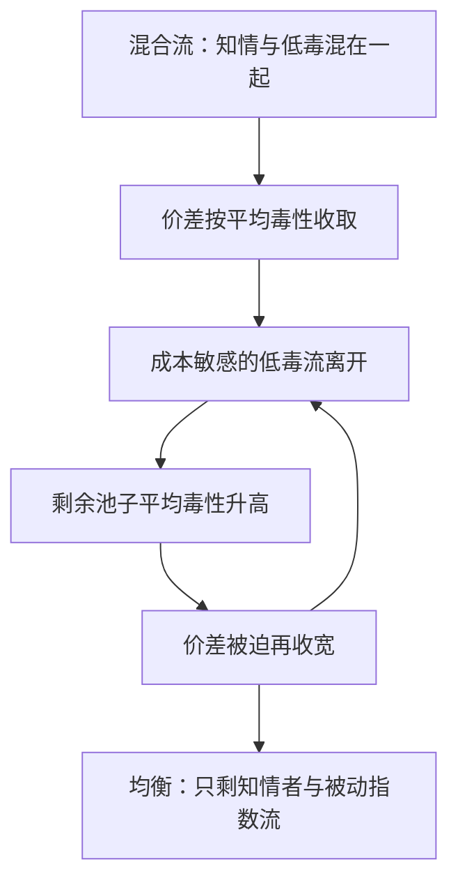
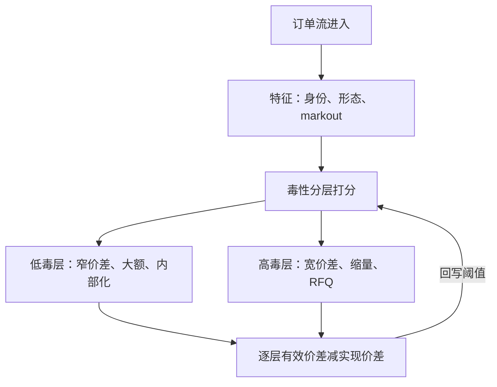

# 对手方分层与定向

把知情概率当成全市场一个常数，价差就按最毒的对手收；低毒流被高价赶走，剩下的池子更毒——分层定价不是歧视，是让做市可活的条件。

<footer>—— 据 Glosten and Milgrom, Journal of Financial Economics, 1985；Harris, Trading and Exchanges, 2003 整理</footer>

[上一课](/quant/mm-hedging-inventory)把库存风险转移给对冲腿之后，对手仍被当成一个整体在定价。[Glosten–Milgrom](/quant/glosten-milgrom) 的知情者比例 $\mu$ 是单一参数：所有人同样可能知情。真实流不是：小额零售、机构母单与程序化单混在同一簿里，被同一个价差收费。本课把 $\mu$ 截面化：用什么特征识别对手、对每层报什么价、哪些做法越线。

## 问题

混合定价的均衡是逆选择螺旋：价差按平均毒性收，价差越宽，对成本敏感的低毒流越先离开，剩余池子的平均毒性越高，价差再宽——驱逐直到市场只剩知情者与被动指数流。缺口因此是三层：识别（用什么可观测特征分层）、定价（对每层报什么价与量）、合规（差别化与抢先的边界在哪）。不做分层的做市商最终只能收全市场最宽的价差，或在消息日历上停摆，把成交量让给会分层的人。

直觉类比：保险公司分不清好坏司机时，只能按平均事故率收保费；好司机觉得亏，转投别家，剩下的池子事故率更高，保费再涨——这就是「柠檬市场」螺旋。做市商不分层定价时面对的是同一道题，只是「保费」是价差。

### 特征族与打分

分层特征三类：身份与路由属性（账户类型、订单标记、进入场所）、订单形态（大小、是否拆分、方向与公开消息的时序相关）、历史行为（该来源成交后固定窗口内中点朝成交方向的位移，即 markout 得分）。打分的会计口径直接用[逆向选择成本度量](/quant/adverse-selection-cost)：每层分别算有效价差减实现价差，谁在事后吃掉你的价差，数字自己会排出来。零售流的行为差异有大样本证据，见 [零售流的证据](/quant/boehmer-retail-flow) 一类研究。

术语翻译：markout 就是「成交后过一小段时间，中点朝成交方向走了多少」。你买入后价格继续涨，说明你更可能是知情方，对手方（做市商）的 markout 为负——瞬间赚了价差，几分钟后在更好的价位把库存亏回去。逐来源累积这个数，就是最朴素的毒性档案。

markout 得分的窗口必须固定并写进台账：把窗口从 30 秒改成 5 分钟，「同一来源」的毒性排序可能翻转。窗口选择本身就是一层模型假设，前台与风控各用各的窗口，分层阈值就永远吵不完。

## 方法

动作按层配套：对低分来源收窄价差、扩大规模，甚至内部化对敲（自己接下对手单，不出现在公开簿）；对高分来源加宽、缩量、拒单，或改走询价——定向报价把「挂给所有人」改成「报给特定对手」，价格可以带该对手的毒性条件。分层经济等价于把单一市场拆成多个子市场，每个子市场的 $\mu$ 更低、价差更窄，公开簿反而更健康。

[PIN](/quant/pin) 的日度似然给不出逐笔分层，但它是分层有效性的低频校验：你的分层是否真的把高 PIN 时段的高毒来源挑了出来。

数字实例：假设全池混合的知情概率对应 12 分宽的价差。分层后，低毒层按 $\mu\approx 0.05$ 收 4 分、高毒层按 $\mu\approx 0.5$ 收 20 分——低毒层价差缩小三分之二，被窄价差吸引回流，公开簿的总流量与深度反而变厚。分层不是把蛋糕切小，是把被高价赶走的流量请回来。

## 机制

分层改变的是价差对谁收：Glosten–Milgrom 里价差是条件期望之差，条件集合从「全市场」换成「这一层」，价差就跟着这一层的 $\mu$ 走。内部化低毒流的经济学不是掠夺而是分离均衡：愿意被内部化的对手拿到更窄的价差，公开簿剩余池子的毒性被明码标价。定向报价更进一步：报价本身成为对特定对手的条件合同，做市商从「被动接所有来者」变成「选择与谁成交」。

反馈环要闭到阈值：分层的正确性只有会计能检验——某层开始持续吃掉实现价差，阈值就该移动；某层长期贡献价差收入，规模就该放开。这是第一课「模型是分解器」口径在对手维度的重演。

## 边界

红线在信息流：不能把一层对手的成交信息用于对另一层的抢先报价——front-running 与信息屏障是监管与合同的双重对象。不能对同层对手做无依据的差别定价，标记错误会让受保护人群系统性拿到劣价。小来源样本不足，阈值要平滑回退到全池价差，不要让两个 markout 样本决定一个价差。分层是风险管理语言：本课不提供识别具体自然人对手或定向淘汰对手的构造。

## 小结

- 单一 $\mu$ 按平均毒性收费，引发逆选择螺旋；分层是让低毒流留在市场的条件。
- 特征三类：身份路由、订单形态、历史 markout；会计口径是逐层有效价差减实现价差。
- 动作按层配套：窄价差与内部化给低毒层，宽价差、缩量与 RFQ 给高毒层。
- 定向报价把报价变成对特定对手的条件合同，等价于拆分子市场。
- 阈值靠会计反馈闭环；窗口与规则进台账。
- 信息屏障与公平对待是红线；小来源回退全池价差。
- 出处：Glosten and Milgrom, *Journal of Financial Economics*, 1985；Easley, Kiefer, O'Hara and Paperman, *Journal of Finance*, 1996；Harris, *Trading and Exchanges*, 2003。
