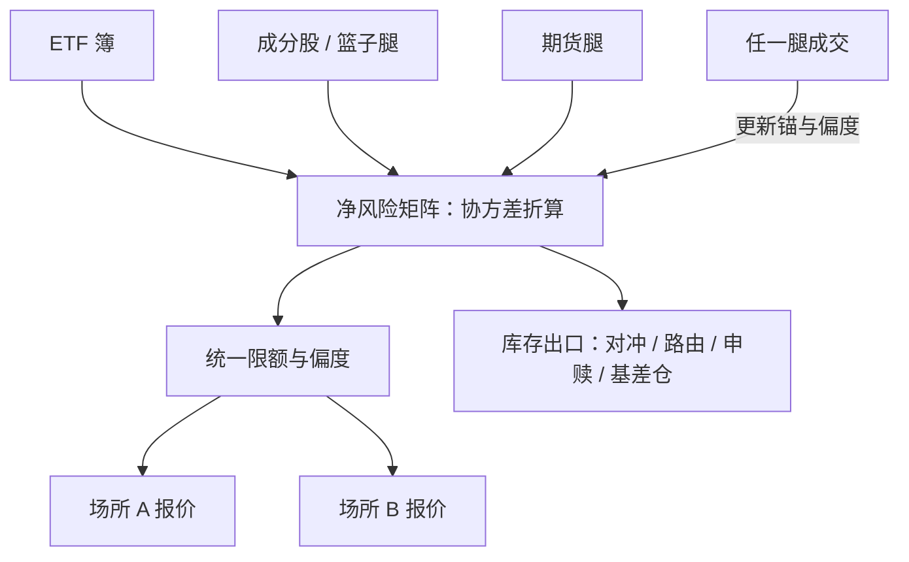

# 跨品种做市

同一份风险在簿里有好几件外衣：ETF、成分股与期货；限额与偏度一旦按单品种设置，加起来的风险早就不是你以为的那份。

<footer>—— 据 Guéant, Lehalle and Fernandez-Tapia, 2013 多资产一节；Harris, Trading and Exchanges, 2003 整理</footer>

[上一课](/quant/mm-inventory-limits)把单品种的库存困境写成阶梯。但当簿里同时有 ETF、成分股篮子与股指期货，单品种的 $q$ 与限额都要换成向量语言：偏度对净暴露、限额看协方差。[GLFT](/quant/glft-market-making) 的多资产一节给出了惩罚矩阵化的原型。本课写业务口径：腿怎么组织、锚怎么联动、库存出口怎么分级。

## 问题

同一风险的多重表达：持有 ETF 约等于持有一篮子成分股，篮子又有期货表达。腿相关但不同时成交：ETF 先成交、篮子腿还在路上，间隙里的暴露不是零，而是带着单腿风险却没有单腿价差保护。错误形态两种：各腿独立设限额与偏度，名义限额加总后的真实风险远超预算——协方差既是余量也是错觉来源；各腿独立公允价，一腿成交后另一腿的锚没更新，两条偏度互相打架，报价在两个锚之间来回改。

### 锚的联动

关联腿成交是公允价事件：ETF 腿吃掉一笔大单，篮子腿的锚要立即按冲击更新；期货跳一格，ETF 的折溢价与偏度基准同时移动。锚联动靠的是同一份定价服务而不是各腿独立实例，延迟预算按[延迟预算](/quant/latency-budget)的口径分配——联动慢于对手的套利速度，你的窄价差就是别人的免费对冲。

把申赎出清当「免费平仓」是最贵的错觉：create/redeem 有过手费、最小申赎单位与篮子截止时间。尾盘残留的不足一个申赎单位的净头寸，只能按二级市场成本出清——预算必须按这个口径留。

## 方法

风险单位用协方差折算：各腿库存进同一个惩罚矩阵，限额与偏度都对净数——这是 [GLFT](/quant/glft-market-making) 多资产口径的直接应用。库存出口分级：盘内对冲腿最快；跨场所转移走[智能订单路由](/quant/smart-order-routing)；申赎出清走 [ETF 实物申赎](/quant/etf-create-redeem)，按过手费与最小申赎单位计价；期货基差仓作为隔夜表达，盯市现金流按[期货保证金](/quant/futures-margin)口径预算。跨场所报价一致性：一个场所改价要在预算内同步到其余场所，否则被跨场所套利单打穿最薄的一处。

## 机制

跨品种的收益来源三块：各腿的价差与回扣、两腿错价的均值回复（折溢价）、义务与费用结构在场所间的优化。错价收益的机制边界在 [ETF 套利](/quant/etf-arb)与[指数套利](/quant/index-arb)讲过：申赎机制保证折溢价收敛，做市商赚的是收敛路径上的价差服务费，不是方向。风险集中在「腿不同时」：间隙暴露等于无保护的单腿做市，所以腿间到达的时距分布本身是监控对象——篮子腿长时间挂不上，说明深度被别人先拿走了，此时 ETF 侧的报价宽度应当反映「对冲腿可得性」这个状态。

相关断裂是向量限额的校核情景：常态下协方差给的限额余量，在相关性归一的当天消失，保证金价差优惠同时取消（期货保证金口径）。向量限额要按断裂情景重算一遍，留出余量。

## 边界

结算与币种错配、交易时段错配（夜盘、假期日历）使「同时」这个假设打折；各场所的义务与费率不同，比较要费用调整后做，见 [maker-taker](/quant/maker-taker)。跨品种做市不是套利课：折溢价的统计规律与申赎机制见 [ETF 实物申赎](/quant/etf-create-redeem)与[指数套利](/quant/index-arb)，本课只写做市侧的簿管理。商品与跨境品种的轮动与价差另有专门问题，见 [跨商品价差](/quant/intercommodity-spread) 一类口径；不展开。

## 小结

- 同一风险的多重表达要求向量语言：限额看协方差，偏度对净暴露。
- 锚必须联动：任一腿成交与期货跳动都是公允价事件，联动慢了窄价差就是别人的对冲。
- 库存出口分级：对冲腿、跨场所路由、申赎出清、基差仓，各有标价。
- 间隙暴露是主要风险：腿间时距分布进监控，宽度反映对冲腿可得性。
- 向量限额按相关断裂情景校核，常态协方差给的余量在裂缝日消失。
- 出处：Guéant, Lehalle and Fernandez-Tapia, *Mathematics and Financial Economics*, 2013；Harris, *Trading and Exchanges*, 2003；Black, *Journal of Financial Economics*, 1976 的期现口径。
