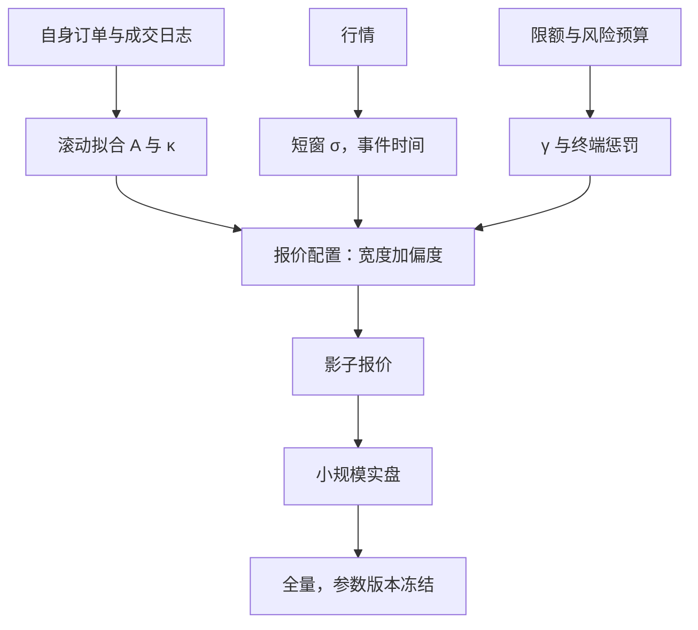
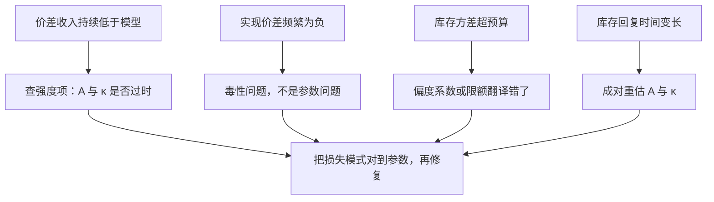

# 从存货模型到实盘参数

模型给的是分解，不是四个数字；实盘的宽度与偏度是校准和灰度出来的配置，参数填错了，闭式解越漂亮，亏得越整齐。

<footer>—— 据 Avellaneda and Stoikov, Quantitative Finance, 2008；Guéant, Lehalle and Fernandez-Tapia, 2013 与生产做市实践整理</footer>

[上一课](/quant/obd-map)把订单簿动力学收成一张地图：状态、速率与机制互相约束，统计清单先于模型、条件化先于平均、闭环意识贯穿始终，并把速率方程与冲击函数交给做市与执行的深化课程。本课是「做市业务深入」的第一课，接走那台引擎：把「按库存偏移报价、按波动开价差」变成会挂单的配置。主干已把理论讲完：[Ho–Stoll](/quant/ho-stoll-inventory) 给出存货偏度，[Avellaneda–Stoikov](/quant/avellaneda-stoikov) 把报价写成无差异价格加最优价差，[GLFT](/quant/glft-market-making) 去掉剩余时间因子。本课不再推公式，只问：公式里的 $\gamma,\sigma,\kappa,A$ 与惩罚系数从哪来，又如何知道填错了。后课默认这些模型已读。

## 问题

理论到实盘隔着一条参数缝。强度 $\lambda(\delta)=A e^{-\kappa\delta}$ 里的 $A$ 与 $\kappa$ 概括市价单对距离的弹性，不是从一档深度读出的物理常数；$\sigma$ 是中间价的扩散系数，隔夜跳空与尾盘放大使它全天不是一个数；$\gamma$ 与终端惩罚是风险偏好与限额的翻译，不是可回归的量。缝填错了，错误会伪装成模型错误：抄论文表格的 $\kappa$ 在自己的标的上差一个量级，报价不是远到没有成交，就是近到被随便捡走。

更隐蔽的是时间结构。$A,\kappa,\sigma$ 随日内时段、波动体制与消息日历漂移，全天一套参数等于假设开盘竞价与午后薄簿是同一个市场。参数缝的完整表述因此是：**哪些参数点-in-time 估计，哪些由偏好与限额反推，哪些随日历调度。**

### 三类参数三种来源

可估计的（$A,\kappa,\sigma$）：用自己的限价成交、改单与撤单日志，滚动窗口内按距离分桶拟合强度；$\sigma$ 用事件时间或短窗已实现波动，剔除开盘与尾盘的机制段。反推的（$\gamma$、终端惩罚）：从风险预算来——限额给定后，等效的风险厌恶或惩罚系数是会计选择，不是统计估计。调度的（时段修正）：开盘与尾盘放大惩罚、缩窄 $Q$，午盘恢复；非平稳写进日历规则，不让一套参数硬扛。

数字实例：$\kappa$ 是报价距离的衰减率——离中点远 1 分钱，成交强度乘 $e^{-\kappa\times 0.01}$。$\kappa=100$ 时强度掉到约 37%，$\kappa=1$ 时几乎不衰减：两者的报价宽度可以一模一样，成交频率却差一个数量级。抄错 $\kappa$，不是没成交，就是被随便捡走。

$A$ 与 $\kappa$ 必须成对重估：同一批日志里只换 $A$ 不动 $\kappa$，等于把整条强度曲线放大或压扁——成交会系统性偏多或偏少，而单看报价宽度毫无异常。

## 方法

上线是一条灰度链：影子报价（不挂真单，用市场对面模拟自己的成交与损益）、小规模实盘（限品种限单量）、全量；影子模式测不了自己成交对簿与队列的影响，后两步不可省。回测与实验走[研究、模拟、实盘隔离](/quant/research-sim-prod)的快照口径，参数版本与快照一起冻结。费率进现金跳：每笔成交的增量是价差减 taker 费加 maker 回扣，见 [maker-taker](/quant/maker-taker)；跨收费方案的场所不可复用参数。

常见误区：「影子报价跑得好，直接上全量。」影子模式里你的单子不会真的排队、也不占簿上的位置——它测不出自己成交后对簿的冲击，也测不出排队被插队的损耗。小规模实盘这一级就是用来补这两件事的，跳过它等于把上线当成回测的重放。

## 机制

模型在生产里的角色是**分解器**而不是预测器。GLFT 的小库存近似给出「线性库存偏度加波动目标价差」，多数生产实现正是这一结构。分解的价值在于错误可定位：价差收入持续低于模型，先查强度项是否过时；实现价差频繁为负，是毒性问题而非参数问题；库存方差超预算，是偏度系数或限额翻译错了。把每个损失模式对到具体参数，是上一课判据口径的延续。

参数漂移靠监控发现而不是等重训：实际成交率偏离目标强度、库存回复时间变长，都是 $A,\kappa$ 过时的征兆；监控闭环是后面毒性检测与归因两课的对象。

直觉类比：模型不是自动导航，而是体检报告上的参考区间——报价赚不够时，它帮你说清「坏的是哪一格」：强度衰减、波动项还是风险厌恶。把模型当预测器、直接抄论文参数下单，就像照抄别人的体检单开药；单子越漂亮，亏得越整齐。

## 边界

指数强度与指数效用是为了闭式；强度若依赖队列长度，应回到数值解或把闭式当初值，见[排队与成交概率](/quant/fill-probability)。竞争性报价与消息延迟不在模型里：最优距离是在对手不变的假设下算的。校准窗口内有熔断或停牌时，强度与 $\sigma$ 都要切段。本课只解决「参数从哪来」；毒性在线发现、限额、降风险依次是后课的缺口。

## 小结

- 理论给结构与分解：宽度为强度项加风险项，偏度随库存；实盘工作是把参数填对并保持新鲜。
- 参数三分类：$A,\kappa,\sigma$ 点-in-time 估计；$\gamma$ 与惩罚由限额与预算反推；时段修正走日历调度。
- $A$ 与 $\kappa$ 成对重估；费率进现金跳，跨收费方案不可复用参数。
- 上线走影子、小规模、全量的灰度链，参数版本与快照冻结。
- 模型是分解器：损失模式对到具体参数，才谈得上修复。
- 出处：Avellaneda and Stoikov, *Quantitative Finance*, 2008；Guéant, Lehalle and Fernandez-Tapia, *Mathematics and Financial Economics*, 2013；Ho and Stoll, *Journal of Financial Economics*, 1981。
