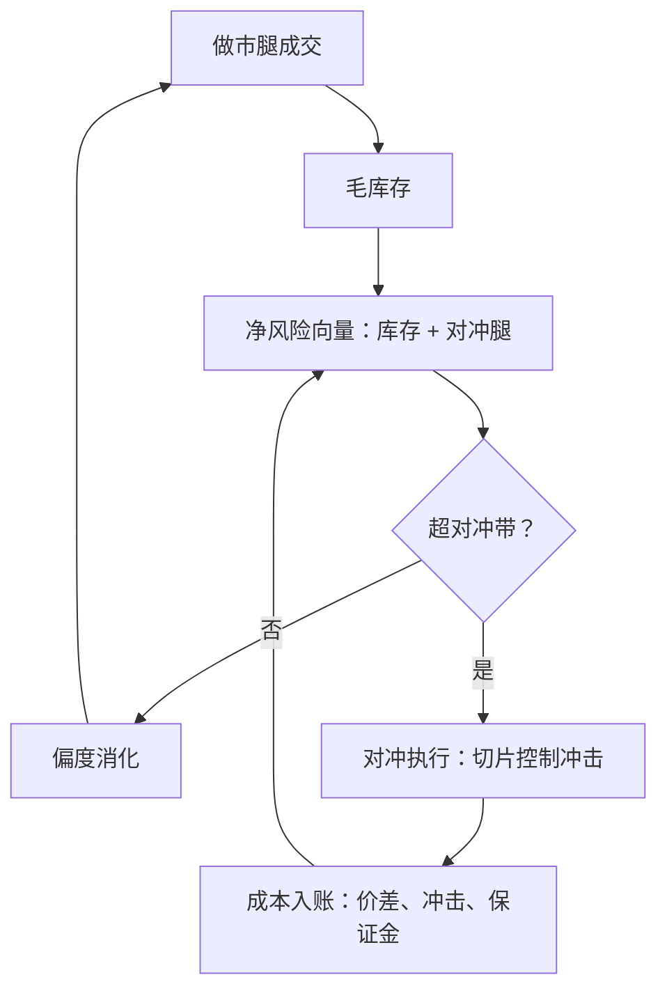
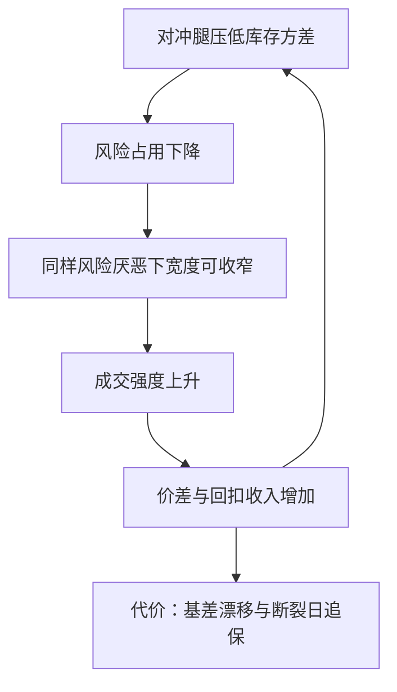

# 对冲与库存转移

偏移是劝对手把货拿走，对冲是自己把风险放到另一条腿上；两条路都有价签，选路的标准是成本，不是习惯。

<footer>—— 据 Guéant, Lehalle and Fernandez-Tapia, 2013 多资产一节；Almgren and Chriss, Journal of Risk, 2000 整理</footer>

[上一课](/quant/mm-quote-skew)把偏度写成围绕独立公允价的不对称移动，并强调 $q$ 应是净风险单位。本课把这句话补全：净风险里往往已经有另一条腿。做市商的库存不一定要靠报价偏移消化，可以把风险转移给对冲工具；[GLFT](/quant/glft-market-making) 的多资产一节已给出原型——惩罚矩阵吃进协方差，偏度对净暴露。本课写业务口径：何时对冲优于偏移、腿怎么选、带怎么设、账怎么记。

## 问题

偏移消化库存的代价是收入与成交强度：为了让别人接货，你要么让价、要么退出另一侧。对冲的代价是执行成本、基差与保证金占用。选择不是二选一而是配比：多小的库存带内用偏度、出带后对冲多少。两种对称的死法：从不设带，每笔成交立刻对冲，做市价差全喂给对冲腿的来回成本；带设太宽，库存带着基差与隔夜缺口一路漂到限额。

直觉类比：对冲带像空调的温控区间——室温（净库存）在区间内不开压缩机（用偏度慢慢调），出了区间才启动。没有带的空调每秒钟开关一次，电费全花在启停上；做市商没有带，价差收入就全喂给对冲腿的来回成本。

### 净风险向量

状态是向量：现货库存、期货腿、期权 delta 合成一个净暴露，进入同一个惩罚与同一份偏度。漏记对冲腿的后果在 GLFT 一节已警告过：偏度对毛库存再 skew 一遍，等于把已经中性的簿往一边推——盘面表现是「明明对冲了，报价却越来越歪」。

数字实例：现货库存 $+100$ 万、期货腿 $-95$ 万，净暴露只有 5 万。若漏记期货腿、按毛库存偏移报价，等于把近乎中性的簿按 100 万去推——偏度被放大 20 倍，报价歪向一边，接回来的全是逆向选择单。

对冲带是一次机会成本的预算：带宽太窄，一次对冲来回（约腿上半个价差加冲击）就能吃掉好几笔做市价差。带宽上限应参照「日成交笔数乘预期价差收入」来定，而不是参照腿的波动。

## 方法

腿的选择按基差与容量排：同标的期货基差最小、容量最大，是默认腿；高相关 ETF 用于期货不可得或时段不覆盖的场合；期权做市商用自己的 delta 对冲工具。触发规则取阈值带：净暴露超带才动，超带部分对冲固定比例或全额。对冲执行走 [Almgren–Chriss](/quant/almgren-chriss) 型切片控制冲击，不是一次市价单砸穿对手簿。成本单列入账：价差、冲击、盯市现金流与保证金占用分开记，保证金口径按[期货保证金](/quant/futures-margin)的每日盯市预算——对冲腿是现金流最硬的那条腿，现货未变现时期货腿已经要求付钱。

## 机制

对冲改变做市的收益结构：赚的仍是价差与回扣，付的是基差漂移与对冲执行成本；库存方差被压低之后，同样的风险厌恶下宽度可以收窄、成交强度上升——**对冲通过降风险间接扩量**，这是它优于纯偏度的机制，也是大容量做市几乎都带对冲腿的原因。边界情形由模型内一阶条件给出：带内偏度的边际成本等于对冲的边际成本，带的位置就落在那里。

相关断裂是这条机制的尾部：正常时两腿相关系数撑起的价差优惠，在相关性归一的当天取消，[期货保证金](/quant/futures-margin)口径下追加保证金与对冲失效同时到达，而那正是库存风险最大的时刻。带与限额要按断裂情景而非常态相关性校核。

为什么重要：断裂日最危险的不是对冲失效本身，而是「失效+追保」同时到达——期货腿本来在替你扛风险，那天它却先要求付钱。现金被追保抽走时，你可能被迫在价差最宽的时刻砍现货库存。压力测试必须把这一分钟写进剧本。

## 边界

涨跌停、停牌与夜盘缺口使对冲腿不可得或延迟，那时只剩偏度与减仓阶梯。保证金螺旋在对冲腿上同样存在，压力日追保优先于新成交。期权做市的 delta 对冲频率与 gamma 损益是衍生品簿自己的问题，见 [delta 对冲频率](/quant/delta-hedge-freq)与[离散对冲误差](/quant/discrete-hedge-error)；本课只写库存转移的框架，不进入希腊字母管理。对冲成本若不单独入账，绩效归因会把腿上的损耗错记到做市策略头上，那是第九课的口径。

## 小结

- 库存消化有两条路：偏移劝对手接货，对冲把风险转移到另一条腿；按边际成本配比。
- 状态是净风险向量：对冲腿与库存进同一惩罚、同一份偏度，漏记会双重偏移。
- 阈值带内用偏度、出带才对冲；带宽是一次机会成本预算，参照价差收入定。
- 对冲降库存方差，间接允许更窄的宽度与更大的量；相关断裂是校核情景。
- 对冲成本单列入账，否则归因错位。
- 出处：Guéant, Lehalle and Fernandez-Tapia, *Mathematics and Financial Economics*, 2013；Almgren and Chriss, *Journal of Risk*, 2000；Black, *Journal of Financial Economics*, 1976 与 Cox, Ingersoll and Ross, 1981 的盯市口径。
