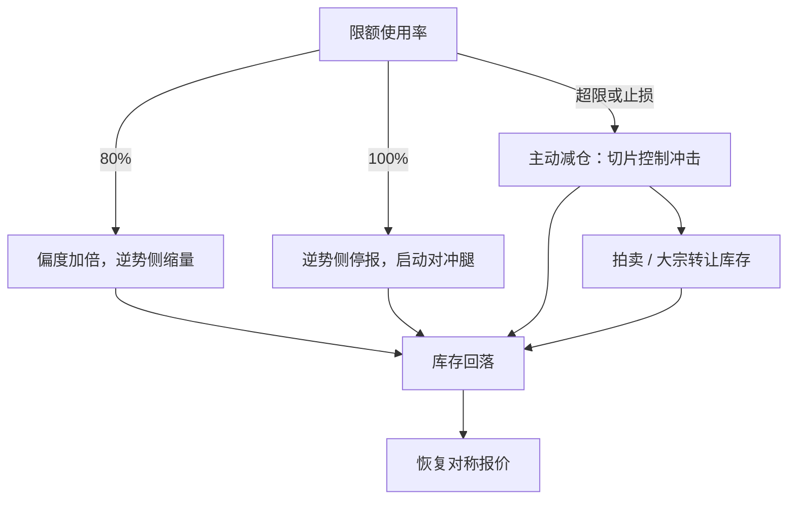

# 库存极限与降风险

降风险是拿确定性的小亏，换掉潜在的更大亏；行动的顺序要事先写好，触限时没有「现想」的位置。

<footer>—— 据 Ho and Stoll, Journal of Financial Economics, 1981；Easley, López de Prado and O'Hara, 2012 整理</footer>

[上一课](/quant/mm-risk-limits)把限额架在报价引擎前，越界侧会被关掉。但「关一侧」只是不再变差：库存已经贴在限额上，每多持一秒都在付方差。本课写降风险的选项排序——从最便宜到最贵的减仓路径，与每条路径的成本核算。

## 问题

触限后的行动集合有六个：加重偏度、只报减仓侧、主动吃单过价差（crossing）、对冲腿转移、参与拍卖或大宗、暂停策略。排序依据是成本-速度谱：偏度最慢最便宜，crossing 最快最贵。两种对称的死法：全用最贵路径，每次触限都吃价差，减仓成本把做市收入吃光；全用最慢路径，库存方差把期望收入磨没，还占满限额让策略停摆。缺的是一张预先写好、演练过的阶梯，以及每级台阶的成本标价。

### 成本-速度谱

偏度：只动价格不动账，成本是收入侧的让价，速度以分钟到小时计。单向报价（只报减仓方向）：退出逆势侧，成本是对称性损失，速度中等。crossing：支付全额有效价差并消耗多档深度，按[有效与实现价差](/quant/effective-realized-spread)口径核算，速度最快。对冲腿：受基差、保证金与腿上容量约束，见[对冲与库存转移](/quant/mm-hedging-inventory)。拍卖与大宗：把库存转让给愿意持有的人，折价是转移价格，路径见[竞价执行](/quant/auction-execution)。

crossing 的真实成本不止半个价差：按逐档消耗核算，名义一档价差的品种，大额减仓常要吃穿数档深度，实际成本数倍于第一档价差。用第一档价差估降风险预算，会系统性低估、临场被迫追加。

## 方法

阶梯按限额使用率预写进引擎：八成——偏度加倍、逆势侧收窄规模；十成——逆势侧停报，只留减仓方向，同时启动对冲腿；超限或触发止损——主动减仓，按 [Almgren–Chriss](/quant/almgren-chriss) 口径切片控制冲击，或转入拍卖与大宗询价。隔夜限额更紧的账，要提前进偏度：尾盘惩罚按日历升高，这是第一课日历调度的对象，等触限才升高惩罚等于没有惩罚。

降风险的每个动作都要回答「为什么是这个价位能成交」：你的单侧撤单与单向报价是公开可见的，对手读得出你的困境。动作的执行质量本身有市场影响——这就是为什么阶梯从最不暴露的开始。

## 机制

降风险的经济学在 [Ho–Stoll](/quant/ho-stoll-inventory) 的框架里就是库存项压过收入项：库存的边际方差成本超过价差边际收入时，最优报价会把一侧推到不成交，甚至主动吃单——1981 年的经销商没有限价簿可退，只剩主动出清。电子市场多了中间选项（单向报价、对冲腿），但角点解的逻辑没变：[毒性流](/quant/toxic-flow)讲过，毒性期望损失超过价差时，停报价或只报减仓侧是零利润约束下的理性选择，而不是故障。

集体维度是边界也是环境：所有做市商同时走同一级台阶时，深度消失、价格发现改走更薄的簿，你自己的减仓成本反而上升。阶梯因此要含拥挤感知：检测到对手单侧撤单抬升时，把 crossing 的预算按深度收缩重估，而不是按旧标价执行。

## 边界

涨跌停、停牌与熔断使部分路径不可用：停板日 crossing 无法成交，只剩对手方少的拍卖与次日缺口风险。对冲腿自己触限或保证金不足时，阶梯跳级到主动减仓，跳级要允许并演练。长周末与节假日前，隔夜惩罚要提前数小时升高，而不是等尾盘。期权簿的减仓紧迫性随 gamma 体制变化，属于衍生品做市另一条线；本课的阶梯以线性库存为对象。

## 小结

- 触限后的选项按成本-速度谱排序：偏度、单向报价、crossing、对冲、拍卖大宗。
- 阶梯按限额使用率预先写进引擎并演练，隔夜惩罚提前进偏度。
- crossing 按逐档消耗核算，第一档价差会低估数倍。
- 角点解逻辑来自 Ho–Stoll 与毒性流的停报价口径：库存边际成本压过收入时就退。
- 降风险动作有市场影响与拥挤效应，预算按可见深度动态重估。
- 出处：Ho and Stoll, *Journal of Financial Economics*, 1981；Almgren and Chriss, *Journal of Risk*, 2000；Easley, López de Prado and O'Hara, *Review of Financial Studies*, 2012。
