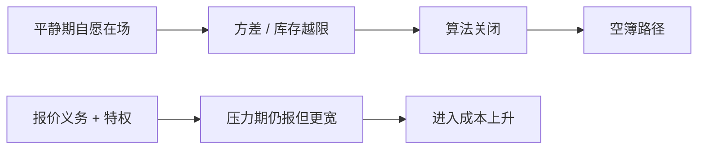

# 做市商义务与撤退

平静期自愿在场的做市商，在方差或库存越限时会关掉算法。义务条款试图把 Grossman–Miller 的 $M$ 在压力期钉住，但钉得太死会让人事先不愿进入，钉得太松则闪崩路径仍在。

<footer>—— 据 Grossman and Miller, Liquidity and Market Structure, Journal of Finance, 1988；经验上做市商资本与撤退见 Anand and Venkataraman, Market conditions, fragility, and the economics of market making, Journal of Financial Economics, 2016</footer>

[幌骚](/quant/spoofing-layering)是伪造供给。缺口是真实供给的**选择性在场**：高频做市没有传统专家那种硬义务时，Ho–Stoll 的限额变成撤退开关。Anand 与 Venkataraman（2016）讨论做市脆弱性；交易所指定做市商（DMM）、NASDAQ 做市商、期权指定商仍带有报价义务。本课写义务与撤退的权衡，接闪电崩盘的供给弹性，不写某司法辖区的条文清单。

## 问题

自愿做市的进入条件是：平静期价差收入覆盖资本与被捡。压力期被捡与库存方差跳升，自愿最优是 $\tau\to 0$ 直至离场。社会最优可能希望他们留下，因为即时性的外部性（别人的止损、价格作为公共信号）未被价差完全内部化。义务把留下写成约束：最大价差、最小深度、最短在场时间。问题是校准：义务过严，进入的 $M$ 下降或要求更高的平时价差补贴；义务过松，约束在闪崩时恰好不绑定。

指定做市商常用特权（费用、信息、拍卖参与）交换义务。这是把 Ho–Stoll 的垄断租金部分退回，换压力期在场——Seppi 意义上专家与限价簿并存的制度版本。

### 撤退是风控，不是一定是恶意

库存模型里硬约束使报价不连续：达到限额即单边或双边撤空。看起来像「扔下市场」，对个体是有限资本的最优。政策若惩罚撤退本身，等于要求无限资本，进入会少。更好的设计是熔断给补给时间、或中央对手方降低尾部，而不是假装 $M$ 可以无限。

欧盟与美国对做市义务的写法不同，期权、期货、股票又不同。本课只保留「特权换在场」的机制，不比较法条。

## 方法

经验：识别指定做市商账户，比较义务股票与对照股票在压力窗的价差、深度、撤退概率。Anand–Venkataraman 强调资本与市场条件。事件：波动率跳升、相关市场中断、个股跳水。结果模式：自愿 HFT 深度比义务做市商更快消失；义务做市商在上限内加宽，但仍可能达到义务允许的最宽价差。

理论：Grossman–Miller 的进入均衡加一个「压力期必须在场」的约束，进入成本上升，平静期 $M$ 可能下降。净福利取决于压力期外部性有多大——闪崩式分配损失 vs 平时更宽的价差。

## 机制

义务把暂时折让的上界切开：价格不能完全沿空簿走，除非义务也被击穿或触发停牌。这与涨跌停、LULD 是同类的硬边界，只是实施者是做市商而不是引擎。代价是做市商在义务区间内承担更大库存，要求事先补偿，价差的处理与库存成分上升。信息成分不会因为义务消失：被捡仍在，义务商可能用更短寿命在允许范围内闪烁。

跨市场：一处有义务、相关处没有，压力会转到无义务场所先崩，再通过套利拖垮有义务的场所。义务必须认清领先市场在哪。

## 边界

义务不能创造资本。2010 年类事件里，若亏损超过资本，义务只是加快谁先破产。中央清算、保证金、熔断是配套。把「恢复专家垄断」当成解决 HFT 撤退的方案，会忽略电子簿在平静期的价差收益。混合设计（义务 + 自愿 HFT）是现实，纯模型两端都不存在。

考核做市商用「平时报价时长」会选出平静期挂机、压力期掉线的人。考核应加权尾部在场，尽管更难测量。

## 小结

- 自愿高频做市在压力期理性撤退；义务用特权换有界在场，但提高进入成本。
- 撤退是有限资本的库存约束，闪崩路径是加总结果。
- 跨市场义务不对称会把压力转移到领先的无义务场所。
- 出处：Grossman and Miller, *Journal of Finance*, 1988；Anand and Venkataraman, *Journal of Financial Economics*, 2016。
