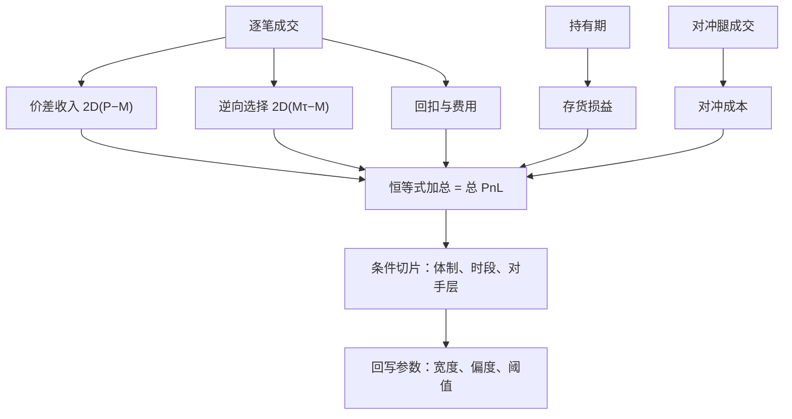
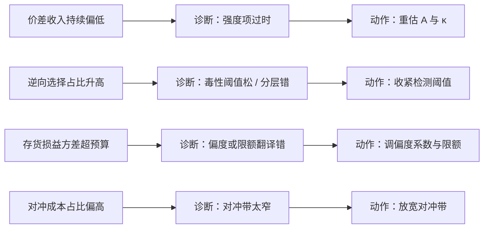

# 做市绩效归因

总损益是一个混合物：不拆开，毒性亏损会被读成运气差，顺风行情会被读成能力；两种误读各自导向一种错误的参数动作。

<footer>—— 据 Huang and Stoll, Journal of Finance, 1997；O'Hara, Market Microstructure Theory, 1995 整理</footer>

[上一课](/quant/mm-crossproduct)把簿扩成向量并给每个净暴露找到了出口。向量簿赚了还是亏了、赚在哪亏在哪，需要把钱拆到机制上。第一课说模型是分解器，本课把同样的分解用到损益上，并让归因回馈参数——这是「做市业务深入」里承上启下的一课。

## 问题

做市总 PnL 是混合物：价差捕获、存货漂移损益、逆向选择损失、费用与回扣、对冲成本、队列资本的隐性收益。不拆开有两种误读：把毒性亏损归因于「行情不好」，于是去调宽度而该收紧的是检测阈值；把顺风行情归因于「策略有效」，于是加杠杆而其实只是市场替你付了存货损益。两种误读都直接写坏参数——归因不是报表，是校准回路的一半。

### 逐笔恒等式

逐笔成交拆五个桶：成交价对当时公允价，得价差收入（$2D(P-M)$，有效价差口径）；成交后固定 $\tau$ 的中点位移，得实现价差与逆向选择（$2D(M_{\tau}-M_t)$，口径见[逆向选择成本度量](/quant/adverse-selection-cost)与[有效与实现价差](/quant/effective-realized-spread)）；持有期内中点漂移，得存货损益；费率表，得回扣与费用（[maker-taker](/quant/maker-taker) 口径）；对冲腿的价差与冲击，单列为对冲成本。概念上的处理、存货、信息三分见[价差分解](/quant/spread-decomposition)。恒等式加总必须等于总 PnL——对不上账先查 $\tau$、方向标志与公允价定义，再谈任何结论。

「逆向选择」翻译成大白话：和你做对手盘的人往往比你先知道消息——你挂出的单子总在坏消息落地前成交。于是「成交了」本身成了坏消息：成交后中点朝对你不利的方向走，走掉的那一段就是逆向选择损失，它和价差收入记在同一笔成交上，方向相反。

回扣主导的场所里，毛价差收入可以为负而净 PnL 为正：归因若不先做费用调整，「价差捕获」一栏直接把回扣误当 alpha，宽度与强度的校准会朝错误方向走。

## 方法

口径先锁死再算账：$\tau$ 一组窗口并排报（口径纪律见逆向选择度量一课）；方向标志用交易所主动被动标记优先；公允价用跨场所锚——跨品种课的锚联动在这里复用。归因做完恒等式再做条件切片：按波动体制、成交量分位、时段、对手层看各桶占比。毒性损失通常集中在少数日与少数层，全期平均会把信号抹平——切片才看得见「哪天、对谁、哪个动作」亏的钱。

数字实例：你在 $100.02$ 卖出、当时中点 $100.00$，毛赚半个价差 $0.02$；若 $\tau=1$ 秒后中点涨到 $100.05$，说明中点朝对你不利的方向走了 $0.05$。这笔的实现收益 $=0.02-0.05=-0.03$：表面上捕获了价差，实际被逆向选择吃穿。所以看毛价差做报表、看实现价差做校准，两者的差就是对手比你聪明的那部分。

## 机制

归因到参数的映射是闭环的另一半：价差收入持续低于模型，强度项过时，回第一课的 $A,\kappa$ 重估；逆向选择占比升高，毒性检测松了或对手分层错了，回第四、五课调阈值；存货损益方差超预算，偏度系数或限额翻译错了，回第二、六课；对冲成本占比高，对冲带太窄，回第三课放宽。每个桶都有明确的负责人与动作，这才是「归因」区别于「报表」的地方。

常见误区：初学者容易以为做市赚的就是「每笔价差」，实际上库存本身也在赚钱亏钱——价格整体上漂时，被动攒下的多头存货白捡收益，下漂时白亏。不把这一桶单独拆出来，行情顺风会被误读成报价能力强，接着加杠杆，反而放大下一个逆风期的存货亏损。

队列位置是隐性科目：每次改价丧失时间优先的机会成本不进现金账，却真实影响成交质量，见[撤单、改单与队列位置](/quant/cancel-queue-position)与[排队与成交概率](/quant/fill-probability)。精确入账困难，至少作为压力项单列，防止把队列资本的损耗误读成「报价不够积极」。

## 边界

中点漂移里信息与存货不分：归因给出会计事实，不给因果识别——这是价差分解一课的识别边界。自身大单推动中点会低估冲击，归因窗口内要剔除或标记自己的主导时段。费前归因在回扣主导的场所误导，跨场所比较必须费用调整。停掉的策略也进归因台账，否则归因有幸存者偏差——这与研究复盘课的台账口径一致：负结果可检索，归因才完整。

## 小结

- 逐笔恒等式拆五桶：价差收入、逆向选择、存货损益、费用回扣、对冲成本；加总必须对上总 PnL。
- 口径（$\tau$、方向、公允价）先锁死，窗口并排报。
- 条件切片按体制、时段、对手层做，毒性集中在少数日，平均会抹平信号。
- 每个桶回写到明确参数：归因是校准回路，不是报表。
- 队列位置作压力项单列；停掉的策略进台账防幸存者偏差。
- 出处：Huang and Stoll, *Journal of Finance*, 1997 与 *Journal of Financial Economics*, 1996；O'Hara, *Market Microstructure Theory*, 1995。
