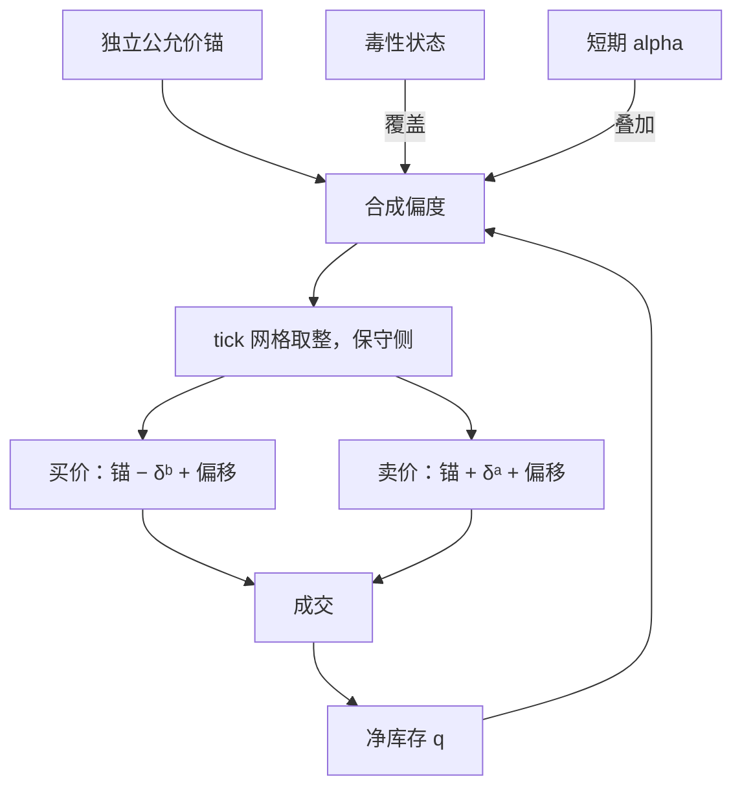

# 报价策略与偏移

偏移不是把整对报价一起挪，而是围绕公允价不对称地移动两侧；锚错了，报价会追着自己的影子跑。

<footer>—— 据 Avellaneda and Stoikov, Quantitative Finance, 2008；Guéant, Lehalle and Fernandez-Tapia, 2013 整理</footer>

[上一课](/quant/mm-floor-to-practice)把参数缝填上：宽度与偏度两个旋钮有了点-in-time 的初值与灰度上线路径。本课把第二个旋钮单独拿出来。主干在[库存偏度](/quant/inventory-skew)已把「中点平移改变成交方向概率」讲成交易台对象；[Avellaneda–Stoikov](/quant/avellaneda-stoikov) 给出偏移随库存线性的一阶近似。本课写工程口径：锚在哪、偏多少、几股偏移同时到场时听谁的。

## 问题

偏移是围绕公允价不对称地移动买、卖两侧：多头时买价退远、卖价贴近，让下一笔更可能是卖。缺口有三个：**锚**（相对什么偏）、**幅度**（每单位库存偏多少）、**覆盖顺序**（库存、毒性、短期 alpha 各自要偏时如何叠加）。锚错了会自我循环：用自己的买卖价中点当公允价，偏移改动中点，中点又喂给偏度，报价越走越偏。幅度错了有两种对称的死法：偏得太小，库存像随机游走一直积到限额墙；偏得太大，一侧几乎不再成交，做市退化成单向减仓，价差收入消失。

### 锚必须独立于自身 BBO

可用的锚：多场所加权中点、深度加权的公允价、对冲腿价格加基差换算。判据只有一条：把你自己全部撤单之后，这个锚仍然存在。幅度取线性 $b\cdot q$，$b$ 的量纲是价格每风险单位，理论原型是 GLFT 价值函数的库存差分 $\theta(q)-\theta(q-1)$；靠近限额时按非线性放大，并设上限截断。

常见错误是把锚放在「上一笔成交价」或自身 BBO 中点：成交价带着库存污染，自身报价又直接决定中点，两种锚都让偏度正反馈，盘面上表现为报价单边漂移、回不来的库存。

## 方法

叠加顺序写成规则而不是拍脑袋：毒性覆盖先于库存偏度——[毒性流](/quant/toxic-flow)讲过，为了回归库存而向知情流继续供货，是把偏度用错了方向；短期 alpha 在存货之上叠加，偏移不再是「减仓」而是「抢先」，口径见 [Cartea–Jaimungal](/quant/cartea-jaimungal)；最后才是库存项。每条来源各自给出目标偏移，引擎按优先级合成并限幅。

改价要节流：合成偏移的变化小于半 tick 不动单。价格-时间优先下每次改价通常丧失队列位置，见 [撤单、改单与队列位置](/quant/cancel-queue-position)；为半 tick 的偏移精度白扔队列资本，是新手最常见的隐性成本。落到 tick 网格时，取整方向应朝减仓一侧（保守侧），否则一半偏移被网格吃掉。

## 机制

偏度把成交方向概率写成库存的函数：偏移量 $b\cdot q$ 改变两侧被击中的相对强度，库存成为均值回复的受控跳过程，回复速度由 $b$ 与成交强度共同决定。这意味着偏度是**漂移控制**，宽度是**波动控制**：只加宽价差不改变库存漂移，只平移则在价差收入大致不变时降低风险——两个旋钮分工，见[库存偏度](/quant/inventory-skew)的工程表述。把偏度当宽度用（库存危险就全面加价差），库存不动、收入先掉。

偏度的极限不是无限偏移而是动作切换：库存贴近限额时，偏度非线性放大直到一侧退出，那是第六课限额的边界条件；毒性高到价差覆盖不了期望损失时，正确动作是停报一侧而不是继续偏——那是第七课降风险阶梯的起点。

## 边界

偏度不是毒性防御：知情流专挑你库存错误的一侧成交，线性偏度可能恰好加码亏损。tick 极小的品种偏移被费用主导，每笔报价的经济价差要按 [maker-taker](/quant/maker-taker) 调整后再谈偏移。对冲腿在场时，$q$ 必须是净风险单位而不是现货股数——对已中性簿再偏一次，是下一课对冲要解决的配对错误。偏移系数 $b$ 不是常数：波动体制切换时 $b$ 应随 $\sigma^2$ 走，这是第一课日历调度的对象。

## 小结

- 偏移是围绕独立公允价的不对称移动；锚必须独立于自身报价，否则正反馈。
- 幅度取 $b\cdot q$ 的线性原型，限额附近非线性放大，上限截断。
- 叠加有顺序：毒性覆盖、alpha 叠加、库存兜底；改价节流在半 tick。
- 偏度管漂移，宽度管波动；两个旋钮不可互相代替。
- 偏度的极限是动作切换：一侧退出或停报属于限额与降风险的口径。
- 出处：Avellaneda and Stoikov, *Quantitative Finance*, 2008；Guéant, Lehalle and Fernandez-Tapia, *Mathematics and Financial Economics*, 2013；Cartea, Jaimungal and Penalva, *Algorithmic and High-Frequency Trading*, 2015。
