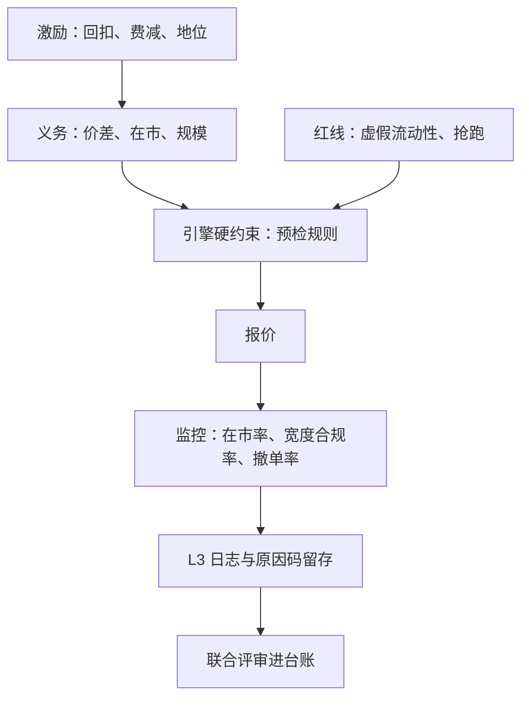

# 监管义务与收束

市场用激励换供给：回扣、费用减免与地位换来价差、在市与规模义务；做市的自由，从来是合同内的自由。

<footer>—— 据 Harris, Trading and Exchanges, 2003 与各交易所做市义务文本整理</footer>

[上一课](/quant/mm-pnl-attribution)把损益拆到机制并回馈参数。到此为止，做市都在与市场博弈；但挂牌本身是一份合同：激励换义务与红线。本课写监管义务如何进引擎，并收束本课程。本课程到此收束：策略（参数、偏移、对冲、对手方）、风控（毒性、限额、降风险）到运营（跨品种、归因、义务），前九课的对象在这里以「约束」的身份再出现一次。

## 问题

义务做市合同的典型条款：最大报价价差、最小挂单量、在市时间比例、参与率上下限、最小报价改进。红线：虚假流动性（申报后撤销以制造深度假象）、误导性展示、抢跑客户订单与信息滥用。缺口有两个：义务如何不与毒性防御打架——检测器喊停时，在市义务不允许你消失；违规证据如何自证——你需要能回答「每一笔撤单为什么撤」。

### 义务进引擎

义务作为硬约束进报价引擎，与[做市风控与限额](/quant/mm-risk-limits)同一接口：在市率、宽度上限、规模下限都是预检规则。毒性触发高档动作时，引擎在义务允许的角落里选择：收窄到义务宽度的下限、只保最小规模、单侧停而另一侧守义务——第五课动作分级要留这些中间档，原因正在于此：义务把「全跑」从合法选项里拿走了一部分。

同一条撤单流有两个读者：做市商读作「切短逆向选择窗口」，监管读作「是否虚假流动性」。意图的推断靠挂撤比、挂撤时序与报价距离；能自证的只有 L3 订单日志与改单原因码——这是合规基础设施，不是可选项。

## 方法

监控与留痕三件事：日报（在市率、宽度合规率、撤单率与改单原因分布，撤单率口径见 [撤单速率](/quant/cancel-rate)）；L3 订单生命周期日志全量留存，每笔撤单可回放当时簿态与决策理由；策略与合规的联合评审进研究台账，与[研究复盘](/quant/research-postmortem)同一模板——义务违约与策略亏损同权归档。制度差异要有对照表：美国注册做市商义务、欧盟 MiFID II 的报备与订单成交比控制、中国程序化报备与异常交易监控（见 [中国量化监管史](/quant/cn-quant-regulation-history)）、加密市场的商业性做市协议。逐域对照是另一门课，本课给的是把制度翻译成引擎约束与监控指标的方法。

## 机制

义务的经济学是公共品：连续性与价格发现无法由分散的使用者分别付费，市场设计者用集中激励换义务供给。义务的形状由此而定：挑做市商本来就要做的事设下限，而不是指挥策略。张力也由此而来：毒性最高、最想收手的时刻，恰是义务价值最大的时刻——第五到第七课的「档位」设计，就是在义务边界内重新获得自由。

红线的技术面在意图与模式的边界：做市修订与虚假申报用同一套接口、同一个撤单按钮，区分只能靠模式证据与留痕。美国的 spoofing 禁令 2010 年写入成文法，首个刑事定罪在 2015 年——「挂了再撤」从惯例问题变成刑责问题。合规的可行解不是少撤单，而是每笔撤单都有可回放的理由。

## 边界

熔断与波动中断时段义务可暂停或转换，复开批次里的在市语义要按[熔断设计](/quant/circuit-breaker-design)预先定义。跨制度经营从严者适用。本课不是法律意见：具体义务以交易所规则、做市协议与监管文本为准，写作口径为据公开文本与 Harris 教材整理。

## 小结

- 义务做市是激励换供给：价差、在市、规模义务对应回扣与地位；红线是合同与法律的双重边界。
- 义务作为硬约束进引擎，与限额同一接口；毒性防御在义务角落里选档位。
- 自证靠 L3 日志与原因码：每笔撤单可回放理由，是合规基础设施。
- 撤单流有两个读者：风险管理语言与监管语言并存，指标必须能同时回答两者。
- 制度差异翻译成引擎约束与监控指标；逐域对照是另一门课。
- 出处：Harris, *Trading and Exchanges*, 2003；Dodd–Frank Act 对商品交易法的 spoofing 修正（2010）；中国程序化报备口径见 [中国量化监管史](/quant/cn-quant-regulation-history)。
