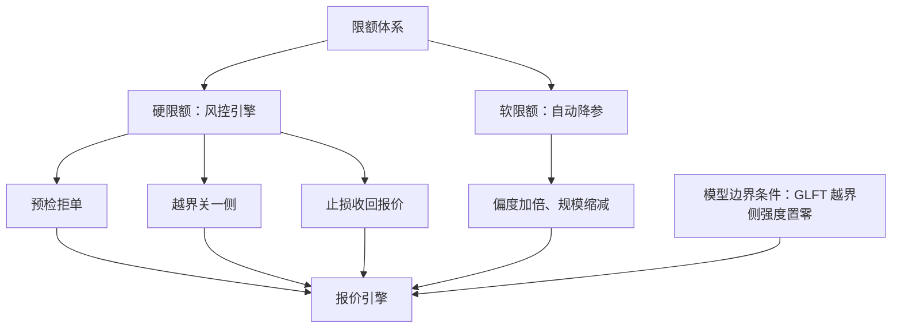

# 做市风控与限额

限额要活在两个地方：报价模型的边界条件里，让策略自己绕开它；模型外的风控引擎里，防的是策略自己出错的那天。

<footer>—— 据 Guéant, Lehalle and Fernandez-Tapia, 2013；Harris, Trading and Exchanges, 2003 整理</footer>

[上一课](/quant/mm-toxicity-online)让引擎知道何时收手；收手的动作需要授权边界，这就是限额。限额不是一行「最大库存」：它是层级化、分维度、软硬两级活的对象。本课写限额的清单、两层部署与失败模式。

## 问题

维度上，库存只是其一：库存（名义与按 $\sigma$ 折算的风险单位）、对冲后净敞口、日内累计亏损与止损线、单笔与单档报价规模、偏移上限、消息与撤单速率、到期与集中度，各自要各自的上限。层级上，公司、交易台、策略、腿逐级收紧，子级限额之和可以大于父级——协方差给出的余量——但绝不小于自己的父级。缺口在部署：软硬怎么分工、与报价引擎什么接口、谁在什么时候拦谁。

### 软硬两级

硬限额由独立风控引擎执行：预检拒单（超规模、超偏移的报价直接拒绝）、库存越界关一侧、止损线触发收回全部报价。硬限额的执行路径必须独立于策略代码——它防的正是策略本身的参数错误、代码回滚与数据异常。软限额只降参：靠近软限时自动加倍偏度、缩减规模，让策略在边界前减速而不是撞墙。

库存限额要用风险单位而不是股数：把 $Q$ 写成 $k\sigma$ 的函数，高波动日限额自动缩容。事后开会调额度要一个交易日，$k\sigma$ 随体制收缩只要一次行情——快了一个数量级。

## 方法

模型内的限额即 [GLFT](/quant/glft-market-making) 的边界条件：越界一侧的成交强度置零，靠近限额时偏度非线性放大——这是报价自洽的部分，策略「知道」边界在哪。模型外的引擎是墙，不知道也不需要知道策略意图。接口只有三个动词：查询（当前用量）、预检（这笔报价可否）、强制（收回、锁单）。

变更走审批与配置发布，与[研究、模拟、实盘隔离](/quant/research-sim-prod)同一套发布纪律：谁提的、谁批的、何时生效、影响哪些策略，全部留痕。保证金维度按[维持保证金](/quant/margin-maintenance)的初始线与维持线分开预算——开仓能力与存续能力不是同一个比例，做市账与保证金账要并排盯。

## 机制

两层不一致的失败模式各有一种。限额只在引擎、模型不知道：报价在边界反复撞墙，来回改价暴露队列与意图，成交与撤销都变成信号。限额只在模型、引擎没有：参数漂移或回滚事故那天，第一道也是最后一道防线消失——风控引擎存在的理由就是假设那天会来。速率限额有双重身份：既是风暴时的自我保护，设在自己撮合通道处理能力之下，风暴时丢的是报价机会而不是断线；也是合规对象，撤单率是交易所监控口径，见 [撤单速率](/quant/cancel-rate)。

限额与毒性检测的接缝在上一课已经埋好：检测器的高档动作（单侧停、全停）就是软限额的行为化表达；限额体系保证即使检测器整体失灵，账上还有一个不会说谎的上限。

## 边界

熔断与停牌时段限额的语义要预先定义：复开批次里库存怎么算、报价义务与限额谁优先，参考[熔断设计](/quant/circuit-breaker-design)的复开口径。跨场所库存聚合有延迟，限额按保守口径就地计算，不等全局对账。限额是风险偏好不是模型参数：不进回测优化目标，否则优化器会把限额磨平——回测里从未触限的限额，多半是被目标函数驯化过的限额。跨品种的向量限额是下一课的起点。

## 小结

- 限额分维度与层级：库存、净敞口、亏损、规模、速率、集中度，逐级收紧。
- 硬限额在模型外的引擎里：预检、越界关侧、止损收回，路径独立于策略代码。
- 软限额自动降参，模型内限额由 GLFT 边界条件表达，策略自洽绕行。
- 两层缺一：只有引擎则报价撞墙，只有模型则事故无拦。
- 速率限额既是自保也是合规对象；变更留痕走发布纪律。
- 出处：Guéant, Lehalle and Fernandez-Tapia, *Mathematics and Financial Economics*, 2013；Harris, *Trading and Exchanges*, 2003；Brunnermeier and Pedersen, *Review of Financial Studies*, 2009 的保证金约束口径。
