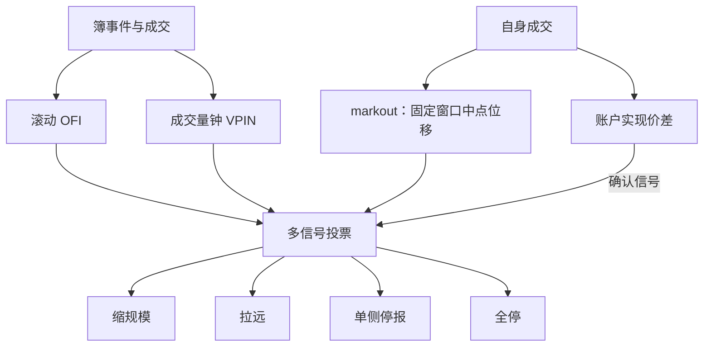
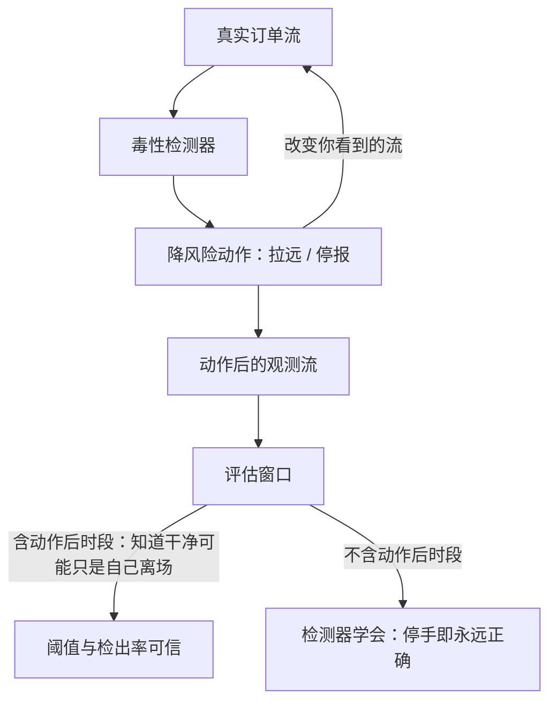

# 毒性流的线上检测

误报的代价是价差收入与队列位置，漏报的代价是负的实现价差；阈值取在哪，由这两种成本的比率决定，不是由检出率决定。

<footer>—— 据 Easley, López de Prado and O'Hara, Review of Financial Studies, 2012；Cont, Kukanov and Stoikov, 2014 整理</footer>

[上一课](/quant/mm-counterparty-tiering)把知情概率做成截面：不同对手不同价。但毒性还随时间起伏：同一位对手，平静时是流动性，消息前后是知情者。[毒性流](/quant/toxic-flow)给出了保护的三档与停报价角点解；[订单流毒性](/quant/ofi-toxicity)给出了 OFI 的研究口径。本课写线上化：检测器如何在低延迟下更新、动作如何分级、两种错误如何定价。

## 问题

研究指标搬上线上隔着三件事。**节拍**：VPIN 在成交量钟上更新，OFI 在簿事件流上更新，markout 逐笔更新——时钟选错，指标就失去含义（口径见 [事件时间](/quant/event-time)）。**动作**：检测器触发的不是「报警」而是一串降风险档位，档位要与报价引擎的接口对齐。**错误成本**：误报把无毒读成毒，损失价差收入与队列位置；漏报则把实现价差让给知情流。两种成本不对称，且随行情变化，所以阈值不是统计量而是决策量。

「毒性流」翻译成大白话：和你成交的对手里，有人消息比你快——你卖给他的货他知道要涨，你从他手里买的他知道要跌。这样的成交像有毒：成交后价格总朝对你不利的方向走。检测毒性就是给订单流「验毒」，决定什么时候少接单、什么时候不接单。

### 信号族

四路信号并行：VPIN 在成交量桶上增量更新，桶不重算；OFI 在滚动短窗上按[订单流毒性](/quant/ofi-toxicity)的带符号加总更新；markout 记录自己每笔成交后固定窗口的中点位移，直接对齐做市商的会计口径；账户级实现价差由正转负是最后的确认信号——前三路是预测，这一路是事实。单路信号都误报，组合用投票或加权，权重由各路的历史误报成本反推。

markout 窗口要与存货周转同量纲：平均几十秒转手的库存用 30 分钟窗口，正常的存货回复会被读成毒性，误报把全天报价拉宽，收入掉下去而库存方差几乎没降。

数字实例：设平均每笔赚半个价差 $0.02$ 元、每分钟成交 $100$ 笔。误报一次把报价拉远 $1$ 分钟，少赚约 $2$ 元；漏报一次放进 $10$ 笔知情单、每笔让出 $0.10$ 元，亏 $1$ 元——成本比约 $2:1$，误报更贵，阈值就该偏向宁可多漏报。行情一变这个比率就变，所以说阈值是决策量，不是拟合出来就一劳永逸的常数。

## 方法

动作分级从轻到重：缩减单笔规模、拉远报价距离、单侧停报、全停。每一档对应一个毒性置信区间，档位切换要带回滞（进入与退出阈值不同），否则信号在边界抖动时报价来回跳，队列资本被自己磨掉。验证走样本外的账户事后损益：指标拟合优度高不等于赚钱，[毒性流](/quant/toxic-flow)已强调这是唯一的验收口径。

公告时段单独体制：消息日历提前把自动阈值挂起，宽度与在市义务按事先规则接管，不要让检测器在新闻脉冲里第一次学做事。

## 机制

检测器处在反馈环里：你的动作改变你看到的流。停报价之后流「变干净」，可能是真的无毒了，也可能只是你不在场上——评估窗口必须包含动作后的时段，否则检测器学会了「只要停手就永远正确」。[VPIN](/quant/vpin) 的钟在成交加速时加密，闪崩前典型；OFI 对撤单加速更敏感，流动性蒸发往往先撤单后成交，两路信号恰好互补，这也是不做单阈值的原因之一。

常见误区：初学者挑检测器看「检出率」，越高越好。实际上检出率单独看没有信息——把所有时段都判为毒，检出率 100%，但误报成本会把全天价差收入清零。唯一的验收口径是样本外的账户事后损益：指标再漂亮，不赚钱就不合格。

分层的截面与检测的时序在同一账本上汇合：上一课的对手层给的是「谁常毒」，本课的信号给的是「现在毒不毒」；高毒时段里高毒层的动作最激进，低毒层仍可保留窄价差——一刀切的全局停报通常过度。

## 边界

冰山与暗池使可见信号有偏，[订单流毒性](/quant/ofi-toxicity)的测量误差讨论原样适用。市场整体波动与毒性混淆：高波动日本身会压实现价差，检测器要按波动体制分段定阈值。指标非平稳，阈值定期重估而不是一次性标定。检测的输出是风险管理语言：本课不提供识别具体自然人对手或伪装流量的构造，检测目的是让报价在毒性面前活下来，不是指控谁。

## 小结

- 线上化隔着节拍、动作与错误成本三件事；阈值是决策量，按误报与漏报成本比率定。
- 四路信号：VPIN、滚动 OFI、markout、账户实现价差；投票组合，最后一路是事实确认。
- 动作分级带回滞：缩规模、拉远、单侧停、全停，与限额接口对齐。
- 检测器在反馈环里：评估必须含动作后时段，否则学会「停手即正确」。
- 公告时段单独体制；截面分层与时序检测共用一本账。
- 出处：Easley, López de Prado and O'Hara, *Review of Financial Studies*, 2012；Cont, Kukanov and Stoikov, *Journal of Financial Econometrics*, 2014；Glosten and Milgrom, *Journal of Financial Economics*, 1985。
