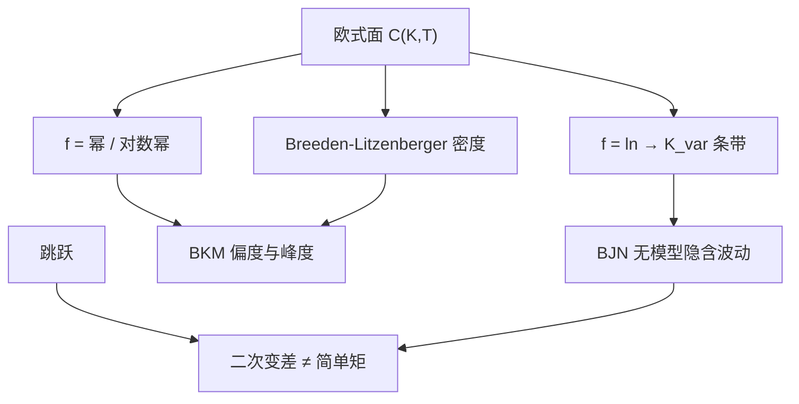

# 模型无关隐含矩

    
欧式香草的连续条带不仅复制对数合约从而给出隐含方差，也复制幂函数从而给出风险中性的三阶、四阶矩；这些矩是密度的积分，不依赖 Heston 或局部波动的参数。

    <footer>—— Britten-Jones and Neuberger, Option Prices, Implied Price Processes, and Stochastic Volatility, Journal of Finance, 2000；Bakshi, Kapadia and Madan, Review of Financial Studies, 2003</footer>

[方差互换复制](/quant/var-swap-replication) 把二次变差的期望写成 $1/K^2$ 加权的虚值香草。[波动互换](/quant/var-vs-vol-swap) 说明开方不再模型无关。本篇把 Carr–Madan 的一般 $f$ 用到幂函数上：Mark Britten-Jones 与 Anthony Neuberger 给出扩散下与欧式面相容的模型无关隐含波动；Gurdip Bakshi、Nikunj Kapadia 与 Dilip Madan 把风险中性偏度、峰度写成看涨看跌对执行价的积分。不重复对数条带的逐步权重，不把 [Heston 特征函数](/quant/heston-cf) 的矩爆炸当成这里的公式。

## 问题

Breeden–Litzenberger 说 $\partial_{KK}C$ 是风险中性密度。密度的矩 $\mathbb{E}^{\mathbb{Q}}[(S_T-F)^n]$ 因而也是香草的积分，只要 $f(x)=x^n$ 的二阶导作为权重。方差对应 $n=2$ 附近的对数（Itô 修正后是二次变差，不是简单的 $\mathrm{Var}(S_T)$）；偏度、峰度对应三、四阶。问题是写出稳定的积分公式、处理翼截断、以及分清三类「波动」：ATM Black、Britten-Jones–Neuberger 的无模型隐含波动（方差条带的平方根）、Bakshi–Kapadia 的 Delta 对冲收益所隐含的溢价。三者不是同一个数。

Britten-Jones–Neuberger（BJN）在扩散、无跳下证明：欧式面决定一条与之相容的瞬时方差过程的积分期望，因而「隐含波动」可以离开 Black 公式、离开特定随机波动参数。有跳时该等价放松，与方差互换的跳余项同源。BKM 不声称复制二次变差，他们复制的是到期收益的中心矩，用于比较指数与个股的风险中性分布形状。

### 方差、简单二阶矩、二次变差

$\mathbb{E}[(S_T-F)^2]$ 是简单方差，权重来自 $f''(x)=2$，即未贴现看涨看跌的积分，**不是** $1/K^2$。二次变差的期望来自 $f=\ln$，权重 $1/K^2$。BJN / 方差互换用后者；讨论「风险中性方差」时必须声明是哪一个。高波动下二者可差出翼部与 Jensen。峰度同样有「价格的四阶矩」与「对数收益的四阶矩」两条线，BKM 用对数收益的标准化偏度、峰度，以便跨期限、跨标的比较。

把 Heston 的 $\theta$ 或 $v_0$ 叫做「隐含方差」会与无模型矩打架。模型参数吸收动态；无模型矩只吸收今日欧式面。校准应对齐无模型方差，而不是对齐 ATM。

## 方法

**BJN 隐含波动。** 在扩散假设下，模型无关隐含方差等于方差互换公平执行价 $K_{\mathrm{var}}$（适当年化），隐含波动为 $\sqrt{K_{\mathrm{var}}}$。实施即 Demeterfi 离散条带：OTM 看跌、看涨，$\Delta K/K^2$，平值修正。报告截断的最低、最高 $K/F$。这是水平矩。

**BKM 偏度与峰度。** 令 $\mu_n=\mathbb{E}^{\mathbb{Q}}[R^n]$，$R$ 为适当定义的对数或简单收益。Bakshi–Kapadia–Madan 给出

$$
\mu_n=\mathrm{e}^{rT}\int_0^\infty w_n(K)\,O(K)\,\mathrm{d}K
$$

一类公式，其中 $O(K)$ 为虚值看涨或看跌，$w_n$ 对 $n=2,3,4$ 分别含 $1/K^2$、$1/K^3$ 与对数项（具体核以原文为准）。标准化偏度 $\mu_3/\mu_2^{3/2}$、峰度 $\mu_4/\mu_2^2$。左翼对偏度权重比对方差更重：缺更低的执行价会让隐含偏度不够负。须外推或声明截断偏差。

**时间序列。** 每日用当日欧式面算一套矩，得到 VIX 风格的偏度指数。与已实现矩之差才是溢价，见 KNS；本篇只负责 $\mathbb{Q}$ 侧。个股对指数的 BKM 矩差，进入 [相关溢价](/quant/dispersion-corr-prem) 的诊断：指数偏度更负、峰度更高，共跳在指数密度里更肥。

### 离散执行价、美式与利率

上市 $K$ 稀疏时，三阶核把噪声放大。应用光滑无套利插值（凸价格）再积分，而不是在三个点上用差分冒充 $\partial_{KK}$。美式个股的早行权溢价进入 $O(K)$，BKM 矩被污染，指数欧式更干净。利率与分红改变锚点 $F$ 与折现，公式要与方差条带同一套曲线。日历套利或蝶式违例会使密度为负，矩无意义——先跑静态套利扫描。

## 机制

Carr–Madan：任意 $C^2$ 的 $f(S_T)$ 等于债券、远期，加上 $f''(K)$ 加权的虚值香草。选 $f$ 就选矩。无模型的含义是：在欧式完备、扩散（对二次变差）或仅需到期分布（对 $S_T$ 的幂矩）的前提下，不需要指定 $\sigma_t$ 的动态。Heston、Bergomi、Dupire 只要拟合同一张面，给出的 BJN 方差与 BKM 到期矩相同；它们的差别在路径矩、条件矩与跳缺口上。这正是「先用无模型矩钉水平与斜度、再用模型钉动态」的校准顺序。

Bakshi–Kapadia 的 Delta 对冲收益是动态对象：它混合了二次变差与波动风险价格，不是 BKM 的静态矩。静态矩贵（隐含偏度更负）与动态收益为负（买左尾亏钱）同向，但一个来自今日积分，一个来自持有期 PnL。研究与交易都应声明测的是哪一个。

### 翼部、Lee 矩公式与外推

Lee 的矩公式把微笑翼斜率与风险中性矩的存在阶连起来：翼太陡则高阶矩爆炸，BKM 积分可能发散。外推应用饱和翼或 SVI 约束，而不是线性把 IV 拉到零执行价。截断而不外推，是把缺失的左尾当成不存在，隐含偏度偏小。报告应同时给截断积分与约束外推积分。方差条带（$1/K^2$）对左翼已敏感，三阶核更敏感，四阶往往只能当定性。

「模型无关」不是「与动态无关的一切」。到期分布的矩无关动态；二次变差的期望在有跳时有关。BJN 的假设比 BKM 的幂矩更严。

## 边界与工程取舍

短到期深度虚值流动性差，短端隐含偏度噪声极大，不宜当高频信号。长到期折现与分红假设主导四阶。不要把 BKM 偏度与 25d RR 画成同一序列而不加说明：后者是两点 IV 差，前者是积分。不要用 Heston 特征函数在 $u=0$ 的导数去「验证」无模型矩还声称独立——若模型已拟合该面，当然接近；那是拟合质量，不是新信息。

有跳时，BJN 与方差互换公平值分道，BKM 到期矩仍然合法（仍是 $S_T$ 的分布）。此时应同时报条带方差与简单二阶矩，差距是跳的诊断。粗糙波动改变路径正则性，不改变今日欧式决定的 BKM 矩；用矩去「拒绝」rBergomi 或 Heston，只能拒绝它们的边际，不能拒绝核。

Britten-Jones–Neuberger（2000）解决的是「隐含波动作为过程」在扩散下的模型无关定义；Bakshi–Kapadia–Madan（2003）解决的是用期权读偏度峰度并比较个股与指数。引用时不要合成一篇不存在的「BJN-BKM 公式」。

VIX 是 BJN 方差的公开、三十天、开方版本。没有同样官方的「偏度 VIX」时，BKM 积分就是研究用的偏度指数；交易仍常用 RR。

## 小结

- 欧式条带按 $f''$ 复制任意光滑支付；对数给出无模型方差（BJN / 方差互换），幂给出 BKM 偏度与峰度。
- 无模型隐含波动是 $\sqrt{K_{\mathrm{var}}}$，不是 ATM Black，也不是 $\mathbb{E}[\sqrt{\mathrm{QV}}]$。
- 简单 $\mathrm{Var}(S_T)$ 与二次变差期望权重不同；跳使二者分道。
- 左翼截断严重偏向隐含偏度；先无套利插值，再积分，并报告 $K$ 范围。
- 静态矩与 Bakshi–Kapadia 的 Delta 对冲收益同向但不是同一对象。
- 出处：Britten-Jones and Neuberger, *Journal of Finance*, 2000；Bakshi, Kapadia and Madan, *Review of Financial Studies*, 2003；条带理论见 Carr and Madan；翼部见 Lee。
