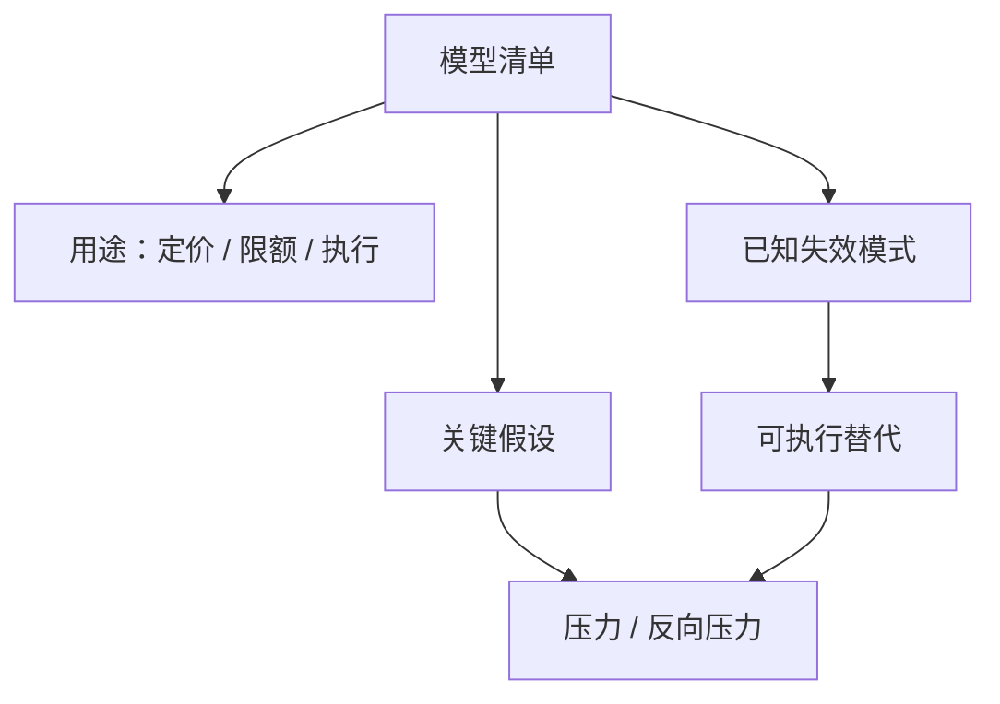

# 模型风险清单

模型风险不是「某个公式算错一位」。它是模型被用在其假设已经失效的决策上，而机构还没有一张表说清：哪些假设、由谁负责、失效时改用什么。

<footer>—— 据 Board of Governors of the Federal Reserve System, SR 11-7, Supervisory Guidance on Model Risk Management, 2011</footer>

[流动性螺旋](/quant/liquidity-spiral-risk)给出了一种具体的、多模型同时失效的机制。本课的缺口是工程与治理：把定价、风险、执行、估值用到的模型收成**清单**，使失效可被点名。SR 11-7 把模型风险定义成错误的模型或正确模型的错误使用，要求开发、验证、使用分开。量化研究里的过拟合、体制切换、相关崩溃，都是清单上的条目，而不是互不往来的论文主题。后课压力与反向压力是清单驱动的测试，不是每年一次的情景故事会。

## 问题

一个交易台同时依赖：信号模型、冲击模型、风险 $\Sigma$、期权曲面、债券曲线、公司行为、另类数据映射。每一块都有文档里没写的假设：平稳性、外生流动性、高斯尾、点-in-time 可用、对手会按历史填成率成交。螺旋来时，假设成组破裂，但事故复盘却只抓「波动估低了」。缺口是一张表：模型名称、用途（定价 / 限额 / 执行 / 估值）、关键假设、输入数据契约、验证日期、已知失效模式、替代方案。没有这张表，就无法做下一课的反向压力——你不知道要逆推哪一个模型。

SR 11-7 的精神适用于并非银行持牌的研究团队：任何决定仓位或限额的计算都是模型。Excel 不是豁免。清单的粒度要到「可被关掉或替换」，不要到「整个量化部」。

### 错误的模型 vs 错误的使用

错误的模型：识别失败、样本外崩溃、数值 bug。错误的使用：把做市实现价差拿去成本化月频因子；把平静期 lambda 送进螺旋第二圈；把修订后的宏观序列当实时。后一类在量化事故里更常见，因为「模型回测还行」。清单必须把**用途**写成字段：同一套 $\Sigma$，用于解释归因可以，用于设定杠杆则需要压力版本。用途变了，验证要重做。

过拟合是模型风险的一种，见过拟合作为风险课。清单上应写：尝试次数、是否 deflated Sharpe、是否与生产共用样本。不要只写「用了交叉验证」。

## 方法

盘点：从生产信号、风控闸门、盘中估值、保证金预测、执行算法各自往回追依赖的模型与数据。每一条记录：所有者、最后验证、输入是否点-in-time、对流动性/相关/填成的假设、与哪些模型共同失效（螺旋是典型簇）。验证独立于开发：至少换样本段、换冲击函数、换相关估计。SR 11-7 要求的是持续性，不是上线前一次。

失效模式预填：体制切换、相关崩溃、流动性螺旋、数据修订、公司行为漏处理、模拟器冲击为零、时钟错配。每一条指向已有课程，避免清单变成空话。替代方案必须可执行：例如「关掉该信号、杠杆上限切到压力 $\Sigma$、执行改拍卖、债券改按变现时间限额」。不能写「届时开会讨论」。

### 清单是限额系统的输入

监控课已经把 PnL、敞口、拒单分开。模型风险清单决定：哪一个敞口数字来自哪一个模型，拒单是否因为模型输入迟到。把清单 ID 打进订单与限额，事故时才能回答「坏的是曲面还是冲击」。这是治理，不是更多的希腊字母。

## 机制

模型风险进入损益的路径是决策。错误估值导致错误杠杆；错误冲击导致错误容量；错误相关导致错误分散。螺旋把多条路径同时打开。清单不能消灭风险，但能把「我们不知道自己依赖什么」变成「我们知道哪三条假设刚被代理指标证伪」。验证的机制是独立挑战：开发者的损失函数是样本内表现，验证者的损失函数是假设清单是否完整。激励不分开，验证会变成表演。

不要把 [Kyle](/quant/kyle-model) 或 [Roll](/quant/roll-model) 写进清单当「已验证的真理」。写进去的应是你校准的经验 lambda、你用的 Roll 窗口、以及它们在停板日失效。理论论文是出处，不是生产模型。

### 供应商模型也要进清单

风险软件、复权算法、另类面板都是模型。责任不能因外包而消失。清单上应有供应商名称、版本、你无法验证的假设，以及关掉该输入时的替代。

## 边界

监管文本针对银行模型体系，研究基金可以按比例裁剪，但不能裁掉「用途」和「假设」两列。供应商模型（风险软件、数据复权）也要进清单，责任不能外包消失。下一课用清单上的假设去设计压力与反向压力：先问什么会让我们破产，再看哪个模型必须先坏。

Excel 与研究笔记本里决定仓位的计算，用途与生产信号相同，不能因为没进代码库就豁免验证。

## 小结

- 模型风险是错误模型或错误用途；清单把假设、用途、失效与替代写成可关闭的单元。
- 螺旋是多模型同时失效的簇，应在清单里预链。
- 同一套参数换用途必须重新验证。
- 替代方案必须可执行，不能停在「开会」。
- 理论模型是出处；生产条目是校准后的估计器与数据契约。
- 出处：Federal Reserve SR 11-7, 2011；过拟合与体制切换见本课序前几课；流动性螺旋见 Brunnermeier–Pedersen。
