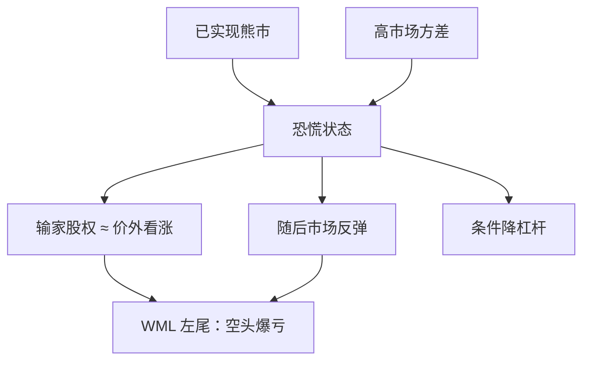

# 动量崩溃

动量策略在多数月份温和赚钱，却在少数恐慌之后的反弹里把多年利润吐出；输家组合在那时表现得像深度价外看涨期权。

<footer>—— Daniel &amp; Moskowitz, Momentum Crashes, Journal of Financial Economics, 2016</footer>

[WML](/quant/momentum-wml) 的样本均值显著为正，这是 Jegadeesh–Titman 与 Carhart 已经写进教科书的事实。Daniel 与 Moskowitz（2016）要人看分布的另一端：**动量崩溃**（momentum crashes）。在市场已经大跌、波动极高、随后出现反弹的窗口，输家腿（空头）爆发式上涨，赢家腿跟不上，WML 出现数十年一遇的负收益。1932 年与 2009 年是美股上的典型月。崩溃不是「动量失效了一段时间」的温和说法，它是期权式的左尾：事先看起来像在卖出输家上的看涨期权。本篇写崩溃的状态依赖、输家的凸性，以及条件策略能改变什么、不能承诺什么。时间序列动量的回撤见 [TSMOM](/quant/tsmom)，机制相近但组合不同。

## 问题

无条件夏普把崩溃摊进七十个年头里，看起来可接受。投资人活在日历时间里：一次 −50% 到 −80% 的月份会触发赎回、融资违约与强制平仓，之后即使均值仍在，策略已经不在。需要回答的是：崩溃是否可预测？若可预测，它来自可观测的市场状态（已实现的熊市、高波动、输家的期权价值），还是来自不可观测的拥挤？Daniel–Moskowitz 给出前一条的证据：在熊市且市场波动高时，动量的期望收益下降、负偏加剧；输家组合对市场反弹的 β 远高于熊市里估出来的历史 β。

这与「动量是风险因子故应有负偏」不是自动同一句话。许多风险因子有负偏，但动量的负偏极端、且集中在特定状态。若状态可测，无条件持有 WML 就不是均值方差最优，甚至不是对冲基金风险预算下可承受的。问题变成：条件化之后，剩下的动量溢价还有多少。

### 输家为什么像看涨期权

熊市里输家股票价格低、杠杆高、股权像深度价外看涨：对资产价值几乎没了 delta，一旦资产反弹，股权价值凸性上升。空这些名字等于卖凸性。反弹到来时，市场 β 从熊市里的「死了」跳到「极高」，历史回归估的 β 完全过时。赢家是已经证明能活过熊市的公司，凸性小、反弹时跟不上。WML = 赢家减输家，于是在反弹月变成空凸性。这解释为什么崩溃发生在**市场上涨**的月份，而不是发生在市场继续下跌的月份——继续下跌时输家已经接近期权的平坦区，空头不一定最痛。

崩溃月的特征是市场已经跌过、波动仍高、然后市场转为大涨。把「动量在熊市里亏钱」记成崩溃，会把熊市里赢家跌得少、WML 仍为正或小负的月份算进去。崩溃是反弹事件，不是熊市本身。

## 方法

无条件统计：WML 月度收益的偏度、峰度、最大回撤、最差月份列表。与市场、价值、规模对比，动量的最差月往往最极端。状态划分：过去若干个月（如两年）市场累计收益为负定义为熊市；市场已实现方差或 VIX 高定义为高波动。在熊市×高波动格子里，下期 WML 的均值显著更低，往往为负；在牛市格子里均值更高。这是预测，不是事后给崩溃月贴标签。

Daniel–Moskowitz 进一步用一个期权式回归描述输家：在市场大涨的月份，输家对市场的载荷上升。他们提出用熊市哑变量与市场方差去预测动量的均值与方差，再做均值方差下的条件权重——在预测最差的状态下降低 WML 暴露。样本内这会削掉最惨的月份、提高夏普；样本外取决于状态变量是否仍然有预测力，以及降低暴露时是否刚好错过动量仍然赚钱的熊市延续期。

### 与拥挤、融资、行业动量

状态依赖不排斥拥挤。同一组输家被许多资金做空、同一组赢家被叠加杠杆时，反弹触发空头回补与赢家减仓，价格路径会被放大。Khandani–Lo 的量化震荡是拥挤崩；动量崩溃可以在没有量化基金的 1932 年发生，说明凸性机制可以独立存在，但 2009 年两者叠在一起。经验上应同时报告：状态变量（熊市、方差）、拥挤代理（借券费、短头寸、共同持仓）、以及行业集中度。2000 年科技股上赢家过度集中，崩溃的行业结构与 2009 年金融输家不同。只做市场级 WML、不看腿的组成，会把两次崩溃写成同一个数字。

行业动量与残差动量的崩溃形态可能不同：行业动量在 2009 年未必同样惨，残差动量去掉市场与价值后仍可能空着一堆凸性股。复制崩溃研究必须声明排序变量是总收益还是残差。国际股票、商品、货币上的趋势跟踪也有急促回撤，但期货 TSMOM 的空头是合约不是公司股权，没有「股权当看涨期权」这一条，凸性来自仓位与波动缩放，机制不能照搬 DM 的股票公式。

## 机制

资产定价含义分两支。风险支：动量的溢价部分是对崩溃风险的补偿，愿意在反弹月亏钱的人要求平时有正收益。这能解释无条件均值，但要求崩溃风险在边际效用高的时候发生。反弹月往往是边际效用开始改善的时候（市场已经涨了），补偿叙事并不干净——更像是杠杆与约束在最痛的时候被触发，而不是消费风险。行为支：熊市里投资者对输家过度悲观，价格低于即使是困境也合理的水平；反弹时修正暴力。凸性是财务杠杆的机械结果，把行为超调放大成崩溃。

对组合的直接含义是：WML 的负偏不能靠再多几年的样本「平均掉」来管理。要么条件化，要么用期权对冲反弹（贵），要么接受较小的无条件仓位。把动量写成永远开启的第四因子，等于在风险预算里卖出那些看涨期权。Carhart 四因子评价基金时，崩溃月会让动量暴露高的基金一起垫底；这不是经理突然愚蠢，是因子本身的状态。

### 条件策略改变的是权重，不是崩溃的存在

用熊市与方差做降杠杆，成功时削的是左尾，代价是在「熊市延续、动量继续赚」的路径上少赚。2009 年 3 月那种 V 型，条件规则若足够保守会避开；1930 年代若规则过早关掉，会错过随后某些动量赚钱的月份。没有免费的崩溃保险。用期权对冲输家反弹，成本会吃掉无条件溢价的可观部分，这本身说明凸性是定价的一部分。工程上可做的是：限制输家腿的财务杠杆与借券集中度、避免行业极端集中、在波动突破时先降杠杆而不是等月度信号——这些是风险预算，不是对 2016 年论文的逐条复制。

动态规则若用到当月已实现的市场大涨再减仓，有前视。预测必须只用 $t$ 月末已有的熊市累计与方差，去定 $t+1$ 的权重。用崩溃当月的收益来展示「若当时空仓」是故事，不是策略。

## 边界与工程取舍

崩溃样本极少，统计量不稳定。用不同的熊市定义（−1 年 vs −2 年、用超额还是用名义）会移动哪些月份被标成高风险。应报告多种状态定义下的条件均值，而不是只留 2009 年好看的那一种。价值加权与等权的崩溃幅度不同：等权输家包含更多微型困境股，凸性更强、也更不可交易。可投资的动量在大中盘上崩溃较轻，溢价也更薄。

不要把 CTA 在 2009 年或 2020 年 3 月的回撤直接叫做 Daniel–Moskowitz 崩溃：对象可能是 TSMOM 或商品趋势。不要在 A 股用 12−1 动量尚未经历过同等长度的熊市—反弹就外推「没有崩溃」。不要用日内反转或隔夜动量的回撤去引用 2016 年 JFE。不要把崩溃写成「动量已死」：无条件溢价在含崩溃的长样本里仍然为正，这正是论文的起点而非否定。

卖空约束在崩溃时双向折磨：平时借不到的输家进不了纸面空头，真实组合崩溃较轻、溢价也更弱；一旦能借到，反弹时回补拥挤更猛。报告崩溃应同时给可交易过滤后的路径。与[价值](/quant/value-factors)的负相关在崩溃期不一定救命：2009 年价值本身也乱。分散化是平均相关，不是尾部相关。

出处：Daniel & Moskowitz, *Journal of Financial Economics*, 2016。动量原现象见 Jegadeesh & Titman, 1993。拥挤见因子拥挤文献。TSMOM 的趋势反转是近亲，股权凸性机制只适用于股票输家腿。

## 小结

- 动量崩溃是熊市高波动之后的反弹事件，输家像看涨期权，WML 出现极端负月。
- 状态变量（已实现熊市、市场方差）对下期动量有预测力；崩溃集中在市场上涨的月份。
- 无条件夏普掩盖左尾；条件降杠杆能削最差月，但会牺牲部分溢价，且不可前视。
- 拥挤与行业集中会放大，但凸性机制在更早的历史里已存在。
- 等权微型股与纸面空头会高估崩溃与溢价；可投资过滤必须同时报告。
- 出处：Daniel & Moskowitz, *JFE*, 2016。
